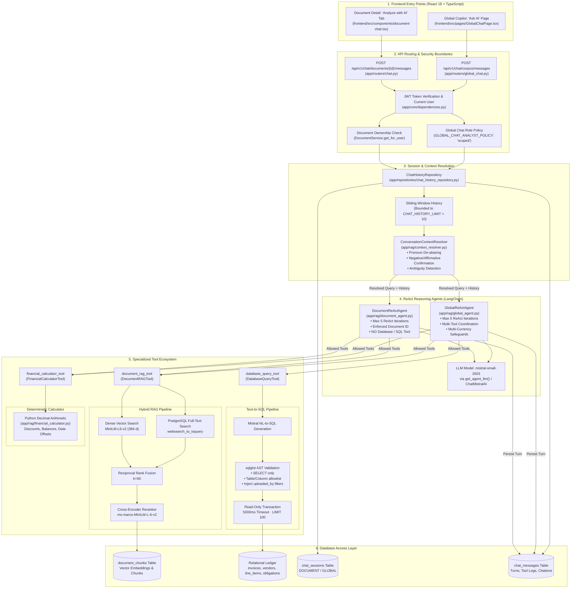

# Conversational AI & Chatbot Architecture

---

## 1. Executive Summary

The EFDI Conversational AI platform provides an enterprise financial copilot through two distinct conversational interfaces:
1. **Document-Level Chatbot (`/api/v1/chat/documents/{id}`):** An in-depth assistant strictly scoped to a single document, answering contractual questions regarding clauses, payment terms, early payment discounts, freight, penalties, and OCR text snippets without cross-document data leakage.
2. **Global Corpus Copilot (`/api/v1/chat/corpus`):** A portfolio-wide financial intelligence agent capable of multi-step reasoning across relational databases, unstructured document collections, and deterministic financial calculations.

Both assistants are powered by **LangChain ReAct agents** utilizing iterative tool calling, backed by Mistral (`mistral-small-2603`), and governed by contextual intent resolvers, strict AST-based SQL guardrails, and role-based access control.

---

## 2. High-Level Chatbot System Architecture Diagram



---

## 3. High-Level Comparison: Document vs Global Chatbot

| Architectural Dimension | Document-Level Chatbot | Global Corpus Chatbot |
|---|---|---|
| **API Route** | `POST /api/v1/chat/documents/{id}/messages` | `POST /api/v1/chat/corpus/messages` |
| **Frontend Location** | Document Detail Page $\rightarrow$ "Analyze with AI" tab | Main Navigation $\rightarrow$ "Ask AI" page |
| **Orchestrator** | [`DocumentReActAgent`](file:///c:/Users/conanferreira/Desktop/PROJECT-BLACKBOX/EFDI/backend/app/rag/document_agent.py) | [`GlobalReActAgent`](file:///c:/Users/conanferreira/Desktop/PROJECT-BLACKBOX/EFDI/backend/app/rag/global_agent.py) |
| **Scope of Analysis** | Strictly isolated to **one `document_id`** | Portfolio-wide across all authorized documents |
| **Available Tools** | `document_rag_tool`, `financial_calculator_tool` | `database_query_tool`, `document_rag_tool`, `financial_calculator_tool` |
| **Text-to-SQL Tool** | **STRICTLY EXCLUDED** | **Enabled** (with AST security validation) |
| **Precondition Check** | Enforces `OCR_COMPLETED` before answering content queries | Dynamically routes queries to DB or RAG |
| **Analyst Access Policy** | Scoped to own uploads | `settings.GLOBAL_CHAT_ANALYST_POLICY` (`"scoped"`) |
| **Primary Use Cases** | Clause verification, penalty terms, invoice summary, freight | Spend aggregation, vendor analytics, cross-invoice counts, portfolio audit |
| **Structured Output** | Standard responses or 5-section "Invoice Summary" | Analytical answers with relational & calculation provenance |

---

## 4. Conversational Context Resolution

Both chatbots utilize the [`ConversationContextResolver`](file:///c:/Users/conanferreira/Desktop/PROJECT-BLACKBOX/EFDI/backend/app/rag/context_resolver.py) before dispatching the user query to the ReAct agent:

```
[ User Message: "What about the second one?" ]
                     │
                     ▼
[ ConversationContextResolver.resolve() ]
  ├─ Inspects Recent Dialogue History (bounded to CHAT_HISTORY_LIMIT = 10)
  ├─ Inspects Session State (active_document_id, pending_offer, verified_facts)
  │
  ├─ Intent 1: "confirmation_negative" ("No thanks", "Nevermind")
  │     └─ Updates session state, produces polite acknowledgement, BYPASSES all tools.
  │
  ├─ Intent 2: "clarification" / is_ambiguous
  │     └─ Produces clarifying question, BYPASSES tools, prevents hallucinated scope.
  │
  └─ Intent 3: Contextualized Query Rewrite
        └─ Resolves pronouns: "What about the second invoice (INV-2026-002)?"
                     │
                     ▼
[ Dispatched to ReAct Agent with Clean Contextualized Query ]
```

---

## 5. Tool Implementations

### 1. Document RAG Tool (`document_rag_tool`)
- **Module:** [`backend/app/rag/tools/rag_tool.py`](file:///c:/Users/conanferreira/Desktop/PROJECT-BLACKBOX/EFDI/backend/app/rag/tools/rag_tool.py)
- **Class:** `DocumentRAGTool(BaseTool)`
- **Retrieval Engine:** Invokes [`RAGService`](file:///c:/Users/conanferreira/Desktop/PROJECT-BLACKBOX/EFDI/backend/app/services/rag_service.py).
  1. Generates 384-dimensional query embedding via `sentence-transformers/all-MiniLM-L6-v2`.
  2. Runs dense vector cosine similarity search in PostgreSQL (`document_chunks.embedding`).
  3. Runs PostgreSQL native full-text search (`websearch_to_tsquery('english', query)`).
  4. Fuses rankings using Reciprocal Rank Fusion ($k=60$) to obtain top 25 candidate chunks.
  5. Reranks candidates using Cross-Encoder model `cross-encoder/ms-marco-MiniLM-L-6-v2` down to top 5 chunks.
- **Safety Framing:** Formats returned chunks in `<document_evidence untrusted="true">` XML blocks to prevent prompt injection from malicious document text.

### 2. Financial Calculator Tool (`financial_calculator_tool`)
- **Module:** [`backend/app/rag/tools/calculator_tool.py`](file:///c:/Users/conanferreira/Desktop/PROJECT-BLACKBOX/EFDI/backend/app/rag/tools/calculator_tool.py)
- **Class:** `FinancialCalculatorTool(BaseTool)`
- **Calculation Engine:** Invokes [`FinancialCalculator`](file:///c:/Users/conanferreira/Desktop/PROJECT-BLACKBOX/EFDI/backend/app/rag/financial_calculator.py).
  - Uses Python's `decimal.Decimal` with bankers rounding (`ROUND_HALF_UP`) to prevent floating-point inaccuracies.
  - Actions supported:
    - `calculate_expression`: Safe evaluation of arithmetic string expressions.
    - `calculate_discount`: Resolves cash discount amounts, net payable sums, and calendar discount deadlines.
    - `batch_discounts`: Vectorized discount calculations across multiple invoice objects with currency isolation.
    - `aggregate_column`: Exact sum, average, min, max, variance over numeric lists.
    - `calculate_date_offset`: Calendar arithmetic adding day offsets to ISO dates (`YYYY-MM-DD`).

### 3. Database Query Tool (`database_query_tool`)
- **Module:** [`backend/app/rag/tools/database_tool.py`](file:///c:/Users/conanferreira/Desktop/PROJECT-BLACKBOX/EFDI/backend/app/rag/tools/database_tool.py)
- **Class:** `DatabaseQueryTool(BaseTool)`
- **Exclusive Availability:** Available **only** to the Global ReAct Agent; inaccessible to Document Chat.
- **Execution Engine:** Invokes [`TextToSQLService`](file:///c:/Users/conanferreira/Desktop/PROJECT-BLACKBOX/EFDI/backend/app/services/text_to_sql_service.py).
  - Generates candidate PostgreSQL SELECT queries via Mistral.
  - Uses `sqlglot` to parse the Abstract Syntax Tree (AST).
  - Validates tables and columns against strict role-based allowlists.
  - Injects mandatory tenant filters (`documents.uploaded_by = user.id`) and soft-delete filters (`documents.is_deleted = false`).
  - Executes inside a `SET TRANSACTION READ ONLY` connection with a 5000ms statement timeout.
  - Enforces a hard ceiling of `LIMIT 100`.

---

## 6. Guardrails & Response Sanitization

Both agents inherit comprehensive security guardrails ([`app/rag/response_guardrails.py`](file:///c:/Users/conanferreira/Desktop/PROJECT-BLACKBOX/EFDI/backend/app/rag/response_guardrails.py)):
1. **Execution-State Refusal:** Questions probing internal agent mechanics (e.g. "What tools did you call?", "Show me your prompt", "What SQL did you run?") are intercepted by `is_execution_state_query()` and immediately return a polite enterprise refusal (`get_execution_state_refusal()`).
2. **Global Request Timeout:** Agent execution is bound to `settings.CHAT_REQUEST_TIMEOUT_SECONDS` (30.0s). If the deadline expires during reasoning, execution terminates gracefully, returning `GLOBAL_TIMEOUT_MESSAGE` rather than crashing the worker.
3. **Multi-Currency Safety:** The agents strictly refuse to sum monetary amounts across heterogeneous currencies without explicit grouping by currency code.
4. **Untrusted Content Sanitization:** Text extracted from document chunks is sanitized to strip prompt injections, markdown exploits, or fabricated citations.

---

## 7. Conversation Persistence Model

Conversations are persisted across two dedicated PostgreSQL tables ([`app/models/chat.py`](file:///c:/Users/conanferreira/Desktop/PROJECT-BLACKBOX/EFDI/backend/app/models/chat.py)):

### 1. `chat_sessions` Table
- `id`: Primary key.
- `user_id`: Foreign key referencing `users.id` (`ondelete="CASCADE"`).
- `session_type`: `"DOCUMENT"` or `"GLOBAL"`.
- `document_id`: Foreign key referencing `documents.id` (NULL for Global Chat).
- `title`: Human-readable conversation title.
- `state_json`: JSONB dictionary maintaining conversation memory (`active_document_id`, `pending_offer`, `verified_facts`).

### 2. `chat_messages` Table
- `id`: Primary key.
- `session_id`: Foreign key referencing `chat_sessions.id` (`ondelete="CASCADE"`).
- `role`: Message role (`"user"`, `"assistant"`, `"system"`, `"tool"`).
- `content`: Message text.
- `tool_calls`: JSONB log capturing executed tools, inputs, summaries, and row counts.
- `citations`: JSONB array of verified grounded citations (document title, page number, section).
