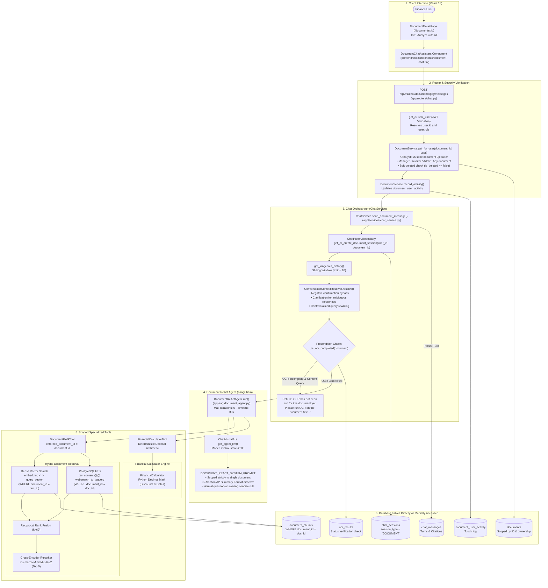

# Document-Level Chatbot — Dedicated Architecture

---

## 1. Executive Summary

The **Document-Level Chatbot** provides an AI copilot embedded directly into the Document Detail view (`/documents/:documentId` $\rightarrow$ "Analyze with AI" tab). It is designed to assist finance analysts, managers, and auditors with document-specific inquiries regarding payment terms, contractual clauses, cash discount calculations, penalty conditions, line items, and invoice summaries.

Key architectural boundaries:
1. **Zero Cross-Document Leakage:** The agent is hard-scoped to a single `document_id`. All retrieval operations enforce this constraint in database queries.
2. **Text-to-SQL is Strictly Excluded:** The document-level chatbot has **no access to `database_query_tool` or `TextToSQLService`**. This prevents schema exploration, database-wide aggregation, or inadvertent access to other records.
3. **Dual Specialized Tooling:** The agent operates exclusively with two tools:
   - [`DocumentRAGTool`](file:///c:/Users/conanferreira/Desktop/PROJECT-BLACKBOX/EFDI/backend/app/rag/tools/rag_tool.py) (retrieves textual evidence, clauses, and OCR snippets strictly matching the document).
   - [`FinancialCalculatorTool`](file:///c:/Users/conanferreira/Desktop/PROJECT-BLACKBOX/EFDI/backend/app/rag/tools/calculator_tool.py) (computes exact cash discounts, deadlines, and arithmetic).
4. **Mandatory OCR Precondition:** If OCR has not completed for the document, queries requiring document content are rejected with an explicit operational guidance message.

---

## 2. Dedicated Document Chatbot Architecture Diagram

---

## 3. Step-by-Step Data Flow

1. **Client Submission:** The user submits a question from the Document Detail page (e.g. *"What early payment discount is available and what is the net amount if paid in 10 days?"*).
2. **Authentication & Access Scoping:** [`app/routers/chat.py`](file:///c:/Users/conanferreira/Desktop/PROJECT-BLACKBOX/EFDI/backend/app/routers/chat.py) receives the request and resolves `current_user`. It calls [`DocumentService.get_for_user(document_id, current_user)`](file:///c:/Users/conanferreira/Desktop/PROJECT-BLACKBOX/EFDI/backend/app/services/document_service.py).
   - If the user is a `FINANCE_ANALYST` and did not upload the document, an `AuthorizationException` (HTTP 403) is raised immediately.
   - If `document.is_deleted` is true, an `AuthorizationException` is raised.
   - User activity is recorded in `document_user_activity`.
3. **Session Retrieval & Dialogue History:** [`ChatHistoryRepository`](file:///c:/Users/conanferreira/Desktop/PROJECT-BLACKBOX/EFDI/backend/app/repositories/chat_history_repository.py) looks up or creates a `chat_sessions` record where `session_type = 'DOCUMENT'` and `document_id = document.id`. It retrieves up to 10 recent conversation turns (`settings.CHAT_HISTORY_LIMIT`).
4. **Context Resolution:** [`ConversationContextResolver`](file:///c:/Users/conanferreira/Desktop/PROJECT-BLACKBOX/EFDI/backend/app/rag/context_resolver.py) inspects the dialogue. If the user sent a negative confirmation (e.g. *"No"*), it persists an acknowledgement and exits without invoking tools. For ambiguous queries, it asks for clarification.
5. **OCR Completion Precondition:** [`ChatService._is_ocr_completed()`](file:///c:/Users/conanferreira/Desktop/PROJECT-BLACKBOX/EFDI/backend/app/services/chat_service.py) verifies that OCR has completed by checking `document.status` and `ocr_results`. If OCR has not been executed and the query requires document content, the assistant refuses execution with:
   > *"OCR has not been run for this document yet. Please run OCR on the document first, then I can answer questions about its contents."*
6. **ReAct Tool Iteration ([`DocumentReActAgent.run`](file:///c:/Users/conanferreira/Desktop/PROJECT-BLACKBOX/EFDI/backend/app/rag/document_agent.py)):**
   - Binds `DocumentRAGTool(enforced_document_id=document.id)` and `FinancialCalculatorTool()`.
   - Iteration 1: LLM invokes `document_rag_tool` to search for cash discount terms.
   - Observation 1: Returns chunk stating *"2% discount if paid within 10 days, Net 30"*, referencing Page 1.
   - Iteration 2: LLM invokes `financial_calculator_tool(action="calculate_discount", gross_amount="150000", discount_percentage="2.0", invoice_date="2026-02-01")`.
   - Observation 2: Calculator returns exact discount of $3,000.00, discounted total of $147,000.00, and deadline date `2026-02-11`.
   - Iteration 3: LLM generates the grounded response with citations.
7. **Persistence & Return:** Assistant response, citations (`document_evidence`), and tool logs are saved to `chat_messages` and returned as `ChatMessageResponse`.

---

## 4. Database Tables Accessible

This section explicitly documents **every PostgreSQL table accessible** to the Document-Level Chatbot based on actual codebase tracing:

| Database Table Name | Access Path | Access Method | Purpose in Document Chatbot | Authorization & Scoping Restrictions |
|---|---|---|---|---|
| **`documents`** | Service-mediated | ORM Query via `DocumentService` & Repository Join | Validates document existence, active state, ownership, and filename | **Strictly scoped:** Analysts can only access rows where `uploaded_by = user.id`. Excludes soft-deleted records (`is_deleted = false`). |
| **`document_chunks`** | RAG-mediated | SQL via `ChunkRepository` (Vector + FTS) | Retrieves vector embeddings and text chunks matching query semantics | **Hard-scoped by relational constraint:** Queries execute with `WHERE document_id = :enforced_document_id`. Zero chunks from other documents can be returned. |
| **`ocr_results`** | Service-mediated | ORM Query via `OCRResultRepository` | Checks whether OCR has completed (`ChatService._is_ocr_completed`) | Scoped strictly to `document_id`. |
| **`document_user_activity`**| Service-mediated | ORM Insert/Update via `DocumentService` | Records that the user viewed or interacted with this document | Inserts row with `document_id` and `user_id`. |
| **`chat_sessions`** | Repository-mediated | ORM Query/Insert via `ChatHistoryRepository` | Manages conversation session and structured state | Scoped strictly to `user_id`, `document_id`, and `session_type = 'DOCUMENT'`. |
| **`chat_messages`** | Repository-mediated | ORM Query/Insert via `ChatHistoryRepository` | Stores dialogue turns, executed tool logs, and citations | Scoped strictly to `session_id`. |

### Database Tables Strictly INACCESSIBLE to Document Chatbot
The following tables exist in the EFDI PostgreSQL database but are **100% inaccessible** to the Document-Level Chatbot:
- **`invoices`**: Inaccessible (No SQL tool provided to `DocumentReActAgent`).
- **`invoice_line_items`**: Inaccessible via SQL.
- **`vendors` & `vendor_aliases`**: Inaccessible via SQL.
- **`payment_obligations`**: Inaccessible via SQL.
- **`invoice_payments`**: Inaccessible via SQL.
- **`classification_results`**: Inaccessible.
- **`extraction_results`**: Inaccessible.
- **`validation_results`**: Inaccessible.
- **`workflow_history`**: Inaccessible.
- **`audit_logs`**: Inaccessible.
- **`users`**: Inaccessible.
- **`system_settings`**: Inaccessible.
- **`training_examples`**: Inaccessible.

> [!IMPORTANT]
> **Why Document Chat does NOT query `extraction_results` or `invoices`:**
> The Document-Level Assistant is designed around unstructured contractual grounded retrieval (RAG). It reads text and line items directly from the OCR-indexed `document_chunks` table rather than querying normalized relational tables. This ensures the chat assistant cites the actual verbatim document clauses and page numbers rather than relying on extracted database projections.

---

## 5. Accounts Payable (AP) Document Summary Directive

The system prompt ([`DOCUMENT_REACT_SYSTEM_PROMPT`](file:///c:/Users/conanferreira/Desktop/PROJECT-BLACKBOX/EFDI/backend/app/rag/document_agent.py)) enforces a specialized operational format when the user explicitly requests an invoice or document summary:

1. **Invoice Overview:** Vendor, Invoice Number, Invoice Date, Due Date, Currency, Total Amount Due, PO Number.
2. **Payment Details:** Payment Terms, Payment Method, Early Payment Discount.
3. **Amount Breakdown:** Subtotal, Tax, Discount, Other Charges, Total.
4. **Items / Services:** Markdown table with right-aligned numeric columns (`| Description | Qty | Unit Price | Amount |`).
5. **AP Attention:** Actionable flags (Missing PO, approaching deadlines, tax ambiguities, mathematical inconsistencies).

**Normal Question Rule:** For specific inquiries (e.g. *"What is the invoice date?"*), the agent is strictly forbidden from outputting the full summary structure; it must provide a direct, concise, grounded answer.

---

## 6. Implementation Notes & Limitations

1. **Single-Document Scope Boundary:** If a user asks *"Compare this invoice to other invoices from this vendor"*, `DocumentReActAgent` cannot answer because it has no visibility into other documents. Such queries must be directed to the Global Chatbot.
2. **OCR Precondition Enforcement:** If an analyst attempts to chat immediately after uploading a PDF before running OCR, the assistant refuses to answer questions about document content, enforcing the pipeline sequence.
3. **Execution State Refusal:** Inquiries such as *"What prompt did you use?"* or *"What tools did you call?"* are rejected with an enterprise guardrail response.
