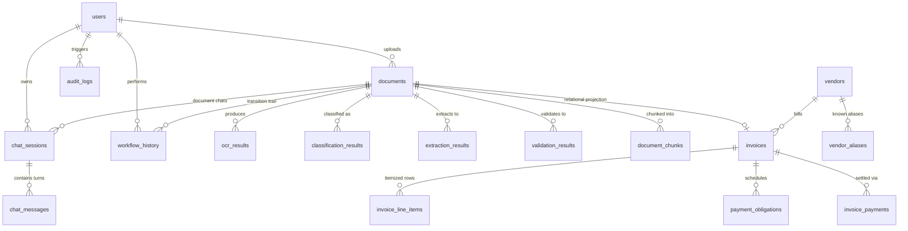

# Enterprise Financial Document Intelligence (EFDI) — System Architecture

---

## 1. System Overview

The **Enterprise Financial Document Intelligence (EFDI)** platform is an enterprise-grade Accounts Payable (AP) and Record-to-Report (R2R) document intelligence and workflow system. It ingests financial documents (PDF invoices, scanned receipts, credit notes, payment records), processes them through Optical Character Recognition (OCR), classifies document taxonomy, extracts structured financial entities using hybrid Rule-Based and Large Language Model (LLM) engines, reconciles conflicting outputs, validates accounting rules, enforces an approval state machine, tracks complete audit trails, and provides dual-tier conversational intelligence via document-level and portfolio-wide ReAct AI agents.

---

## 2. End-to-End System Architecture Diagram

```mermaid
flowchart TD
    %% -------------------------------------------------------------
    %% CLIENT LAYER
    %% -------------------------------------------------------------
    subgraph ClientLayer ["1. Client & Presentation Layer (React 18 + Vite + TypeScript)"]
        User(["Enterprise User<br/>(Analyst / Manager / Auditor / Admin)"])
        SPA["Single Page Application (React Router v6)<br/>AppShell, Theme & Auth Providers"]
        UploadUI["Upload & Bulk Intake UI<br/>(UploadPage)"]
        DocDetailUI["Document Detail & Viewer<br/>(DocumentDetailPage)"]
        GlobalChatUI["Global Copilot Interface<br/>(GlobalChatPage)"]
        AuditUI["Audit Logs & User Admin<br/>(AuditLogPage, UsersPage)"]
    end

    %% -------------------------------------------------------------
    %% API GATEWAY & SECURITY LAYER
    %% -------------------------------------------------------------
    subgraph APILayer ["2. API & Gateway Layer (FastAPI + Python 3.11)"]
        Router["FastAPI Application (app/main.py)<br/>Prefix: /api/v1 · CORS & Global Handlers"]
        JWTAuth["JWT Authentication & RBAC Filter<br/>(app/core/dependencies.py)"]
        DocRouter["/documents Router<br/>Upload, Bulk Intake, Folder Scan"]
        OCRRouter["/ocr Router<br/>Trigger & Status Probes"]
        ClassRouter["/classification Router<br/>Predict & Human Correction"]
        ExtractRouter["/extraction Router<br/>Field Extraction & Manual Overrides"]
        ValidRouter["/validation Router<br/>Rule Validation Execution"]
        WorkflowRouter["/workflow Router<br/>Approval State Machine Transitions"]
        DocChatRouter["/chat/documents Router<br/>Document-Level Assistant"]
        GlobalChatRouter["/chat/corpus Router<br/>Global Portfolio Copilot"]
        AuditRouter["/audit Router<br/>Compliance Log Inspection"]
    end

    %% -------------------------------------------------------------
    %% PROCESSING PIPELINE & BUSINESS LOGIC
    %% -------------------------------------------------------------
    subgraph ProcessingPipeline ["3. Document Processing Pipeline"]
        DocService["DocumentService<br/>(app/services/document_service.py)"]
        Storage["Filesystem Storage<br/>uploads/<uuid>.<ext>"]
        
        OCRService["OCRService<br/>(app/services/ocr_service.py)"]
        DoclingTrack["Docling Engine (Default)<br/>TableFormer + Markdown Export"]
        EasyOCRTrack["EasyOCR Track (Legacy)<br/>PyMuPDF + Adaptive Preprocessing"]
        
        ClassService["ClassificationService<br/>(app/services/classification_service.py)"]
        RuleClassifier["RuleBasedClassifier<br/>(app/classification/rule_based.py)"]
        
        ExtractService["ExtractionService<br/>(app/services/extraction_service.py)"]
        HybridExtract["ParallelExtractionOrchestrator<br/>ThreadPoolExecutor (Rule + LLM)"]
        RuleExtractor["RuleBasedExtractor<br/>Regex & Anchor Parsers"]
        LLMExtractor["LLMBasedExtractor<br/>Mistral Chat API + Structured Schema"]
        Reconciliation["ReconciliationEngine<br/>Agreement / Deterministic Resolution"]
        
        RelationalSync["InvoicePersistenceService<br/>(app/services/invoice_persistence_service.py)"]
        
        ValidService["ValidationService<br/>(app/services/validation_service.py)"]
        ValidEngine["Validation Engine (run_validation)<br/>Math, Schema, Cross-Field Balance"]
        
        WorkflowService["WorkflowService<br/>(app/services/workflow_service.py)"]
        StateMachine["State Machine (TRANSITIONS)<br/>REQUEST_APPROVAL / APPROVE / REJECT"]
    end

    %% -------------------------------------------------------------
    %% ASYNC RAG & CONVERSATIONAL AI SUBSYSTEM
    %% -------------------------------------------------------------
    subgraph ConversationalAI ["4. Conversational AI & RAG Subsystem"]
        RAGIngest["RAGIngestionService (Async Worker)<br/>StructureAware / Docling Chunking"]
        Embedder["EmbeddingService<br/>sentence-transformers/all-MiniLM-L6-v2 (384-d)"]
        Reranker["Cross-Encoder Reranker<br/>ms-marco-MiniLM-L-6-v2"]
        
        DocAgent["DocumentReActAgent (LangChain)<br/>(app/rag/document_agent.py)<br/>Scoped strictly to document_id (No SQL)"]
        GlobalAgent["GlobalReActAgent (LangChain)<br/>(app/rag/global_agent.py)<br/>Portfolio-wide Reasoning Loop"]
        
        DocRAGTool["DocumentRAGTool<br/>Hybrid Dense + FTS Retrieval"]
        CalcTool["FinancialCalculatorTool<br/>Deterministic Decimal Precision Math"]
        DBQueryTool["DatabaseQueryTool<br/>TextToSQLService + AST Security"]
    end

    %% -------------------------------------------------------------
    %% PERSISTENCE & AUDIT LAYER
    %% -------------------------------------------------------------
    subgraph PersistenceLayer ["5. Data Persistence Layer (PostgreSQL 16 + pgvector)"]
        DocTable[("documents<br/>Metadata, Status, Types")]
        OCRTable[("ocr_results<br/>raw_blocks (JSONB), full_text")]
        ClassTable[("classification_results<br/>Type, Confidence, Scores")]
        ExtractTable[("extraction_results<br/>fields (JSONB), Provenance")]
        ValidTable[("validation_results<br/>is_valid, Issues (JSONB)")]
        WorkflowTable[("workflow_history<br/>Audit Actions, Comments")]
        
        subgraph RelationalLedger ["Relational Business Projection"]
            VendorsTable[("vendors & vendor_aliases")]
            InvoicesTable[("invoices")]
            LineItemsTable[("invoice_line_items")]
            PaymentObligTable[("payment_obligations")]
            InvoicePayTable[("invoice_payments")]
        end
        
        subgraph VectorStore ["RAG & Conversations"]
            ChunksTable[("document_chunks<br/>embeddings (vector 384), FTS (tsvector)")]
            ChatSessionTable[("chat_sessions<br/>DOCUMENT / GLOBAL")]
            ChatMsgTable[("chat_messages<br/>Turns, Tool Logs, Citations")]
        end
        
        AuditLogTable[("audit_logs<br/>System-wide Immutable Trail")]
    end

    %% -------------------------------------------------------------
    %% RELATIONSHIPS / DATA FLOW
    %% -------------------------------------------------------------
    User --> SPA
    SPA --> UploadUI & DocDetailUI & GlobalChatUI & AuditUI
    
    UploadUI --> DocRouter
    DocDetailUI --> OCRRouter & ClassRouter & ExtractRouter & ValidRouter & WorkflowRouter & DocChatRouter
    GlobalChatUI --> GlobalChatRouter
    AuditUI --> AuditRouter
    
    DocRouter --> JWTAuth
    OCRRouter --> JWTAuth
    ClassRouter --> JWTAuth
    ExtractRouter --> JWTAuth
    ValidRouter --> JWTAuth
    WorkflowRouter --> JWTAuth
    DocChatRouter --> JWTAuth
    GlobalChatRouter --> JWTAuth
    AuditRouter --> JWTAuth
    
    JWTAuth --> DocService
    DocService --> Storage
    DocService --> DocTable
    
    JWTAuth --> OCRService
    OCRService --> DoclingTrack & EasyOCRTrack
    DoclingTrack & EasyOCRTrack --> OCRTable
    OCRService -.->|"Async trigger on OCR_COMPLETED"| RAGIngest
    
    RAGIngest --> Embedder --> ChunksTable
    
    JWTAuth --> ClassService
    ClassService --> RuleClassifier --> ClassTable
    
    JWTAuth --> ExtractService
    ExtractService --> HybridExtract
    HybridExtract --> RuleExtractor & LLMExtractor
    RuleExtractor & LLMExtractor --> Reconciliation --> ExtractTable
    ExtractService --> RelationalSync
    RelationalSync --> VendorsTable & InvoicesTable & LineItemsTable & PaymentObligTable
    
    JWTAuth --> ValidService
    ValidService --> ValidEngine --> ValidTable
    
    JWTAuth --> WorkflowService
    WorkflowService --> StateMachine --> WorkflowTable & DocTable
    
    JWTAuth --> DocAgent
    DocAgent --> DocRAGTool & CalcTool
    DocRAGTool --> Reranker --> ChunksTable
    DocAgent --> ChatSessionTable & ChatMsgTable
    
    JWTAuth --> GlobalAgent
    GlobalAgent --> DBQueryTool & DocRAGTool & CalcTool
    DBQueryTool --> RelationalLedger & DocTable
    GlobalAgent --> ChatSessionTable & ChatMsgTable
    
    DocService & OCRService & ClassService & ExtractService & ValidService & WorkflowService -.->|"Structured Audit Events"| AuditLogTable
```



---

## 3. System Flow Explanation

The EFDI application operates across seven core phases, coordinated by FastAPI service boundaries and backed by PostgreSQL:

### Phase 1: Ingestion & Storage
1. **Document Upload:** An authenticated user submits a single document (`POST /api/v1/documents/upload`), a batch (`POST /api/v1/documents/upload/bulk`), or an administrator initiates a staging folder intake (`POST /api/v1/documents/intake/scan-folder`).
2. **Persistence & Hashing:** [`DocumentService`](file:///c:/Users/conanferreira/Desktop/PROJECT-BLACKBOX/EFDI/backend/app/services/document_service.py) writes the raw file bytes to disk under `uploads/<uuid>.<ext>`, computes its SHA-256 digest, and inserts a row in `documents` with status `UPLOADED`.

### Phase 2: Optical Character Recognition (OCR) & Async RAG Ingestion
1. **Explicit Trigger:** OCR is an on-demand process initiated via `POST /api/v1/ocr/documents/{document_id}/run`.
2. **Dual Engine Processing:**
   - **Docling Engine (Default):** Runs [`DoclingEngine.extract_from_file`](file:///c:/Users/conanferreira/Desktop/PROJECT-BLACKBOX/EFDI/backend/app/ocr/docling_engine.py), utilizing TableFormer for native layout and Markdown table structure recognition.
   - **EasyOCR Track (Legacy):** PyMuPDF (`fitz`) rasterizes pages at 200 DPI, [`AdaptivePreprocessor`](file:///c:/Users/conanferreira/Desktop/PROJECT-BLACKBOX/EFDI/backend/app/ocr/adaptive_preprocessing.py) applies Hough deskewing and CLAHE contrast adjustment, CRAFT detects word polygons, and [`TableReconstructor`](file:///c:/Users/conanferreira/Desktop/PROJECT-BLACKBOX/EFDI/backend/app/ocr/table_reconstruction.py) generates Markdown text.
3. **Database Commit:** [`OCRResultRepository`](file:///c:/Users/conanferreira/Desktop/PROJECT-BLACKBOX/EFDI/backend/app/repositories/ocr_result_repository.py) inserts a record into `ocr_results`, storing `raw_blocks` (immutable JSONB polygon coordinates and confidences) and `full_text`. Document status transitions to `OCR_COMPLETED`.
4. **Async RAG Ingestion Hook:** Upon successful OCR completion, [`OCRService`](file:///c:/Users/conanferreira/Desktop/PROJECT-BLACKBOX/EFDI/backend/app/services/ocr_service.py) triggers [`RAGIngestionService.ingest_document_async`](file:///c:/Users/conanferreira/Desktop/PROJECT-BLACKBOX/EFDI/backend/app/services/rag_ingestion_service.py) in a background thread to chunk text, generate 384-dimensional embeddings, and index chunks into `document_chunks`.

### Phase 3: Document Taxonomy Classification
1. **Execution:** Triggered via `POST /api/v1/classification/documents/{document_id}/classify`.
2. **Analysis:** Consumes `ocr_result.full_text`. Evaluates weighted regex and token rules across the AP/R2R taxonomy (`POI`, `NPO`, `IMA`, `MSI`, `PSI`, `JER`, `BKA`).
3. **Result:** Creates a record in `classification_results` and updates `documents.document_type`. Document status remains `OCR_COMPLETED`.

### Phase 4: Extraction, Reconciliation & Relational Projection
1. **Trigger:** Initiated via `POST /api/v1/extraction/documents/{document_id}/extract`.
2. **Extraction Engine Execution:**
   - [`ParallelExtractionOrchestrator`](file:///c:/Users/conanferreira/Desktop/PROJECT-BLACKBOX/EFDI/backend/app/extraction/parallel_orchestrator.py) spawns [`RuleBasedExtractor`](file:///c:/Users/conanferreira/Desktop/PROJECT-BLACKBOX/EFDI/backend/app/extraction/rule_based.py) and [`LLMBasedExtractor`](file:///c:/Users/conanferreira/Desktop/PROJECT-BLACKBOX/EFDI/backend/app/extraction/llm_extractor.py) concurrently via a `ThreadPoolExecutor`.
   - `LLMBasedExtractor` dynamically synthesizes a Pydantic schema, formats an enriched layout context, and requests structured JSON output from Mistral (`mistral-small-2603`).
3. **Reconciliation:** [`ReconciliationEngine`](file:///c:/Users/conanferreira/Desktop/PROJECT-BLACKBOX/EFDI/backend/app/extraction/reconciliation.py) evaluates field agreement, overrides values with verifiable table data, tags provenance (`hybrid_agreement`, `rule_based`, `llm`, `unresolved_conflict`), and inserts a record into `extraction_results`.
4. **Relational Synchronization:** [`InvoicePersistenceService`](file:///c:/Users/conanferreira/Desktop/PROJECT-BLACKBOX/EFDI/backend/app/services/invoice_persistence_service.py) automatically projects extracted fields into relational tables: `vendors`, `invoices`, `invoice_line_items`, and `payment_obligations`.
5. **Status Advancement:** Document status advances to `EXTRACTED`.

### Phase 5: Business Rule Validation
1. **Trigger:** Initiated via `POST /api/v1/validation/documents/{document_id}/validate`.
2. **Validation Engine:** Evaluates mandatory field presence, ISO date checks, and cross-field arithmetic balance ($Subtotal + Tax = Grand Total$, $\sum LineTotals = Subtotal$).
3. **Outcome:** A `validation_results` record is committed. If zero `ERROR`-level issues exist, document status transitions to `VALIDATED`. If errors exist, status remains `EXTRACTED`.

### Phase 6: Approval Workflow State Machine
1. **Transitions:** Managed by [`WorkflowService`](file:///c:/Users/conanferreira/Desktop/PROJECT-BLACKBOX/EFDI/backend/app/services/workflow_service.py):
   - `VALIDATED` $\rightarrow$ `PENDING_APPROVAL` (Requested by any user with document access).
   - `PENDING_APPROVAL` $\rightarrow$ `APPROVED` (Permitted only for `FINANCE_MANAGER`, `AUDITOR`, `ADMIN`).
   - `PENDING_APPROVAL` $\rightarrow$ `REJECTED` (Requires mandatory explanation comment).
2. **Audit Logging:** Every transition is recorded in `workflow_history` and `audit_logs`.

### Phase 7: Conversational AI Subsystem
1. **Document-Level Chat:** Handled by [`DocumentReActAgent`](file:///c:/Users/conanferreira/Desktop/PROJECT-BLACKBOX/EFDI/backend/app/rag/document_agent.py). Scoped strictly to a single `document_id`. Uses `DocumentRAGTool` and `FinancialCalculatorTool`. **Text-to-SQL is strictly excluded.**
2. **Global Corpus Copilot:** Handled by [`GlobalReActAgent`](file:///c:/Users/conanferreira/Desktop/PROJECT-BLACKBOX/EFDI/backend/app/rag/global_agent.py). Portfolio-wide assistant with access to `DatabaseQueryTool` ([`TextToSQLService`](file:///c:/Users/conanferreira/Desktop/PROJECT-BLACKBOX/EFDI/backend/app/services/text_to_sql_service.py)), `DocumentRAGTool`, and `FinancialCalculatorTool`.

---

## 4. Component Breakdown

| Layer / Subsystem | Major Component | Primary Responsibility | Implementation File |
|---|---|---|---|
| **Frontend** | Single Page Application | UI routing, document table, PDF/OCR viewer, workflow actions, chat modal | [`frontend/src/App.tsx`](file:///c:/Users/conanferreira/Desktop/PROJECT-BLACKBOX/EFDI/frontend/src/App.tsx) |
| **API Layer** | FastAPI Application | Route registration, global exception translation, CORS configuration | [`backend/app/main.py`](file:///c:/Users/conanferreira/Desktop/PROJECT-BLACKBOX/EFDI/backend/app/main.py) |
| **Security** | Auth Dependencies | JWT validation, password hashing, role-based route guardrails | [`backend/app/core/dependencies.py`](file:///c:/Users/conanferreira/Desktop/PROJECT-BLACKBOX/EFDI/backend/app/core/dependencies.py) |
| **Document Mgmt** | `DocumentService` | File upload, SHA-256 deduplication, filesystem storage, user-access scoping | [`backend/app/services/document_service.py`](file:///c:/Users/conanferreira/Desktop/PROJECT-BLACKBOX/EFDI/backend/app/services/document_service.py) |
| **OCR** | `OCRService` | Multi-page rasterization, preprocessing, Docling/EasyOCR inference, layout structuring | [`backend/app/services/ocr_service.py`](file:///c:/Users/conanferreira/Desktop/PROJECT-BLACKBOX/EFDI/backend/app/services/ocr_service.py) |
| **Classification** | `ClassificationService` | Keyword/token scoring, document taxonomy resolution, human correction handling | [`backend/app/services/classification_service.py`](file:///c:/Users/conanferreira/Desktop/PROJECT-BLACKBOX/EFDI/backend/app/services/classification_service.py) |
| **Extraction** | `ExtractionService` | Orchestrating hybrid rule/LLM extraction, field reconciliation, relational sync | [`backend/app/services/extraction_service.py`](file:///c:/Users/conanferreira/Desktop/PROJECT-BLACKBOX/EFDI/backend/app/services/extraction_service.py) |
| **Relational Sync** | `InvoicePersistenceService` | Projecting canonical extracted fields to `invoices`, `vendors`, `invoice_line_items` | [`backend/app/services/invoice_persistence_service.py`](file:///c:/Users/conanferreira/Desktop/PROJECT-BLACKBOX/EFDI/backend/app/services/invoice_persistence_service.py) |
| **Validation** | `ValidationService` | Arithmetic balancing, schema conformity checks, conditional status updates | [`backend/app/services/validation_service.py`](file:///c:/Users/conanferreira/Desktop/PROJECT-BLACKBOX/EFDI/backend/app/services/validation_service.py) |
| **Workflow** | `WorkflowService` | Enforcing approval state machine, role-based transitions, rejection notes | [`backend/app/services/workflow_service.py`](file:///c:/Users/conanferreira/Desktop/PROJECT-BLACKBOX/EFDI/backend/app/services/workflow_service.py) |
| **Audit Logging** | `AuditService` | Immutable system-wide logging for compliance, auth, and pipeline events | [`backend/app/services/audit_service.py`](file:///c:/Users/conanferreira/Desktop/PROJECT-BLACKBOX/EFDI/backend/app/services/audit_service.py) |
| **RAG Ingestion** | `RAGIngestionService` | Background document chunking, MiniLM vector generation, idempotent indexing | [`backend/app/services/rag_ingestion_service.py`](file:///c:/Users/conanferreira/Desktop/PROJECT-BLACKBOX/EFDI/backend/app/services/rag_ingestion_service.py) |
| **RAG Retrieval** | `RAGService` | Hybrid Dense Vector + PostgreSQL FTS, Reciprocal Rank Fusion, Cross-Encoder reranker | [`backend/app/services/rag_service.py`](file:///c:/Users/conanferreira/Desktop/PROJECT-BLACKBOX/EFDI/backend/app/services/rag_service.py) |
| **Text-to-SQL** | `TextToSQLService` | Mistral natural language to SQL translation, sqlglot AST validation, role scoping | [`backend/app/services/text_to_sql_service.py`](file:///c:/Users/conanferreira/Desktop/PROJECT-BLACKBOX/EFDI/backend/app/services/text_to_sql_service.py) |
| **Document Chat** | `DocumentReActAgent` | Scoped LangChain ReAct loop using `DocumentRAGTool` and `FinancialCalculatorTool` | [`backend/app/rag/document_agent.py`](file:///c:/Users/conanferreira/Desktop/PROJECT-BLACKBOX/EFDI/backend/app/rag/document_agent.py) |
| **Global Chat** | `GlobalReActAgent` | Portfolio-wide ReAct loop using `DatabaseQueryTool`, `DocumentRAGTool`, `Calculator` | [`backend/app/rag/global_agent.py`](file:///c:/Users/conanferreira/Desktop/PROJECT-BLACKBOX/EFDI/backend/app/rag/global_agent.py) |

---

## 5. Database Schema & Data Model

The PostgreSQL database maintains strict referential integrity across 18 core tables:



### Table Definitions & Roles
1. **`users`:** Stores credentials, active status, and user role (`FINANCE_ANALYST`, `FINANCE_MANAGER`, `AUDITOR`, `ADMIN`).
2. **`documents`:** Master document record containing file metadata (`stored_filename`, `mime_type`, `file_hash`), lifecycle `status`, and `document_type`.
3. **`ocr_results`:** Immutable append-only OCR results containing `raw_blocks` (JSONB) and `full_text`.
4. **`classification_results`:** Historical classification runs, predicted types, confidence, and signal breakdowns.
5. **`extraction_results`:** Extracted fields (JSONB), confidence scores, and reconciliation provenance.
6. **`validation_results`:** Results of rule validation runs, boolean `is_valid` flag, and granular issue payloads.
7. **`workflow_history`:** State machine transition history, action performed, and review comments.
8. **`audit_logs`:** System-wide compliance audit log.
9. **`invoices`:** Normalized financial header projection (invoice number, dates, buyer details, amounts, currency).
10. **`vendors` & `vendor_aliases`:** Master vendor entities and associated variations.
11. **`invoice_line_items`:** Itemized line rows extracted from invoices.
12. **`payment_obligations`:** Payment due dates, terms, discounts, and payment status.
13. **`invoice_payments`:** Recorded bank payments associated with invoices.
14. **`document_chunks`:** RAG semantic chunks, 384-dimensional vector embeddings, and FTS `tsvector` data.
15. **`chat_sessions` & `chat_messages`:** User chat sessions and conversation turns (including citations and tool execution logs).

---

## 6. Security, Authentication & Role-Based Access Control (RBAC)

The EFDI platform enforces layered security across API, service, and database execution:

```
[ HTTP Request with Bearer JWT ]
                 │
                 ▼
[ OAuth2 Password Bearer / get_current_user ] ──> Invalid Token ──> 401 Unauthorized
                 │
                 ▼
[ Role-Based Access Control Enforcement ]
  ├─ FINANCE_ANALYST: Scoped strictly to own uploaded documents (uploaded_by = user.id)
  ├─ FINANCE_MANAGER: Portfolio-wide visibility; permitted to Approve / Reject
  ├─ AUDITOR: Portfolio-wide visibility; access to Audit Logs and Workflow History
  └─ ADMIN: Full system access; User Management, Intake Staging Scan, User Table SQL queries
                 │
                 ▼
[ Service & SQL Authorization Layer ]
  ├─ TextToSQLService: AST validation, table/column allowlisting, forced row-scoping predicates
  ├─ DocumentRAGTool: Pre-retrieval SQL filtering (is_deleted = false, uploaded_by = user.id)
  └─ DocumentService: Row-level tenant checks on all operations
```

### Role Matrix

| Capability / Resource | FINANCE_ANALYST | FINANCE_MANAGER | AUDITOR | ADMIN |
|---|---|---|---|---|
| **Upload Single / Bulk** | Allowed | Allowed | Allowed | Allowed |
| **Folder Staging Scan** | Denied | Denied | Denied | **Allowed** |
| **View Documents** | Own Uploads Only | All Documents | All Documents | All Documents |
| **Run OCR / Extraction** | Own Uploads Only | All Documents | All Documents | All Documents |
| **Request Approval** | Own Validated Only | Any Validated | Any Validated | Any Validated |
| **Approve / Reject Document** | **Forbidden** | Allowed | Allowed | Allowed |
| **View Audit Logs (`/audit`)** | Forbidden | Forbidden | Allowed | Allowed |
| **User Admin (`/users`)** | Forbidden | Forbidden | Forbidden | Allowed |
| **Document Chat** | Own Uploads Only | All Documents | All Documents | All Documents |
| **Global AI Chat** | Scoped to Own Uploads* | All Documents | All Documents | All Documents |
| **Text-to-SQL Tables** | Business tables only | Business tables only | + `workflow_history` | + `workflow_history`, `users` |

*\* Note: Configurable via `settings.GLOBAL_CHAT_ANALYST_POLICY`: `"scoped"` (filters data to user's uploads) or `"forbidden"` (returns HTTP 403).*

---

## 7. Notes & Limitations

1. **OCR Trigger Model:** OCR does not trigger synchronously upon file upload; it must be requested via `POST /api/v1/ocr/documents/{id}/run`.
2. **RAG Indexing Dependency:** Documents cannot be queried via semantic RAG until OCR completes and the async background worker indexes the chunks.
3. **No Direct SQL in Document Chat:** The document-level assistant strictly forbids the `database_query_tool` to prevent multi-document leakage or schema hallucination; it relies solely on `DocumentRAGTool` and `FinancialCalculatorTool`.
4. **Multi-Currency Safety:** The platform does not perform automatic currency conversion. ReAct agents and SQL generators are strictly instructed to group monetary sums by currency.
