# Extraction Pipeline — Architecture and Data Flow

---

## 1. Executive Summary

The Extraction Pipeline in the Enterprise Financial Document Intelligence (EFDI) platform transforms unstructured OCR text, spatial layout blocks, and reconstructed tables into structured, type-validated business entities matching the enterprise AP/R2R taxonomy (`POI`, `NPO`, `IMA`, `MSI`, `PSI`, `JER`, `BKA`).

Key characteristics of the verified implementation:
1. **Hybrid Architecture (Default):** The active default engine is **Hybrid** ([`HybridExtractor`](file:///c:/Users/conanferreira/Desktop/PROJECT-BLACKBOX/EFDI/backend/app/extraction/parallel_orchestrator.py)), which concurrently executes both [`RuleBasedExtractor`](file:///c:/Users/conanferreira/Desktop/PROJECT-BLACKBOX/EFDI/backend/app/extraction/rule_based.py) and [`LLMBasedExtractor`](file:///c:/Users/conanferreira/Desktop/PROJECT-BLACKBOX/EFDI/backend/app/extraction/llm_extractor.py) in parallel using Python's `ThreadPoolExecutor`.
2. **Deterministic Reconciliation:** The independent outputs of both engines are submitted to the [`ReconciliationEngine`](file:///c:/Users/conanferreira/Desktop/PROJECT-BLACKBOX/EFDI/backend/app/extraction/reconciliation.py), which applies deterministic domain rules, detects agreement, resolves conflicts using verifiable table evidence, and preserves field-level provenance (`hybrid_agreement`, `rule_based`, `llm`, `unresolved_conflict`).
3. **Structured LLM Context & Schemas:** [`LLMContextBuilder`](file:///c:/Users/conanferreira/Desktop/PROJECT-BLACKBOX/EFDI/backend/app/extraction/llm_context_builder.py) constructs an enriched prompt containing raw OCR text, Markdown table grids, spatial Left/Right column alignments, and OCR quality metrics. The target extraction structure is generated dynamically as a Pydantic model (`NPOExtractionPayload` for hierarchical documents, or dynamic Pydantic models for flat documents) and passed as a strict `json_schema` to Mistral Chat Completion (`mistral-small-2603`).
4. **Relational Business Ledger Synchronization:** Beyond storing extracted key-value pairs in `extraction_results.fields` (JSONB), [`InvoicePersistenceService`](file:///c:/Users/conanferreira/Desktop/PROJECT-BLACKBOX/EFDI/backend/app/services/invoice_persistence_service.py) automatically projects verified financial entities into normalized relational tables (`invoices`, `vendors`, `invoice_line_items`, `payment_obligations`).
5. **Workflow Milestone:** Successful completion of extraction updates `documents.status` from `OCR_COMPLETED` to `EXTRACTED`.

---

## 2. Extraction Pipeline Architecture Diagram

```mermaid
flowchart TD
    %% -------------------------------------------------------------
    %% INPUT & PRE-REQUISITES
    %% -------------------------------------------------------------
    subgraph Inputs ["1. Extraction Inputs & Prerequisites"]
        DocEntity["Document Entity<br/>(status = 'OCR_COMPLETED')"]
        LatestOCR["Latest OCRResult<br/>• full_text<br/>• raw_blocks (JSONB)<br/>• average_confidence"]
        LatestClass["Latest ClassificationResult<br/>• predicted_type (e.g. 'POI', 'NPO')"]
        Trigger["POST /api/v1/extraction/documents/{id}/extract<br/>(app/routers/extraction.py)"]
    end

    %% -------------------------------------------------------------
    %% CONTEXT SYNTHESIS
    %% -------------------------------------------------------------
    subgraph ContextBuilder ["2. Context Construction (ExtractionService.extract)"]
        ExtractSvc["ExtractionService Orchestrator<br/>(app/services/extraction_service.py)"]
        MDParser["Markdown Table Parser / Table Reconstructor<br/>Extracts table_data and normalized_data"]
        ExtContext["ExtractionContext Object<br/>• full_text<br/>• document_type<br/>• raw_blocks<br/>• table_data<br/>• normalized_data<br/>• ocr_validation & ocr_quality"]
    end

    %% -------------------------------------------------------------
    %% PARALLEL EXECUTION
    %% -------------------------------------------------------------
    subgraph ParallelEngine ["3. Parallel Dual Execution (HybridExtractor)"]
        Orchestrator["ParallelExtractionOrchestrator<br/>(ThreadPoolExecutor, max_workers=2)"]
        
        subgraph RuleEngine ["Rule-Based Track"]
            RuleExt["RuleBasedExtractor<br/>(app/extraction/rule_based.py)"]
            RegexParsers["Regex & Anchor Matchers<br/>Invoice #, Dates, PO #"]
            TableHelpers["table_helpers.py<br/>Header/Row Scanners"]
            RuleResult["Rule Result<br/>ExtractionResultData"]
        end
        
        subgraph LLMEngine ["LLM-Based Track"]
            LLMExt["LLMBasedExtractor<br/>(app/extraction/llm_extractor.py)"]
            SchemaGen["Schema Generator (get_extraction_model)<br/>Hierarchical NPO vs Flat Pydantic"]
            PromptSynth["LLMContextBuilder<br/>• === PRIMARY DOCUMENT OCR TEXT ===<br/>• === RECONSTRUCTED LINE ITEMS TABLE ===<br/>• === SPATIAL PARTY & HEADER LAYOUT ==="]
            MistralAPI["Mistral Chat API (/chat/completions)<br/>Model: mistral-small-2603<br/>temperature=0.0 · json_schema"]
            LLMResult["LLM Result<br/>ExtractionResultData"]
        end
    end

    %% -------------------------------------------------------------
    %% RECONCILIATION & POST-PROCESSING
    %% -------------------------------------------------------------
    subgraph ReconciliationLayer ["4. Deterministic Reconciliation & Refinement"]
        DualResult["DualExtractionResult<br/>Captures Rule + LLM outputs"]
        ReconcileEngine["ReconciliationEngine.reconcile()<br/>(app/extraction/reconciliation.py)"]
        FieldComparator{"Field-by-Field Value & Format Comparison"}
        
        Agreement["AGREEMENT<br/>provenance = 'hybrid_agreement'"]
        TableOverride["TABLE / FORMAT OVERRIDE<br/>provenance = 'rule_based'"]
        LLMOverride["LLM OVERRIDE<br/>provenance = 'llm'"]
        Conflict["UNRESOLVED_CONFLICT<br/>provenance = 'unresolved_conflict'<br/>Stores conflict_value"]
        
        SystemMeta["Inject System Metadata<br/>document_id, company_code, vendor_code, status"]
    end

    %% -------------------------------------------------------------
    %% PERSISTENCE & RELATIONAL PROJECTION
    %% -------------------------------------------------------------
    subgraph PersistenceLayer ["5. Database Commit & Relational Projection"]
        ExtractRepo["ExtractionResultRepository.create()"]
        ExtractTable[("extraction_results Table<br/>• fields (JSONB with values, confidence, provenance)<br/>• overall_confidence<br/>• fields_found_count")]
        
        DocStatusUpdate["DocumentRepository.update_status()<br/>status = 'EXTRACTED'"]
        
        RelationalSync["InvoicePersistenceService.sync_from_extraction()<br/>(app/services/invoice_persistence_service.py)"]
        
        subgraph RelationalDB ["Relational Business Projection"]
            Vendors[("vendors & vendor_aliases")]
            Invoices[("invoices (Header)")]
            LineItems[("invoice_line_items")]
            PaymentOblig[("payment_obligations")]
        end
    end

    %% Flow Connections
    DocEntity & LatestOCR & LatestClass --> Trigger --> ExtractSvc
    ExtractSvc --> MDParser --> ExtContext
    ExtContext --> Orchestrator
    
    Orchestrator --> RuleExt
    RuleExt --> RegexParsers & TableHelpers --> RuleResult
    
    Orchestrator --> LLMExt
    LLMExt --> SchemaGen & PromptSynth --> MistralAPI --> LLMResult
    
    RuleResult & LLMResult --> DualResult --> ReconcileEngine
    ReconcileEngine --> FieldComparator
    
    FieldComparator --> Agreement & TableOverride & LLMOverride & Conflict
    Agreement & TableOverride & LLMOverride & Conflict --> SystemMeta
    
    SystemMeta --> ExtractRepo --> ExtractTable
    ExtractTable --> DocStatusUpdate
    ExtractTable --> RelationalSync
    RelationalSync --> Vendors & Invoices & LineItems & PaymentOblig
```



---

## 3. Extraction Engines

The extraction factory ([`app/extraction/factory.py`](file:///c:/Users/conanferreira/Desktop/PROJECT-BLACKBOX/EFDI/backend/app/extraction/factory.py)) supports four selectable engine identifiers: `rule_based`, `llm_based`, `llm_rag`, and `hybrid`.

### 1. Hybrid Extractor (Default: `"hybrid"`)
- **Module:** [`backend/app/extraction/parallel_orchestrator.py`](file:///c:/Users/conanferreira/Desktop/PROJECT-BLACKBOX/EFDI/backend/app/extraction/parallel_orchestrator.py)
- **Class:** `HybridExtractor(ExtractionEngine)`
- **Behavior:**
  - Instantiates [`ParallelExtractionOrchestrator`](file:///c:/Users/conanferreira/Desktop/PROJECT-BLACKBOX/EFDI/backend/app/extraction/parallel_orchestrator.py).
  - Uses a `ThreadPoolExecutor(max_workers=2)` to execute `RuleBasedExtractor` and `LLMBasedExtractor` concurrently with complete fault isolation.
  - If one engine crashes or times out, the other's result is preserved.
  - Submits the `DualExtractionResult` to `ReconciliationEngine.reconcile()`.

### 2. Rule-Based Extractor (`"rule_based"`)
- **Module:** [`backend/app/extraction/rule_based.py`](file:///c:/Users/conanferreira/Desktop/PROJECT-BLACKBOX/EFDI/backend/app/extraction/rule_based.py)
- **Class:** `RuleBasedExtractor(ExtractionEngine)`
- **Mechanism:**
  - Employs strict regular expressions and anchor keyphrase dictionaries defined in [`DOCUMENT_TYPE_FIELDS`](file:///c:/Users/conanferreira/Desktop/PROJECT-BLACKBOX/EFDI/backend/app/extraction/field_schemas.py).
  - Uses geometric proximity logic for key-value pair discovery.
  - Normalizes amounts via [`normalize_amount`](file:///c:/Users/conanferreira/Desktop/PROJECT-BLACKBOX/EFDI/backend/app/extraction/primitives.py) and dates via [`normalize_date`](file:///c:/Users/conanferreira/Desktop/PROJECT-BLACKBOX/EFDI/backend/app/extraction/primitives.py).
  - Highly deterministic and fast; serves as a robust baseline and fallback.

### 3. LLM-Based Extractor (`"llm_based"` and `"llm_rag"`)
- **Module:** [`backend/app/extraction/llm_extractor.py`](file:///c:/Users/conanferreira/Desktop/PROJECT-BLACKBOX/EFDI/backend/app/extraction/llm_extractor.py)
- **Class:** `LLMBasedExtractor(ExtractionEngine)`
- **Model:** `settings.EXTRACTION_LLM_MODEL = "mistral-small-2603"` via `https://api.mistral.ai/v1/chat/completions`.
- **Dynamic Schema Synthesis:**
  - Built by [`app/extraction/llm_schema.py`](file:///c:/Users/conanferreira/Desktop/PROJECT-BLACKBOX/EFDI/backend/app/extraction/llm_schema.py).
  - For `NPO` (Non-PO Invoices): Generates hierarchical Pydantic models ([`NPOExtractionPayload`](file:///c:/Users/conanferreira/Desktop/PROJECT-BLACKBOX/EFDI/backend/app/extraction/llm_schema.py)) capturing `invoice_information`, `seller`, `buyer`, `totals`, `references`, `line_items`, and `taxes`.
  - For flat schemas: Dynamically creates a Pydantic model where each field wraps an [`LLMFieldItem`](file:///c:/Users/conanferreira/Desktop/PROJECT-BLACKBOX/EFDI/backend/app/extraction/llm_schema.py) (`value`, `confidence`, `source_quote`).
- **Prompt Architecture ([`LLMContextBuilder`](file:///c:/Users/conanferreira/Desktop/PROJECT-BLACKBOX/EFDI/backend/app/extraction/llm_context_builder.py)):**
  - **System Prompt:** Instructs the model to act as an enterprise accounting extractor, follow strict JSON output, ground every extracted field in a source quote, and return null for missing fields.
  - **User Prompt:** Assembles enriched document sections:
    1. `=== PRIMARY DOCUMENT OCR TEXT ===`: The complete `ocr_result.full_text`.
    2. `=== RECONSTRUCTED LINE ITEMS TABLE ===`: Clean Markdown pipe-delimited grid of line items with descriptions, quantities, unit prices, net amounts, and VAT rates.
    3. `=== SPATIAL PARTY & HEADER LAYOUT ===`: Left/Right column layout derived from bounding boxes to eliminate ambiguity between Seller and Buyer details.
    4. `=== OCR QUALITY SIGNALS ===`: Average character confidence and validation flags.
- **Inference Execution:**
  - Sends an HTTP POST with `response_format: {"type": "json_schema", "json_schema": {"strict": false, "schema": model.model_json_schema()}}`.
  - Runs with `temperature=0.0`.
  - Includes retry logic (3 attempts with exponential backoff).
  - If `settings.MISTRAL_API_KEY` is not configured, logs a warning and falls back to `RuleBasedExtractor` wrapped in LLM schema format.

---

## 4. Deterministic Reconciliation Engine

- **Module:** [`backend/app/extraction/reconciliation.py`](file:///c:/Users/conanferreira/Desktop/PROJECT-BLACKBOX/EFDI/backend/app/extraction/reconciliation.py)
- **Class:** `ReconciliationEngine`

### Resolution Logic

```
                          ┌──────────────────────────┐
                          │ Rule Value vs. LLM Value │
                          └─────────────┬────────────┘
                                        │
                 ┌──────────────────────┴──────────────────────┐
                 ▼                                             ▼
       [ Values Equivalent? ]                        [ Values Discrepant ]
       (Semantic / Math / Date)                                │
                 │                                             │
                 ▼                                             ▼
         ┌───────────────┐                            [ Evaluates Field ]
         │   AGREEMENT   │                                     │
         │ Provenance:   │                                     │
         │ 'hybrid_agr.' │            ┌────────────────────────┴────────────────────────┐
         └───────────────┘            ▼                                                 ▼
                             [ Line Item / Table? ]                          [ General Header Field ]
                                      │                                                 │
                                      ▼                                                 ▼
                          ┌───────────────────────┐                         ┌───────────────────────┐
                          │     RULE OVERRIDE     │                         │      LLM OVERRIDE     │
                          │ Verifiable Arithmetic │                         │ Contextual Extraction │
                          │ Provenance:           │                         │ Provenance:           │
                          │ 'rule_based'          │                         │ 'llm'                 │
                          └───────────────────────┘                         └───────────┬───────────┘
                                                                                        │
                                                                           [ Unresolvable Conflict? ]
                                                                                        │
                                                                                        ▼
                                                                            ┌───────────────────────┐
                                                                            │  UNRESOLVED_CONFLICT  │
                                                                            │ Stores Competing Val  │
                                                                            │ Provenance:           │
                                                                            │ 'unresolved_conflict' │
                                                                            └───────────────────────┘
```

1. **Equivalence Detection:** Values are normalized before comparison. Case differences (`USD` vs `usd`), date representations (`01/02/2026` vs `2026-02-01`), and numeric punctuation (`1,250.00` vs `1250`) are treated as equivalent. Both engines agreeing assigns `provenance = "hybrid_agreement"`.
2. **Table & Mathematical Precedence:** When extracting amounts, net values, or tax amounts where structured table reconstruction provides verified arithmetic evidence, the rule-based table extraction takes precedence (`provenance = "rule_based"`).
3. **Complex Semantic Fields:** For long addresses, vendor legal entity names, or messy multi-line descriptions, the LLM extraction takes precedence (`provenance = "llm"`).
4. **Unresolvable Conflicts:** If values are materially irreconcilable and lack definitive arithmetic proof, the field is saved with `provenance = "unresolved_conflict"` and `conflict_value = <competing_value>`, exposing the ambiguity to human reviewers rather than silently discarding evidence.

---

## 5. System Metadata Injection

Before committing to the database, `ExtractionService` injects system-level authoritative fields directly from application context:
- `document_id`: Integer ID of the master document record.
- `processing_status`: `DocumentStatus.EXTRACTED.value`.
- `validation_status`: Current validation status or `"PENDING"`.
- `company_code`: Pre-assigned tenant company code.
- `vendor_code`: Pre-assigned vendor identifier (if available).
- `customer_code`: Pre-assigned customer identifier (if applicable).

---

## 6. Database Persistence & Relational Projection

### 1. Raw Extraction Record (`extraction_results`)
- **Model:** [`ExtractionResult`](file:///c:/Users/conanferreira/Desktop/PROJECT-BLACKBOX/EFDI/backend/app/models/extraction_result.py)
- **Table:** `extraction_results`
- **Fields Stored:**
  - `document_id`: Foreign key referencing `documents.id`.
  - `document_type`: Resolved document type (`"POI"`, `"NPO"`, etc.).
  - `engine_name`: `"hybrid"` (or `"rule_based"` / `"llm_based"`).
  - `overall_confidence`: Floating point composite confidence.
  - `fields_found_count` / `fields_total_count`: Completeness counters.
  - `fields`: Complete JSONB dictionary containing:
    ```json
    {
      "invoice_number": {
        "value": "INV-2026-001",
        "confidence": 0.98,
        "matched_text": "Invoice Number: INV-2026-001",
        "is_found": true,
        "manually_entered": false,
        "provenance": "hybrid_agreement",
        "conflict_value": null
      }
    }
    ```

### 2. Relational Business Ledger Sync (`InvoicePersistenceService`)
- **Module:** [`backend/app/services/invoice_persistence_service.py`](file:///c:/Users/conanferreira/Desktop/PROJECT-BLACKBOX/EFDI/backend/app/services/invoice_persistence_service.py)
- Immediately following `extraction_results` commit, `InvoicePersistenceService.sync_from_extraction()` executes an idempotent relational projection:
  1. **`vendors` Table:** Finds or creates vendor by matching `vendor_code` or `tax_id` / canonical name.
  2. **`invoices` Table:** Inserts or updates the financial header:
     - `invoice_number`, `invoice_date`, `currency`
     - `subtotal_amount`, `tax_amount`, `discount_amount`, `shipping_amount`, `grand_total_amount`
     - `buyer_name`, `buyer_tax_id`, `po_number`
     - `source_extraction_result_id`: Direct foreign key to `extraction_results.id`.
  3. **`invoice_line_items` Table:** Deterministically replaces line items for this invoice with normalized line descriptions, quantities, unit prices, tax rates, and line amounts.
  4. **`payment_obligations` Table:** Synchronizes payment terms, calculated due dates, outstanding balances, and discount deadlines.
  5. *Note on `invoice_payments`:* This table is **never populated** by extraction; it is reserved strictly for actual payment settlement records.

---

## 7. Data Flow Table

| Step | Component | Input | Output | Persisted To |
|---|---|---|---|---|
| **1. Trigger** | API Router | Document ID, optional engine | Invokes `ExtractionService.extract()` | None |
| **2. Context Build** | `ExtractionService` | `OCRResult` + `ClassificationResult` | `ExtractionContext` | In-memory |
| **3. Parallel Dispatch** | `ParallelExtractionOrchestrator` | `ExtractionContext` | Concurrent Rule + LLM execution | In-memory |
| **4. Rule Parse** | `RuleBasedExtractor` | Regex, Anchors, Table items | Rule `ExtractionResultData` | In-memory |
| **5. LLM Prompt & Call**| `LLMBasedExtractor` | Pydantic schema + Markdown context | Mistral JSON output | In-memory |
| **6. Reconciliation** | `ReconciliationEngine` | Dual outputs | Reconciled fields with provenance | In-memory |
| **7. Metadata Tagging** | `ExtractionService` | Context metadata | Complete fields payload | In-memory |
| **8. Extraction Commit** | `ExtractionResultRepository` | Fields payload | `ExtractionResult` entity | `extraction_results` |
| **9. Status Update** | `DocumentRepository` | Document entity | `status = 'EXTRACTED'` | `documents.status` |
| **10. Relational Sync**| `InvoicePersistenceService` | Extraction fields | Invoices, Line Items, Vendors, Obligations | Relational tables |

---

## 8. Authorization & Security

1. **Document Ownership Scoping:** `ExtractionService.extract()` verifies that `current_user` has permission to access the document via `DocumentService.get_for_user()`.
   - `FINANCE_ANALYST`: Can only trigger extraction on documents uploaded by themselves.
   - `FINANCE_MANAGER`, `AUDITOR`, `ADMIN`: Can trigger extraction across all documents.
2. **Audit Logging:** Every extraction execution logs an `AuditAction.EXTRACTION_RUN` entry containing engine name, fields found, and confidence score. Manual field corrections log `AuditAction.EXTRACTION_FIELD_CORRECTED`.

---

## 9. Implementation Notes & Limitations

1. **API Key Dependency:** The LLM track strictly requires `settings.MISTRAL_API_KEY`. If the key is omitted or invalid, the engine transparently logs a warning and falls back to `RuleBasedExtractor`.
2. **Taxonomy Field Availability:** Full schemas are implemented for `POI`, `NPO`, `IMA`, `MSI`, `PSI`, `JER`, and `BKA`. Types `DPR` (Down payment request) and `LCA` (Letter of credit) classify successfully, but field schemas are documented no-ops pending client definition.
3. **Idempotent Relational Sync:** Re-running extraction creates a **new row** in `extraction_results` (preserving full historical provenance) while updating existing rows in `invoices` and replacing items in `invoice_line_items`.
