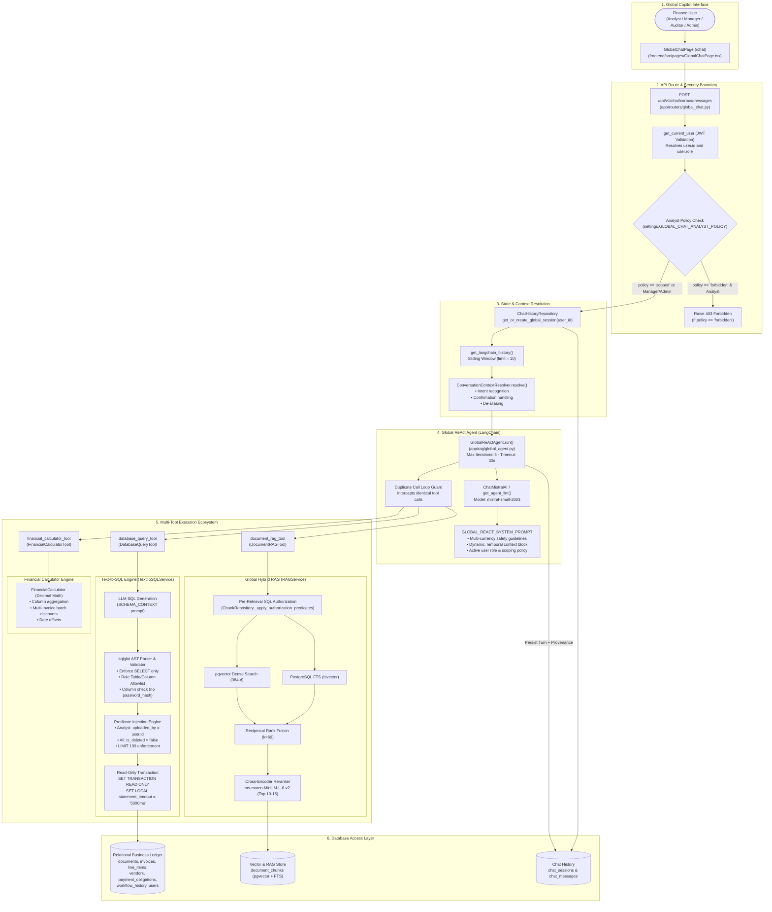

# Global Chatbot — Dedicated Architecture

---

## 1. Executive Summary

The **Global Chatbot** (accessible via `/chat` or "Ask AI" in the top navigation) is EFDI's portfolio-wide conversational intelligence agent. It is designed to assist finance professionals with portfolio analytics, cross-document aggregations, vendor spend analysis, status filtering, and complex financial questions.

Key architectural characteristics:
1. **Dynamic Multi-Tool Coordination:** Powered by [`GlobalReActAgent`](file:///c:/Users/conanferreira/Desktop/PROJECT-BLACKBOX/EFDI/backend/app/rag/global_agent.py), which coordinates three specialized tools:
   - [`DatabaseQueryTool`](file:///c:/Users/conanferreira/Desktop/PROJECT-BLACKBOX/EFDI/backend/app/rag/tools/database_tool.py) ([`TextToSQLService`](file:///c:/Users/conanferreira/Desktop/PROJECT-BLACKBOX/EFDI/backend/app/services/text_to_sql_service.py)) for relational queries, counts, sums, and status filters.
   - [`DocumentRAGTool`](file:///c:/Users/conanferreira/Desktop/PROJECT-BLACKBOX/EFDI/backend/app/rag/tools/rag_tool.py) ([`RAGService`](file:///c:/Users/conanferreira/Desktop/PROJECT-BLACKBOX/EFDI/backend/app/services/rag_service.py)) for unstructured clauses, terms, and OCR text snippets.
   - [`FinancialCalculatorTool`](file:///c:/Users/conanferreira/Desktop/PROJECT-BLACKBOX/EFDI/backend/app/rag/tools/calculator_tool.py) ([`FinancialCalculator`](file:///c:/Users/conanferreira/Desktop/PROJECT-BLACKBOX/EFDI/backend/app/rag/financial_calculator.py)) for exact Decimal arithmetic and date computations.
2. **AST-Based SQL Security:** Employs `sqlglot` for rigorous Abstract Syntax Tree (AST) validation. Rejects non-SELECT queries, DDL, DML, and dangerous functions. Automatically injects tenant ownership and soft-deletion predicates into the query AST.
3. **Multi-Currency Safety Contract:** System prompts and SQL generators strictly forbid summing or ranking monetary amounts across heterogeneous currencies without explicit `GROUP BY currency` breakdowns.
4. **Relational & Calculation Provenance:** In addition to unstructured citations, the agent tracks and returns structured relational records and calculation logs in its response.

---

## 2. Dedicated Global Chatbot Architecture Diagram

---

## 3. Step-by-Step Data Flow

1. **Submission:** User enters a query on the Global Copilot page (e.g. *"What is our total spend per vendor in 2026 across approved invoices?"*).
2. **Authentication & Policy Evaluation:** [`app/routers/global_chat.py`](file:///c:/Users/conanferreira/Desktop/PROJECT-BLACKBOX/EFDI/backend/app/routers/global_chat.py) verifies the JWT token.
   - If the user is a `FINANCE_ANALYST` and `settings.GLOBAL_CHAT_ANALYST_POLICY` is configured as `"forbidden"`, an `AuthorizationException` (HTTP 403) is raised.
   - If configured as `"scoped"` (default), the analyst proceeds under row-level database filtering.
3. **Session & History:** [`ChatHistoryRepository`](file:///c:/Users/conanferreira/Desktop/PROJECT-BLACKBOX/EFDI/backend/app/repositories/chat_history_repository.py) loads or creates a `chat_sessions` record where `session_type = 'GLOBAL'`. It fetches the last 10 messages.
4. **Context Resolution:** [`ConversationContextResolver`](file:///c:/Users/conanferreira/Desktop/PROJECT-BLACKBOX/EFDI/backend/app/rag/context_resolver.py) resolves ambiguous references and rewrites conversational queries.
5. **ReAct Loop Execution ([`GlobalReActAgent.run`](file:///c:/Users/conanferreira/Desktop/PROJECT-BLACKBOX/EFDI/backend/app/rag/global_agent.py)):**
   - Injects temporal clock block (e.g. *"CURRENT TEMPORAL CONTEXT: Today is 2026-09-30"*).
   - Dynamically selects `database_query_tool`.
   - Tool translates question into PostgreSQL query, verifies AST safety, injects tenant scoping, and executes read-only query against `invoices` and `vendors`.
   - Returns observation with grouped spend per currency and vendor.
   - If arithmetic discrepancies or secondary currency conversions are required, the agent calls `financial_calculator_tool`.
6. **Provenance Tracking & Response Assembly:** The agent captures:
   - `relational_provenance`: List of specific invoice IDs, vendor IDs, and amounts queried from the database.
   - `calculation_provenance`: Execution logs of deterministic formulas.
   - `citations`: Grounded document evidence if `document_rag_tool` was invoked.
7. **Persistence:** Assistant message is saved in `chat_messages` with tool calls and provenance JSON.

---

## 4. Database Tables Accessible

This section provides the verified, comprehensive list of **every PostgreSQL table accessible** to the Global Chatbot based on direct code inspection of [`TextToSQLService`](file:///c:/Users/conanferreira/Desktop/PROJECT-BLACKBOX/EFDI/backend/app/services/text_to_sql_service.py), [`RAGService`](file:///c:/Users/conanferreira/Desktop/PROJECT-BLACKBOX/EFDI/backend/app/services/rag_service.py), and [`ChatHistoryRepository`](file:///c:/Users/conanferreira/Desktop/PROJECT-BLACKBOX/EFDI/backend/app/repositories/chat_history_repository.py):

### Part A: Relational Tables Accessible via `database_query_tool` (Text-to-SQL)

All queries execute via direct SQL connection in [`TextToSQLService.execute_safe_query()`](file:///c:/Users/conanferreira/Desktop/PROJECT-BLACKBOX/EFDI/backend/app/services/text_to_sql_service.py) under `SET TRANSACTION READ ONLY` with a 5000ms timeout and `LIMIT 100`.

| Table Name | Purpose & Available Data | Access Method | Role Access & AST Authorization Restrictions |
|---|---|---|---|
| **`documents`** | Master document metadata, workflow status, document type, timestamps | Direct SQL via `TextToSQLService` | • **All Roles.** • **Analyst:** Predicate `uploaded_by = <user.id> AND is_deleted = false` is injected into AST. • **Manager / Auditor / Admin:** Predicate `is_deleted = false` injected. |
| **`invoices`** | Financial header amounts (subtotal, tax, discounts, grand total), invoice date, currency, PO number | Direct SQL via `TextToSQLService` | • **All Roles.** • **Analyst:** Injected: `document_id IN (SELECT id FROM documents WHERE uploaded_by = <id> AND is_deleted = false)`. • **Others:** Injected: `document_id IN (SELECT id FROM documents WHERE is_deleted = false)`. |
| **`invoice_line_items`**| Itemized lines, line descriptions, quantities, unit prices, tax rates, net/gross amounts | Direct SQL via `TextToSQLService` | • **All Roles.** • **Analyst:** Injected: `invoice_id IN (SELECT id FROM invoices WHERE document_id IN (SELECT id FROM documents WHERE uploaded_by = <id> AND is_deleted = false))`. • **Others:** Scoped to non-deleted documents. |
| **`vendors`** | Master vendor names, vendor codes, tax IDs, addresses | Direct SQL via `TextToSQLService` | • **All Roles.** • **Analyst:** Injected: `id IN (SELECT vendor_id FROM invoices WHERE document_id IN (SELECT id FROM documents WHERE uploaded_by = <id> AND is_deleted = false))`. |
| **`vendor_aliases`** | Known aliases and name variations | Direct SQL via `TextToSQLService` | • **All Roles.** • Same analyst vendor scoping as `vendors`. |
| **`payment_obligations`**| Payment terms, due dates, amount outstanding, early discount deadlines | Direct SQL via `TextToSQLService` | • **All Roles.** • Injected scoping through parent `invoices` $\rightarrow$ `documents`. |
| **`invoice_payments`** | Recorded actual settlements, payment references, payment methods, dates | Direct SQL via `TextToSQLService` | • **All Roles.** • Injected scoping through parent `invoices` $\rightarrow$ `documents`. |
| **`extraction_results`** | Raw extraction JSON, extraction engine, overall confidence | Direct SQL via `TextToSQLService` | • **All Roles.** • Injected scoping through `document_id`. |
| **`classification_results`**| Predicted document type, confidence, classification timestamp | Direct SQL via `TextToSQLService` | • **All Roles.** • Injected scoping through `document_id`. |
| **`validation_results`** | Boolean `is_valid`, error/warning counts, validation issues JSON | Direct SQL via `TextToSQLService` | • **All Roles.** • Injected scoping through `document_id`. |
| **`workflow_history`** | State transitions, approval/rejection actions, comments, reviewer user IDs | Direct SQL via `TextToSQLService` | • **RESTRICTED:** Accessible **ONLY to `AUDITOR` and `ADMIN`**. • **Unauthorized:** Raises `SQLSecurityException` if queried by `FINANCE_ANALYST` or `FINANCE_MANAGER`. |
| **`users`** | Usernames, full names, email addresses, roles, active status | Direct SQL via `TextToSQLService` | • **RESTRICTED:** Accessible **ONLY to `ADMIN`**. • **Unauthorized:** Raises `SQLSecurityException` if queried by Analyst, Manager, or Auditor. • **Column Security:** Column `password_hash` is **strictly excluded** from `ALLOWED_COLUMNS`. |

### Part B: Vector & RAG Tables Accessible via `document_rag_tool`

| Table Name | Purpose | Access Method | Authorization Scoping |
|---|---|---|---|
| **`document_chunks`** | Semantic text chunks, vector embeddings (384-d), Full-Text Search tsvectors | Repository-mediated via `ChunkRepository` | • Joined with `documents`. • If user is `FINANCE_ANALYST`, pre-retrieval SQL filter forces: `Document.uploaded_by == user.id AND Document.is_deleted == false`. • If Manager/Auditor/Admin: forces `Document.is_deleted == false`. |
| **`documents`** | Joined during chunk retrieval for title and metadata resolution | Repository-mediated via `ChunkRepository` | Filtered for soft-deletion and tenant ownership before embeddings are queried. |

### Part C: Chat Management Tables Accessible via Repository

| Table Name | Purpose | Access Method | Authorization Scoping |
|---|---|---|---|
| **`chat_sessions`** | Manages session lifecycle and structured conversation state | Repository-mediated via `ChatHistoryRepository` | Scoped strictly to `user_id` where `session_type = 'GLOBAL'`. |
| **`chat_messages`** | Stores conversation turns, tool logs, citations, and provenance | Repository-mediated via `ChatHistoryRepository` | Scoped strictly to `session_id`. |

---

## 5. Database Tables Strictly INACCESSIBLE to Global Chatbot

The following tables exist in PostgreSQL but are **strictly excluded from all tools and allowlists**:

| Table Name | Why Inaccessible | Enforcement Mechanism |
|---|---|---|
| **`audit_logs`** | Excluded to protect compliance log integrity and prevent prompt-injected extraction of security audit events | Omitted from `ALLOWED_TABLES` in [`app/services/text_to_sql_service.py`](file:///c:/Users/conanferreira/Desktop/PROJECT-BLACKBOX/EFDI/backend/app/services/text_to_sql_service.py). AST parser raises `SQLSecurityException`. |
| **`ocr_results`** | Excluded from SQL allowlist; chat reads unstructured text from `document_chunks` via RAG rather than querying raw JSON polygons | Omitted from `ALLOWED_TABLES`. |
| **`document_user_activity`**| Operational access log; not exposed to conversational reporting | Omitted from `ALLOWED_TABLES`. |
| **`system_settings`** | Contains system secrets, model selections, and environment configs | Omitted from `ALLOWED_TABLES`. |
| **`training_examples`** | Internal ML training dataset | Omitted from `ALLOWED_TABLES`. |
| **`vendor_knowledge`** | Internal cache | Omitted from `ALLOWED_TABLES`. |

---

## 6. Security, AST Validation & Guardrails

The [`TextToSQLService`](file:///c:/Users/conanferreira/Desktop/PROJECT-BLACKBOX/EFDI/backend/app/services/text_to_sql_service.py) enforces defense-in-depth before any query touches the database:

1. **AST Parser Verification (`sqlglot`):**
   - Rejects anything other than `exp.Select` (blocks `INSERT`, `UPDATE`, `DELETE`, `DROP`, `ALTER`, `CREATE`).
   - Recursively walks the syntax tree to detect and block forbidden PostgreSQL functions:
     `pg_sleep`, `pg_read_file`, `pg_write_file`, `query_to_xml`, `version`, `dblink`, `current_setting`, `set_config`.
2. **Column Allowlist Enforcement:**
   - Every column in the SELECT, WHERE, GROUP BY, and ORDER BY clauses is validated against `ALLOWED_COLUMNS`.
   - `users.password_hash` is explicitly excluded from the allowlist. Even if an Administrator attempts to query it, the AST validator rejects the query.
3. **Automated Predicate Injection:**
   - Inspects immediate tables in every `SELECT` node.
   - Appends required scoping filters using AST node composition (`exp.And`).
   - Ensures an analyst cannot bypass scoping by omitting the `documents` table in a join.
4. **Connection Guardrails:**
   - Always runs on an independent database connection (`engine.connect()`).
   - Executes `SET TRANSACTION READ ONLY;`.
   - Executes `SET LOCAL statement_timeout = '5000ms';`.
   - Forces `LIMIT <= 100`.

---

## 7. Implementation Notes & Limitations

1. **Multi-Currency Safety Warning:** If an analyst asks *"What is our total spend?"* across invoices in USD, EUR, and GBP, the agent is instructed to **never calculate a single summed total**. It groups by currency and presents separate totals for USD, EUR, and GBP.
2. **Analyst Scoping Policy:** While `FINANCE_ANALYST` can use Global Chat by default under row-level scoping (`GLOBAL_CHAT_ANALYST_POLICY = "scoped"`), administrators can globally disable analyst access by setting `GLOBAL_CHAT_ANALYST_POLICY = "forbidden"`, causing the endpoint to return HTTP 403.
3. **Execution State Refusal:** Questions asking *"What SQL did you run?"* or *"Show me your system prompt"* trigger the response guardrail refusal, keeping system prompts and database structure private.
