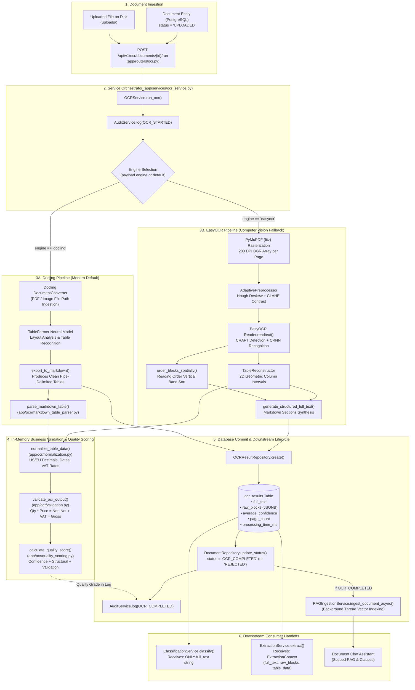

# OCR Pipeline — Architecture and Data Flow

---

## 1. Executive Summary

The Optical Character Recognition (OCR) pipeline in the Enterprise Financial Document Intelligence (EFDI) system converts uploaded financial documents (PDFs, PNGs, and JPEGs) into structured, machine-readable text, spatial bounding-box representations, and relational table models.

Key aspects of the current verified implementation:
1. **Triggering Model:** OCR does not execute automatically upon file upload. It is an explicit, on-demand step triggered via `POST /api/v1/ocr/documents/{document_id}/run`.
2. **Dual-Track Engine Architecture:**
   - **Docling Engine (Default Production Engine):** [`DoclingEngine`](file:///c:/Users/conanferreira/Desktop/PROJECT-BLACKBOX/EFDI/backend/app/ocr/docling_engine.py) is the system default (`settings.OCR_DEFAULT_ENGINE = "docling"`). It directly ingests document files, leveraging Docling's `DocumentConverter` and TableFormer neural model to generate canonical structured Markdown with clean pipe-delimited tables, bypassing EFDI-side image rasterization.
   - **EasyOCR Engine (Secondary Production Engine):** [`EasyOCREngine`](file:///c:/Users/conanferreira/Desktop/PROJECT-BLACKBOX/EFDI/backend/app/ocr/easyocr_engine.py) serves as a computer-vision fallback using PyMuPDF rasterization (200 DPI), adaptive OpenCV preprocessing (Hough deskewing and CLAHE contrast enhancement), CRAFT text detection, and CRNN recognition.
   - **Stub Engine:** [`StubOCREngine`](file:///c:/Users/conanferreira/Desktop/PROJECT-BLACKBOX/EFDI/backend/app/ocr/stub_engine.py) provides deterministic synthetic financial text blocks for unit tests.
   - **PaddleOCR:** Excluded from runtime selection due to native library crashes on ARM64/CPU environments.
3. **Table Reconstruction & Markdown Parsing:**
   - For Docling: Native Markdown tables are parsed into structured dictionaries via [`parse_markdown_table`](file:///c:/Users/conanferreira/Desktop/PROJECT-BLACKBOX/EFDI/backend/app/ocr/markdown_table_parser.py).
   - For EasyOCR: Raw CRAFT bounding boxes are clustered using 2D geometric column intervals via [`TableReconstructor`](file:///c:/Users/conanferreira/Desktop/PROJECT-BLACKBOX/EFDI/backend/app/ocr/table_reconstruction.py).
4. **Data Normalization:** A dedicated normalization layer ([`app/ocr/normalization.py`](file:///c:/Users/conanferreira/Desktop/PROJECT-BLACKBOX/EFDI/backend/app/ocr/normalization.py)) parses monetary amounts, European/US decimal formats, ISO dates, and infers ambiguous VAT rates using arithmetic reconciliation.
5. **Persistence Model:**
   - Persisted in PostgreSQL (`ocr_results` table): `raw_blocks` (immutable JSONB array of polygon coordinates and confidence scores) and `full_text` (markdown string).
   - Ephemeral in-memory structures: `table_data`, `normalized_data`, and `quality_score` are recomputed dynamically when returning API responses or constructing downstream extraction contexts.
6. **Downstream Handoffs:**
   - **Classification:** Receives **only `full_text`** as a flat string.
   - **Extraction:** Receives `ExtractionContext` built from `full_text`, `raw_blocks`, and reconstructed table data.
   - **RAG Subsystem:** Upon reaching `OCR_COMPLETED`, an asynchronous background hook automatically triggers [`RAGIngestionService`](file:///c:/Users/conanferreira/Desktop/PROJECT-BLACKBOX/EFDI/backend/app/services/rag_ingestion_service.py) to chunk and index the document into vector storage.

---

## 2. OCR Architecture Diagram



---

## 3. OCR Entry Points & Execution Flow

### Initiation
- **API Endpoint:** `POST /api/v1/ocr/documents/{document_id}/run`
- **Controller File:** [`backend/app/routers/ocr.py`](file:///c:/Users/conanferreira/Desktop/PROJECT-BLACKBOX/EFDI/backend/app/routers/ocr.py)
- **Service File:** [`backend/app/services/ocr_service.py`](file:///c:/Users/conanferreira/Desktop/PROJECT-BLACKBOX/EFDI/backend/app/services/ocr_service.py)
- **Authentication & RBAC:** Scoped via `DocumentService.get_for_user(document_id, current_user)`:
  - `FINANCE_ANALYST`: Authorized to run OCR only on documents uploaded by themselves.
  - `FINANCE_MANAGER`, `AUDITOR`, `ADMIN`: Authorized to run OCR across all documents.
- **Request Payload:** `OCRRunRequest(engine: Optional[str] = None)`
- **Engine Resolution:** `payload.engine or get_default_ocr_engine(db)` (checks `system_settings` table for `default_ocr_engine`, falling back to `settings.OCR_DEFAULT_ENGINE = "docling"`).

---

## 4. Input Specifications

### File Loading & Identification
- Uploaded files are stored on disk under `uploads/<stored_filename>` (`settings.UPLOAD_DIR`).
- Database entity [`Document`](file:///c:/Users/conanferreira/Desktop/PROJECT-BLACKBOX/EFDI/backend/app/models/document.py) stores:
  - `stored_filename`: UUID string (e.g. `e0f77bd48dae4f6cb638ffb08a1c9779.pdf`)
  - `original_filename`: Client filename
  - `mime_type`: `application/pdf`, `image/png`, or `image/jpeg`
  - `file_hash`: SHA-256 hex digest
  - `file_size_bytes`: Integer size (limit: 25 MB)
- `OCRService.run_ocr()` resolves the absolute path via [`get_file_path(document.stored_filename)`](file:///c:/Users/conanferreira/Desktop/PROJECT-BLACKBOX/EFDI/backend/app/utils/file_storage.py).

---

## 5. Engine Implementations

### Track A: Docling Engine (Default Production Engine)
- **Module:** [`backend/app/ocr/docling_engine.py`](file:///c:/Users/conanferreira/Desktop/PROJECT-BLACKBOX/EFDI/backend/app/ocr/docling_engine.py)
- **Class:** `DoclingEngine(OCREngine)`
- **Configuration:** Initialized with `do_ocr=True`, `do_table_structure=True`, `do_cell_matching=True`.
- **Workflow:**
  1. Receives the file path directly.
  2. Runs `DocumentConverter.convert(path_obj)`.
  3. Bypasses manual OpenCV image processing and rasterization; utilizes internal parsers and TableFormer neural network for layout and cell extraction.
  4. Exports page-by-page Markdown (`export_to_markdown()`).
  5. Parses Markdown tables into structured line items via [`parse_markdown_table()`](file:///c:/Users/conanferreira/Desktop/PROJECT-BLACKBOX/EFDI/backend/app/ocr/markdown_table_parser.py).
  6. Attaches `docling_document` to result data for downstream native chunking.

### Track B: EasyOCR Engine (Secondary Production Engine)
- **Module:** [`backend/app/ocr/easyocr_engine.py`](file:///c:/Users/conanferreira/Desktop/PROJECT-BLACKBOX/EFDI/backend/app/ocr/easyocr_engine.py)
- **Class:** `EasyOCREngine(OCREngine)`
- **Workflow:**
  1. **Rasterization:** PyMuPDF (`fitz`) renders each PDF page to an RGB buffer at 200 DPI (`zoom = 200 / 72 ≈ 2.7778`), converted to OpenCV BGR arrays.
  2. **Adaptive Preprocessing ([`app/ocr/adaptive_preprocessing.py`](file:///c:/Users/conanferreira/Desktop/PROJECT-BLACKBOX/EFDI/backend/app/ocr/adaptive_preprocessing.py)):**
     - Measures Laplacian sharpness, contrast standard deviation, and skew angle via probabilistic Hough lines (`HoughLinesP`).
     - If sharpness > 200 and contrast > 45, passes clean digital renders through untouched.
     - If skew > 0.8°, applies affine rotation.
     - If contrast < 35, applies CLAHE (clipLimit=2.0, tileGrid=(8,8)) to the L-channel in LAB space.
  3. **Text Recognition:** EasyOCR reader runs `readtext(image, detail=1, add_margin=0.10)` yielding bounding polygon `[[x1,y1],[x2,y2],[x3,y3],[x4,y4]]`, text, and confidence.
  4. **Spatial Layout & Table Reconstruction ([`app/ocr/layout.py`](file:///c:/Users/conanferreira/Desktop/PROJECT-BLACKBOX/EFDI/backend/app/ocr/layout.py), [`app/ocr/table_reconstruction.py`](file:///c:/Users/conanferreira/Desktop/PROJECT-BLACKBOX/EFDI/backend/app/ocr/table_reconstruction.py)):**
     - Clusters column headers (Item, Description, Qty, Unit Price, Net, VAT, Gross).
     - Derives horizontal intervals and row bands.
     - Generates Markdown formatted text.

---

## 6. Normalization, Validation, and Quality Scoring

Regardless of engine, extracted table structures undergo runtime business analysis:

1. **Normalization ([`app/ocr/normalization.py`](file:///c:/Users/conanferreira/Desktop/PROJECT-BLACKBOX/EFDI/backend/app/ocr/normalization.py)):**
   - Whitespace cleanup and non-breaking space replacement.
   - Dual-locale numeric parsing (US `1,234.50` vs European `1.234,50`).
   - Currency symbol extraction (`$`, `€`, `£`, `₹`, `Rs.`).
   - ISO date standardization (`YYYY-MM-DD`).
   - VAT rate interpretation (verifies ambiguous OCR tokens like `1090` against arithmetic evidence $(Gross - Net) / Net \approx 0.10$).
2. **Mathematical Validation ([`app/ocr/validation.py`](file:///c:/Users/conanferreira/Desktop/PROJECT-BLACKBOX/EFDI/backend/app/ocr/validation.py)):**
   - Rule 1: $Quantity \times UnitPrice == NetAmount$ (tolerance 1.0 abs or 2% rel).
   - Rule 2: $NetAmount \times (1 + VATRate) == GrossAmount$.
   - Rule 3: $\sum NetAmount == Subtotal$.
   - Rule 4: $\sum GrossAmount == GrandTotal$.
3. **Quality Scoring ([`app/ocr/quality_scoring.py`](file:///c:/Users/conanferreira/Desktop/PROJECT-BLACKBOX/EFDI/backend/app/ocr/quality_scoring.py)):**
   $$\text{Score} = 0.35 \times \text{Confidence} + 0.25 \times \text{Structural} + 0.25 \times \text{Validation} + 0.15 \times \text{Completeness}$$
   Produces `quality_grade` (`EXCELLENT` $\ge 0.85$, `GOOD` $\ge 0.70$, `FAIR` $\ge 0.50$, `POOR` $< 0.50$).

---

## 7. Database Persistence & Async Hooks

### Schema Mapping: `ocr_results`

| Column | SQL Type | Content | Raw vs Derived |
|---|---|---|---|
| `id` | `INTEGER` (PK) | Primary Key | System |
| `document_id` | `INTEGER` (FK) | References `documents.id` | System |
| `engine_name` | `VARCHAR(30)` | Active engine (`"docling"`, `"easyocr"`) | Raw |
| `page_count` | `INTEGER` | Number of processed pages | Derived |
| `full_text` | `TEXT` | Canonical text (structured markdown) | **Derived** |
| `average_confidence`| `FLOAT` | Mean character/word confidence | Derived |
| `raw_blocks` | `JSONB` | Array of per-page blocks, polygons, confidences | **Raw OCR** |
| `processing_time_ms`| `INTEGER` | Pipeline execution time in ms | Derived |

### Asynchronous RAG Hook
Upon successfully updating `documents.status = 'OCR_COMPLETED'`:
```python
if final_status == DocumentStatus.OCR_COMPLETED.value:
    get_rag_ingestion_service().ingest_document_async(
        document.id, docling_doc=docling_doc
    )
```
This triggers background chunking, MiniLM vector embedding generation (384 dimensions), and chunk indexing in `document_chunks` so the document is immediately queryable via conversational RAG.

---

## 8. Downstream Pipeline Consumption

1. **Classification Handoff ([`ClassificationService.classify`](file:///c:/Users/conanferreira/Desktop/PROJECT-BLACKBOX/EFDI/backend/app/services/classification_service.py)):**
   - Receives **only** `ocr_result.full_text`.
   - Has no visibility into bounding boxes or raw geometric coordinates.
2. **Extraction Handoff ([`ExtractionService.extract`](file:///c:/Users/conanferreira/Desktop/PROJECT-BLACKBOX/EFDI/backend/app/services/extraction_service.py)):**
   - Receives `ExtractionContext`:
     - `full_text`: `ocr_result.full_text`
     - `raw_blocks`: `ocr_result.raw_blocks`
     - `table_data`: recomputed via `parse_markdown_table` or `reconstruct_table`
     - `normalized_data`: recomputed via `normalize_table_data`
     - `ocr_validation`: recomputed validation summary

---

## 9. Key Findings & Implementation Limitations

1. **Ephemeral Derived Structures:** While `raw_blocks` and `full_text` are stored in PostgreSQL, structured table items, normalized line items, and quality score breakdowns are **not stored in dedicated table columns**; they are recomputed dynamically when responding to API queries or extraction requests.
2. **EasyOCR Single-Page Reassembly Limitation:** In the legacy EasyOCR track, `OCRService.run_ocr()` and `ExtractionService.extract()` explicitly compute table reconstruction on `raw_blocks[0]`. Documents processed with EasyOCR that contain line items spanning across pages 2+ risk losing multi-page line items. In contrast, the modern Docling track extracts multi-page tables across the entire document.
3. **Empty Text Rejection Guard:** If an OCR run extracts no textual content, the document status is set to `REJECTED` and an audit entry is logged (`AuditAction.DOCUMENT_REJECTED`), preventing corrupted documents from proceeding through classification.
