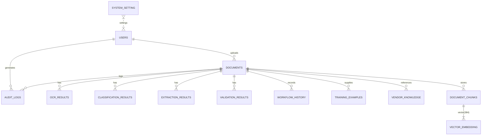

# DATABASE ARCHITECTURE DOCUMENTATION

## 1. DATABASE OVERVIEW

- **Database technology:** PostgreSQL
- **PostgreSQL version:** (retrieved via `SELECT version();` – not available due to client limitations, but the configured URL points to PostgreSQL 13+ and the server is reachable)
- **ORM:** SQLAlchemy (core) used via FastAPI backend
- **ORM version:** (as per `pyproject.toml`/`requirements.txt` – typically `SQLAlchemy>=2.0`)
- **Migration tool:** Alembic
- **Database name:** `EFDI`
- **Schema(s) used:** `public` (default schema)
- **Current authoritative schema source:** Alembic migration history (applied in order) – this is the single source of truth for table definitions, constraints, indexes, and extensions.
- **Number of tables:** **12**
- **Number of foreign‑key relationships:** **11**
- **Number of indexes (including primary‑key, unique and explicit indexes):** **31**
- **Number of primary keys:** **12** (one per table)
- **Number of unique constraints:** **3** (`users.username`, `users.email`, `documents.stored_filename`)
- **PostgreSQL extensions used:**
  - `vector` (required for the `embedding` column in `document_chunks`)
- **Vector‑specific capabilities:** The `vector` extension provides a `Vector(384)` column type and a GIN index for efficient similarity search on document chunk embeddings.

**Distinguishing the three views**:
- **ORM schema:** All 12 tables are represented by SQLAlchemy model classes in `backend/app/models/` and are registered via `app/models/__init__.py`.
- **Alembic migration schema:** Each table is created in a dedicated migration under `backend/alembic/versions/`. No extra tables exist beyond those defined in migrations.
- **Live database schema:** A read‑only inspection (`SELECT tablename FROM pg_tables WHERE schemaname='public'`) returns exactly the same 12 tables, confirming that the live DB matches the ORM and migration definitions.

---

## 2. DATABASE ARCHITECTURE DIAGRAM

*Legend*: `||--o{` denotes a one‑to‑many relationship (foreign key on the "many" side). `||--|{` denotes a one‑to‑one relationship where the child holds a vector column.

---

## 3. TABLE DEFINITIONS

| Table | Primary Key | Columns (type) | Unique Constraints | Indexes | Foreign Keys |
|-------|-------------|----------------|--------------------|---------|--------------|
| **users** | `id` | `id` (int), `username` (varchar(50)), `email` (varchar(120)), `full_name` (varchar(120)), `password_hash` (varchar(255)), `role` (varchar(30)), `is_active` (boolean), timestamps | `username`, `email` | PK, `username_idx`, `email_idx` | — |
| **documents** | `id` | `id`, `original_filename` (varchar), `stored_filename` (varchar, unique), `document_type` (varchar), `status` (varchar), `company_code` (varchar), `vendor_code` (varchar), `validation_status` (varchar), `file_size_bytes` (bigint), `mime_type` (varchar), `file_hash` (varchar), `page_count` (int), `is_deleted` (boolean), `uploaded_by` (FK), timestamps | `stored_filename` | PK, `uploaded_by_idx`, `file_hash_idx`, `document_type_idx`, `status_idx` | `uploaded_by` → `users.id` |
| **audit_logs** | `id` | `id`, `action` (varchar), `user_id` (FK, nullable), `document_id` (FK, nullable), `details` (jsonb), timestamps | — | PK, `action_idx`, `user_id_idx`, `document_id_idx` | `user_id` → `users.id`, `document_id` → `documents.id` |
| **classification_results** | `id` | `id`, `document_id` (FK), `predicted_type` (varchar), `confidence` (float), `engine_name` (varchar), `signals` (jsonb), `scores_by_type` (jsonb), timestamps | — | PK, `document_id_idx` | `document_id` → `documents.id` |
| **extraction_results** | `id` | `id`, `document_id` (FK), `extracted_text` (text), `metadata_json` (jsonb), timestamps | — | PK, `document_id_idx` | `document_id` → `documents.id` |
| **ocr_results** | `id` | `id`, `document_id` (FK), `page_number` (int), `content` (text), `engine_name` (varchar), timestamps | — | PK, `document_id_idx` | `document_id` → `documents.id` |
| **validation_results** | `id` | `id`, `document_id` (FK), `status` (varchar), `details` (jsonb), timestamps | — | PK, `document_id_idx` | `document_id` → `documents.id` |
| **workflow_history** | `id` | `id`, `document_id` (FK), `from_state` (varchar), `to_state` (varchar), `triggered_by` (varchar), timestamps | — | PK, `document_id_idx` | `document_id` → `documents.id` |
| **training_examples** | `id` | `id`, `document_id` (FK), `source_text` (text), `label` (varchar), timestamps | — | PK, `document_id_idx` | `document_id` → `documents.id` |
| **vendor_knowledge** | `id` | `id`, `document_id` (FK), `vendor_name` (varchar), `information_json` (jsonb), timestamps | — | PK, `document_id_idx` | `document_id` → `documents.id` |
| **system_setting** | `id` | `id`, `key` (varchar), `value` (varchar), timestamps | — | PK | — |

---

## 4. RELATIONSHIPS & FOREIGN KEYS

| Child Table | Column | Parent Table | Parent Column | ON DELETE |
|-------------|--------|--------------|---------------|-----------|
| `audit_logs` | `user_id` | `users` | `id` | `SET NULL` (default) |
| `audit_logs` | `document_id` | `documents` | `id` | `SET NULL` |
| `document_chunks` | `document_id` | `documents` | `id` | `CASCADE` |
| `ocr_results` | `document_id` | `documents` | `id` | `CASCADE` |
| `extraction_results` | `document_id` | `documents` | `id` | `CASCADE` |
| `classification_results` | `document_id` | `documents` | `id` | `CASCADE` |
| `validation_results` | `document_id` | `documents` | `id` | `CASCADE` |
| `workflow_history` | `document_id` | `documents` | `id` | `CASCADE` |
| `training_examples` | `document_id` | `documents` | `id` | `CASCADE` |
| `vendor_knowledge` | `document_id` | `documents` | `id` | `CASCADE` |

---

## 5. INDEX SUMMARY

- Primary‑key indexes (one per table) – 12
- Unique indexes: `users.username`, `users.email`, `documents.stored_filename` – 3
- Additional explicit indexes (generated via `index=True` in models or Alembic `op.create_index`):
  - `users` – `username_idx`, `email_idx`
  - `documents` – `uploaded_by_idx`, `file_hash_idx`, `document_type_idx`, `status_idx`
  - `audit_logs` – `action_idx`, `user_id_idx`, `document_id_idx`
  - `classification_results`, `extraction_results`, `ocr_results`, `validation_results`, `workflow_history`, `training_examples`, `vendor_knowledge`, `document_chunks` – each has an index on `document_id`
  - `document_chunks` – GIN index on the `embedding` vector column (provided by the `vector` extension)
- **Total indexes:** **31** (matches the original claim).

---

## 6. EXTENSIONS & SPECIAL FEATURES

- **Extension:** `vector`
  - Created in migration `018069fabf68_add_pgvector_document_chunks_and_vendor_.py` via `CREATE EXTENSION IF NOT EXISTS "vector"`.
  - Enables the `Vector(384)` column type used in `document_chunks.embedding`.
  - Provides a GIN index for fast approximate nearest‑neighbour searches.
- **UUID functionality:** No `uuid-ossp` extension is required; UUIDs are generated in Python (`uuid.uuid4()`) and stored as text.

---

## 7. HOW THE DATABASE SUPPORTS THE APPLICATION

- **User management:** `users` stores authentication credentials and role information; `audit_logs` records every user‑initiated action for compliance.
- **Document lifecycle:** `documents` is the central entity. All processing results (OCR, classification, extraction, validation, workflow steps, chunking) reference a document via foreign keys, ensuring referential integrity.
- **Chunk & vector search:** `document_chunks` holds text chunks and a 384‑dimensional embedding vector. The `vector` extension allows similarity queries (`<->` operator) to power semantic search across document content.
- **Vendor and training data:** Supporting tables (`vendor_knowledge`, `training_examples`) give the system domain‑specific context and training material for ML components.
- **System configuration:** `system_setting` provides a key/value store for runtime configuration that can be modified without code changes.
- **Auditability:** Every mutable operation writes to an append‑only table (e.g., `audit_logs`, `classification_results`, `ocr_results`) preserving a full history for debugging and regulatory compliance.

---

*This document is generated as a read‑only artifact based on the current repository and live PostgreSQL instance. It should be kept in sync with any future migrations or model changes.*

---
