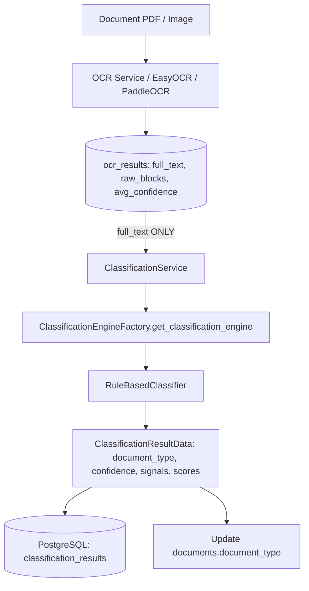

# RAW_BLOCKS EXPERIMENT ARCHITECTURE AUDIT

**Project:** EFDI (Enhanced Financial Document Intake)  
**Audit Date:** 2026-09-05  
**Auditor:** Antigravity AI Document Intelligence Architecture & Forensic Inspector  
**Subject:** Forensic audit of experimental `raw_blocks` classification code, files, and architectural touchpoints  
**Status:** Audit Completed — Awaiting User Approval before any modification or cleanup  

---

## 1. Executive Summary

A comprehensive forensic audit of the entire EFDI codebase was conducted following the decision to **REJECT** the experimental use of OCR `raw_blocks` in document classification.

### Key Audit Findings:
1. **Production Path is Intact & Isolated:** The production classification path ([ClassificationService](file:///c:/Users/conanferreira/Desktop/PROJECT-BLACKBOX/EFDI/backend/app/services/classification_service.py) $\rightarrow$ [RuleBasedClassifier](file:///c:/Users/conanferreira/Desktop/PROJECT-BLACKBOX/EFDI/backend/app/classification/rule_based.py)) has remained 100% text-based throughout the experiment. `ClassificationService.classify` exclusively passes `ocr_result.full_text` to the engine.
2. **Zero Database / Schema / Migration Leakage:** No database schema changes, table alterations, or Alembic migrations were introduced for the experiment.
3. **Only One Production File Modified:** The only production file touched by the experiment was [backend/app/classification/factory.py](file:///c:/Users/conanferreira/Desktop/PROJECT-BLACKBOX/EFDI/backend/app/classification/factory.py), where `experimental_rule_based` was registered as an optional pluggable engine.
4. **Isolated Experimental Files Identified:** Three experimental application modules, one experimental test file, several scratch evaluation scripts, and two evaluation output files were created solely for the study.
5. **Pre-Existing OCR `raw_blocks` Functionality Preserved:** `raw_blocks` in `ocr_results`, OCR engines, and table reconstruction are pre-existing core capabilities of the OCR subsystem (Phase 4/6) and must remain untouched.

---

## 2. Production Architecture Before Experiment

The intended production document classification architecture in EFDI is strictly text-based and deterministic:



### Contract:
- **`ClassificationEngine.classify(text: str) -> ClassificationResultData`**
- **Input:** Document text extracted from `OCRResult.full_text`.
- **Logic:** Lexical keyword and regex matching across 9 document classes (`POI`, `NPO`, `IMA`, `MSI`, `PSI`, `JER`, `BKA`, `DPR`, `LCA`) with minimum confidence thresholding (`MIN_CONFIDENCE = 0.23`) and contextual text-based disambiguation (`_apply_po_npo_disambiguation`, `_apply_msi_npo_disambiguation`).

---

## 3. Current Architecture

An audit of the runtime classification path confirms that **`raw_blocks` has NOT leaked into the production classification execution flow**:

- `ClassificationService.classify` (lines 34–35) continues to call:
  ```python
  engine = get_classification_engine(engine_name or "rule_based")
  result_data = engine.classify(ocr_result.full_text)
  ```
- `RuleBasedClassifier.classify` (lines 280–282) takes `text: str` and operates exclusively on `text.lower()` and `text`.
- The classification API router (`POST /api/v1/classification/documents/{document_id}/classify`) defaults to `engine="rule_based"`.
- `ClassificationEngine` interface in `base.py` requires only `classify(self, text: str) -> ClassificationResultData`.

The only point of coupling is the registration of the `experimental_rule_based` singleton in `factory.py`.

---

## 4. Files Introduced by the Experiment

The following files were created specifically for the `full_text` + `raw_blocks` classification experiment:

| File | Purpose | Category | Recommended Action |
|:---|:---|:---:|:---|
| [`backend/app/classification/text_analyzer.py`](file:///c:/Users/conanferreira/Desktop/PROJECT-BLACKBOX/EFDI/backend/app/classification/text_analyzer.py) | Modular lexical analyzer created to ensure exact parity with baseline text rules during the experiment | **C** (Experiment-Only) | **DELETE** upon approval |
| [`backend/app/classification/layout_analyzer.py`](file:///c:/Users/conanferreira/Desktop/PROJECT-BLACKBOX/EFDI/backend/app/classification/layout_analyzer.py) | Spatial rule analyzer parsing `raw_blocks` bounding boxes for classification | **C** (Experiment-Only) | **DELETE** upon approval |
| [`backend/app/classification/experimental_classifier.py`](file:///c:/Users/conanferreira/Desktop/PROJECT-BLACKBOX/EFDI/backend/app/classification/experimental_classifier.py) | `ExperimentalRuleBasedClassifier` combining text and layout scores | **C** (Experiment-Only) | **DELETE** upon approval |
| [`backend/tests/test_experimental_classifier.py`](file:///c:/Users/conanferreira/Desktop/PROJECT-BLACKBOX/EFDI/backend/tests/test_experimental_classifier.py) | Unit tests created for `LayoutRuleAnalyzer` and `ExperimentalRuleBasedClassifier` | **C** (Experiment-Only) | **DELETE** upon approval |
| [`scratch/run_experimental_evaluation.py`](file:///c:/Users/conanferreira/Desktop/PROJECT-BLACKBOX/EFDI/scratch/run_experimental_evaluation.py) | Script executing the 3-way ablation evaluation across 250 documents | **C** (Experiment-Only) | **DELETE** or retain in `scratch/` |
| [`scratch/compute_metrics.py`](file:///c:/Users/conanferreira/Desktop/PROJECT-BLACKBOX/EFDI/scratch/compute_metrics.py) | Helper script calculating cross-tabulation and precision/recall metrics | **C** (Experiment-Only) | **DELETE** or retain in `scratch/` |
| [`scratch/audit_raw_blocks_references.py`](file:///c:/Users/conanferreira/Desktop/PROJECT-BLACKBOX/EFDI/scratch/audit_raw_blocks_references.py) | Temporary forensic scanning script | **C** (Experiment-Only) | **DELETE** upon approval |
| [`EXPERIMENT_FULLTEXT_PLUS_RAWBLOCKS_CLASSIFICATION_REPORT.md`](file:///c:/Users/conanferreira/Desktop/PROJECT-BLACKBOX/EFDI/EXPERIMENT_FULLTEXT_PLUS_RAWBLOCKS_CLASSIFICATION_REPORT.md) | Technical evaluation report documenting experimental findings | **C** (Experiment-Only Document) | **RETAIN** as historical audit record |
| [`EXPERIMENT_FULLTEXT_PLUS_RAWBLOCKS_RESULTS.csv`](file:///c:/Users/conanferreira/Desktop/PROJECT-BLACKBOX/EFDI/EXPERIMENT_FULLTEXT_PLUS_RAWBLOCKS_RESULTS.csv) | Machine-readable document-level evaluation data | **C** (Experiment-Only Data) | **RETAIN** as historical audit record |

---

## 5. Production Files Modified by the Experiment

| File | Change Introduced | Category | Recommended Action |
|:---|:---|:---:|:---|
| [`backend/app/classification/factory.py`](file:///c:/Users/conanferreira/Desktop/PROJECT-BLACKBOX/EFDI/backend/app/classification/factory.py) | Imported `ExperimentalRuleBasedClassifier`, added `"experimental_rule_based"` to `SUPPORTED_CLASSIFIERS`, and added singleton factory branch | **C** (Experiment-Only) | **REVERT** lines importing and registering `experimental_rule_based` |
| [`backend/app/classification/base.py`](file:///c:/Users/conanferreira/Desktop/PROJECT-BLACKBOX/EFDI/backend/app/classification/base.py) | None (retained `classify(self, text: str) -> ClassificationResultData`) | **A** (Pre-Existing) | **NO ACTION** (already clean) |
| [`backend/app/classification/rule_based.py`](file:///c:/Users/conanferreira/Desktop/PROJECT-BLACKBOX/EFDI/backend/app/classification/rule_based.py) | None (retained `classify(self, text: str) -> ClassificationResultData`) | **A** (Pre-Existing) | **NO ACTION** (already clean) |
| [`backend/app/classification/ml_classifier.py`](file:///c:/Users/conanferreira/Desktop/PROJECT-BLACKBOX/EFDI/backend/app/classification/ml_classifier.py) | None (retained `classify(self, text: str) -> ClassificationResultData`) | **A** (Pre-Existing) | **NO ACTION** (already clean) |
| [`backend/app/services/classification_service.py`](file:///c:/Users/conanferreira/Desktop/PROJECT-BLACKBOX/EFDI/backend/app/services/classification_service.py) | None (retained `engine.classify(ocr_result.full_text)`) | **A** (Pre-Existing) | **NO ACTION** (already clean) |

---

## 6. `raw_blocks` References Across the Entire Codebase

Every occurrence of `raw_blocks` in the repository was analyzed to determine its subsystem ownership:

| File Path | Subsystem | Purpose & Usage | Category |
|:---|:---:|:---|:---:|
| `backend/app/models/ocr_result.py` | **Persistence** | ORM column `raw_blocks: Mapped[list] = mapped_column(JSONB)` storing OCR detections | **D** (Valid OCR Core) |
| `backend/app/schemas/ocr.py` | **Schemas/API** | Pydantic field `raw_blocks: list[dict]` in `OCRResultResponse` | **D** (Valid OCR Core) |
| `backend/app/repositories/ocr_result_repository.py` | **Persistence** | CRUD repository methods writing/reading `raw_blocks` in DB | **D** (Valid OCR Core) |
| `backend/app/services/ocr_service.py` | **OCR Service** | Aggregates per-page block detections from OCR engines, calls spatial ordering and table reconstruction | **D** (Valid OCR Core) |
| `backend/app/ocr/layout.py` | **OCR / Layout** | Reconstructs natural non-interleaved reading order for multi-column documents | **D** (Valid OCR Core) |
| `backend/app/ocr/table_reconstruction.py` | **OCR / Tables** | Reconstructs tabular line-items from OCR bounding boxes | **D** (Valid OCR Core) |
| `backend/app/ocr/normalization.py` | **OCR / Tables** | Normalizes reconstructed table data | **D** (Valid OCR Core) |
| `backend/app/routers/ocr.py` | **OCR Router** | Returns OCR execution results including raw block data | **D** (Valid OCR Core) |
| `backend/tests/test_phase4_ocr.py` | **Tests** | Verifies OCR raw blocks generation, bounding boxes, and storage | **D** (Valid OCR Core) |
| `backend/tests/test_ocr_layout.py` | **Tests** | Verifies reading-order reconstruction from raw block coordinates | **D** (Valid OCR Core) |
| `backend/tests/test_ocr_table_reconstruction.py` | **Tests** | Verifies table grid reconstruction from raw block coordinates | **D** (Valid OCR Core) |
| `backend/tests/test_phase6_extraction.py` | **Tests** | Verifies field extraction consuming OCR text/table data | **D** (Valid OCR Core) |
| `backend/app/classification/layout_analyzer.py` | **Classification** | Analyzes `raw_blocks` for document classification | **C** (Experiment-Only) |
| `backend/app/classification/experimental_classifier.py` | **Classification** | Consumes `raw_blocks` in experimental classifier | **C** (Experiment-Only) |
| `backend/tests/test_experimental_classifier.py` | **Tests** | Tests `raw_blocks` classification analyzer | **C** (Experiment-Only) |

---

## 7. Classification Architecture Integrity

| Inspection Question | Direct Finding |
|:---|:---|
| **Does `ClassificationService` still retrieve OCR `full_text`?** | **YES.** `ClassificationService.classify` calls `engine.classify(ocr_result.full_text)`. |
| **Does `RuleBasedClassifier` still accept `text`?** | **YES.** Signature is `def classify(self, text: str) -> ClassificationResultData:`. |
| **Does the production classifier depend on `raw_blocks`?** | **NO.** `RuleBasedClassifier` has zero dependencies on `raw_blocks` or coordinates. |
| **Is `ExperimentalRuleBasedClassifier` imported in production?** | **Only in `factory.py`** (to be reverted). Not used in any router or service. |
| **Is `LayoutRuleAnalyzer` imported anywhere in production?** | **NO.** Only imported inside `experimental_classifier.py`. |
| **Is `TextRuleAnalyzer` imported anywhere in production?** | **NO.** Only imported inside `experimental_classifier.py`. |
| **Are layout weighting/multiplier rules active in production?** | **NO.** Production rules in `rule_based.py` use only lexical weights and text disambiguation. |
| **Has the `ClassificationEngine` interface changed?** | **NO.** Interface is `classify(self, text: str) -> ClassificationResultData`. |
| **Has the classification API contract changed?** | **NO.** API route and request/response schemas are unchanged. |
| **Has the database schema changed due to the experiment?** | **NO.** Zero schema changes were made. |
| **Have any migrations been added due to the experiment?** | **NO.** Zero migration files were generated. |

---

## 8. Recommended Cleanup Plan

Upon explicit user approval, the cleanup will execute the following surgical actions:

### A. Remove Experiment-Only Application Files:
1. `backend/app/classification/text_analyzer.py`
2. `backend/app/classification/layout_analyzer.py`
3. `backend/app/classification/experimental_classifier.py`

### B. Remove Experiment-Only Test Files:
1. `backend/tests/test_experimental_classifier.py`

### C. Remove Temporary Scratch Files:
1. `scratch/audit_raw_blocks_references.py`
2. `scratch/compute_metrics.py`
3. `scratch/run_experimental_evaluation.py`

### D. Revert Single Production File Change:
In [`backend/app/classification/factory.py`](file:///c:/Users/conanferreira/Desktop/PROJECT-BLACKBOX/EFDI/backend/app/classification/factory.py):
- Remove `from app.classification.experimental_classifier import ExperimentalRuleBasedClassifier`
- Restore `SUPPORTED_CLASSIFIERS = ("rule_based", "ml_classifier")`
- Remove the `elif engine_name == "experimental_rule_based":` singleton branch.

---

## 9. DO NOT DELETE (Critical Retention List)

The following components MUST REMAIN completely intact:
- **OCR `raw_blocks` Generation:** `EasyOCREngine.extract_text_blocks`, `PaddleOCREngine.extract_text_blocks`, `OCRService.run_ocr`.
- **OCR `raw_blocks` Persistence:** `OCRResult.raw_blocks` column, `OCRResultRepository`.
- **OCR Layout & Table Reconstruction:** `app/ocr/layout.py`, `app/ocr/table_reconstruction.py`, `app/ocr/normalization.py`.
- **Production Classification Engine:** `app/classification/rule_based.py` (`RuleBasedClassifier`, `RULES`, `MIN_CONFIDENCE`, text disambiguation).
- **Production Classification Tests:** `backend/tests/test_phase5_classification.py`.
- **All Phase Tests:** `test_phase1_foundation.py` through `test_phase10_bulk_intake.py`.
- **Historical Reports:** `POI_JER_CLASSIFIER_EVALUATION_REPORT.md`, `EXPERIMENT_FULLTEXT_PLUS_RAWBLOCKS_CLASSIFICATION_REPORT.md`, `EXPERIMENT_FULLTEXT_PLUS_RAWBLOCKS_RESULTS.csv`.

---

## 10. Post-Cleanup Architecture

Following cleanup, the system will have zero experimental code remnants and will reflect the clean text-only classification design:

```
backend/app/classification/
├── __init__.py
├── base.py               # Abstract ClassificationEngine interface: classify(text: str)
├── factory.py            # Factory supporting ("rule_based", "ml_classifier")
├── ml_classifier.py      # ML-ready classification engine stub
└── rule_based.py         # Production text-based RuleBasedClassifier
```

---

## 11. Audit Conclusion & Hold State

**AUDIT COMPLETE.**  
No source code, configuration, or database modifications have been made during this phase.

Awaiting explicit approval to execute the cleanup plan.
