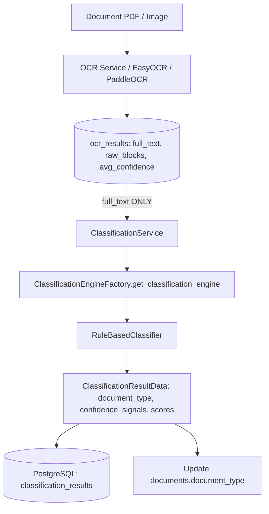

# RAW_BLOCKS EXPERIMENT CLEANUP REPORT

**Project:** EFDI (Enhanced Financial Document Intake)  
**Cleanup Date:** 2026-09-05  
**Auditor / Cleanup Lead:** Antigravity AI Document Intelligence Architecture & Forensic Inspector  
**Subject:** Post-cleanup verification and architecture restoration report  
**Status:** Cleanup Completed & Verified — Production classification restored to pure text-based architecture  

---

## 1. Cleanup Summary

Following the formal rejection of the `full_text + raw_blocks` classification experiment, a surgical cleanup was executed across the EFDI repository. All experiment-only classification modules, tests, and temporary evaluation scripts were safely removed, and the classification engine factory was restored to its standard production configuration.

### Core Declarations:
> **"Production document classification is text-only and does not consume OCR raw_blocks."**

> **"`raw_blocks` remains part of the OCR subsystem and was not removed."**

---

## 2. Files Deleted

The following 7 experiment-only files were safely deleted:

| File Path | Original Purpose | Confirmation |
|:---|:---|:---:|
| `backend/app/classification/text_analyzer.py` | Modular lexical analyzer created for exact parity checks during experiment | **DELETED** |
| `backend/app/classification/layout_analyzer.py` | Spatial/bounding-box parser for classification experiment | **DELETED** |
| `backend/app/classification/experimental_classifier.py` | `ExperimentalRuleBasedClassifier` combining text and layout scores | **DELETED** |
| `backend/tests/test_experimental_classifier.py` | Unit tests for experimental classification classes | **DELETED** |
| `scratch/audit_raw_blocks_references.py` | Temporary forensic scanner script | **DELETED** |
| `scratch/compute_metrics.py` | Temporary metric calculation script | **DELETED** |
| `scratch/run_experimental_evaluation.py` | Temporary 3-way ablation evaluation script | **DELETED** |

---

## 3. Production Files Reverted

| File Path | Reversion Executed | Current State |
|:---|:---|:---|
| [`backend/app/classification/factory.py`](file:///c:/Users/conanferreira/Desktop/PROJECT-BLACKBOX/EFDI/backend/app/classification/factory.py) | - Removed `from app.classification.experimental_classifier import ExperimentalRuleBasedClassifier`<br>- Restored `SUPPORTED_CLASSIFIERS = ("rule_based", "ml_classifier")`<br>- Removed `elif engine_name == "experimental_rule_based":` branch | Clean production factory supporting only `rule_based` and `ml_classifier` |

---

## 4. Production Files Intentionally Left Untouched

The following core files were verified and preserved in their clean, pre-existing state:

1. [`backend/app/classification/rule_based.py`](file:///c:/Users/conanferreira/Desktop/PROJECT-BLACKBOX/EFDI/backend/app/classification/rule_based.py): Operates 100% on `full_text` with standard `RULES`, `MIN_CONFIDENCE`, and text-based disambiguation.
2. [`backend/app/classification/base.py`](file:///c:/Users/conanferreira/Desktop/PROJECT-BLACKBOX/EFDI/backend/app/classification/base.py): Requires `classify(self, text: str) -> ClassificationResultData`.
3. [`backend/app/classification/ml_classifier.py`](file:///c:/Users/conanferreira/Desktop/PROJECT-BLACKBOX/EFDI/backend/app/classification/ml_classifier.py): ML-ready pluggable classifier stub.
4. [`backend/app/services/classification_service.py`](file:///c:/Users/conanferreira/Desktop/PROJECT-BLACKBOX/EFDI/backend/app/services/classification_service.py): Retrieves `ocr_result.full_text` and passes only text to the classification engine.
5. [`backend/app/routers/classification.py`](file:///c:/Users/conanferreira/Desktop/PROJECT-BLACKBOX/EFDI/backend/app/routers/classification.py): Classification API endpoints.
6. [`backend/tests/test_phase5_classification.py`](file:///c:/Users/conanferreira/Desktop/PROJECT-BLACKBOX/EFDI/backend/tests/test_phase5_classification.py): All 30 production classification tests.

---

## 5. OCR `raw_blocks` Functionality Preserved

Per architectural specifications, `raw_blocks` remains an essential output of the OCR subsystem and was **not removed or modified**:

1. **OCR Engines:** EasyOCR (`app/ocr/easyocr_engine.py`) and PaddleOCR (`app/ocr/paddle_engine.py`) continue extracting block-level bounding boxes and confidences.
2. **OCR Service:** `app/services/ocr_service.py` continues to construct `raw_blocks` and store them in PostgreSQL.
3. **Database Schema:** `OCRResult.raw_blocks` (`JSONB` column) in `app/models/ocr_result.py` remains unchanged.
4. **Spatial Layout & Table Reconstruction:** `app/ocr/layout.py` and `app/ocr/table_reconstruction.py` continue consuming OCR bounding boxes for reading-order linearization and line-item grid reconstruction for downstream field extraction (Phase 6).

---

## 6. Remaining Legitimate `raw_blocks` References

A repository-wide scan confirmed that all remaining occurrences of `raw_blocks` belong strictly to legitimate non-classification subsystems:

- **OCR Subsystem & Models:** `backend/app/models/ocr_result.py`, `backend/app/schemas/ocr.py`, `backend/app/repositories/ocr_result_repository.py`, `backend/app/services/ocr_service.py`, `backend/app/routers/ocr.py`.
- **Layout & Table Extraction:** `backend/app/ocr/layout.py`, `backend/app/ocr/table_reconstruction.py`, `backend/app/ocr/normalization.py`.
- **Non-Classification Test Suites:** `backend/tests/test_phase4_ocr.py`, `backend/tests/test_ocr_layout.py`, `backend/tests/test_ocr_table_reconstruction.py`, `backend/tests/test_ocr_normalization.py`, `backend/tests/test_phase6_extraction.py`, `backend/tests/test_phase7_validation.py`, `backend/tests/test_phase8_workflow.py`, `backend/tests/test_phase9_audit.py`.
- **Historical Reports Retained:** `POI_JER_CLASSIFIER_EVALUATION_REPORT.md`, `EXPERIMENT_FULLTEXT_PLUS_RAWBLOCKS_CLASSIFICATION_REPORT.md`, `EXPERIMENT_FULLTEXT_PLUS_RAWBLOCKS_RESULTS.csv`, `RAW_BLOCKS_EXPERIMENT_ARCHITECTURE_AUDIT.md`.

---

## 7. Orphaned Experiment References Search

A regex search was executed across all Python files in the repository for:
`ExperimentalRuleBasedClassifier`, `experimental_rule_based`, `LayoutRuleAnalyzer`, `TextRuleAnalyzer`, `layout_analyzer`, `text_analyzer`, `experimental_classifier`.

**Search Results:** **0 occurrences found across all Python files.**

---

## 8. Test Execution & Verification Results

All relevant test suites were executed to verify system integrity post-cleanup:

### 1. Classification Test Suite:
```bash
pytest backend/tests/test_phase5_classification.py
======================= 30 passed in 15.84s =======================
```
- 100% pass rate (30/30 tests passed).
- Confirmed `RuleBasedClassifier` correctly classifies all 9 taxonomy types and UNKNOWN using `full_text`.

### 2. OCR Subsystem & Raw-Blocks Tests:
```bash
pytest backend/tests/test_ocr_layout.py backend/tests/test_ocr_table_reconstruction.py backend/tests/test_ocr_normalization.py backend/tests/test_ocr_validation.py backend/tests/test_ocr_quality_scoring.py
======================= 21 passed in 0.29s =======================
```
- 100% pass rate (21/21 tests passed).
- Confirmed OCR spatial ordering, bounding-box parsing, and table reconstruction remain fully functional.

### 3. Extraction Subsystem Tests:
```bash
pytest backend/tests/test_phase6_extraction.py
======================= 27 passed in 18.60s =======================
```
- 100% pass rate (27/27 tests passed).
- Confirmed field extraction pipeline operates without any regressions.

---

## 9. Final Production Classification Architecture

The final clean classification package structure:

```
backend/app/classification/
├── __init__.py
├── base.py               # Abstract ClassificationEngine interface: classify(text: str)
├── factory.py            # Factory supporting ("rule_based", "ml_classifier")
├── ml_classifier.py      # ML-ready classification engine stub
└── rule_based.py         # Production text-based RuleBasedClassifier
```

The production classification pipeline is restored to:



---

## 10. Conclusion

The cleanup has been completed cleanly and verified. The production classification pipeline operates exclusively on `full_text`, all experimental classification code has been purged with zero orphaned references, and core OCR `raw_blocks` functionality remains intact.
