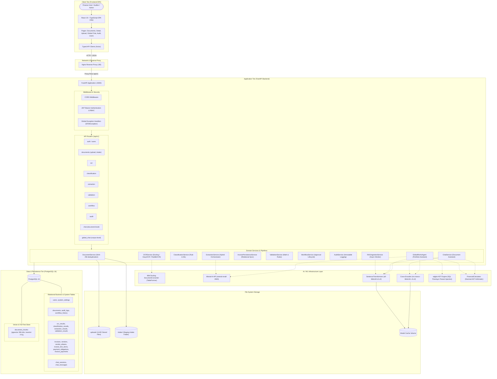
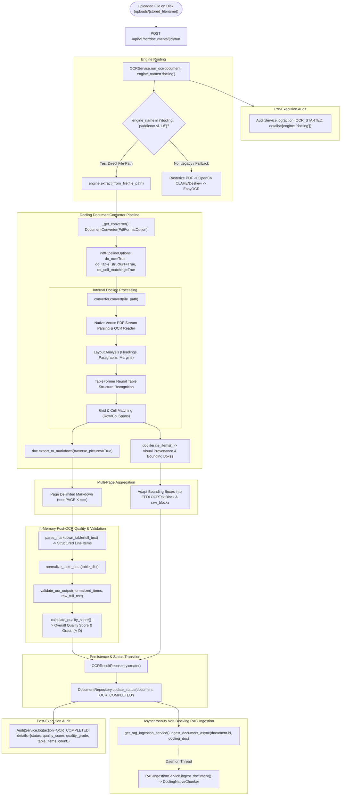
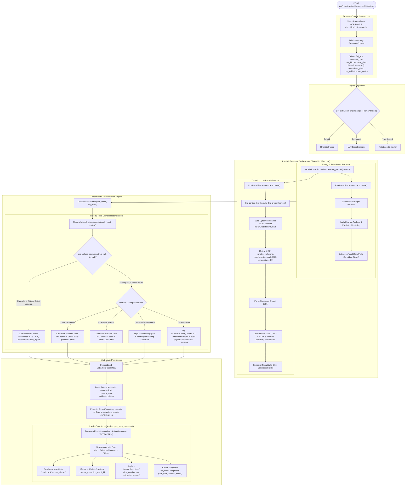
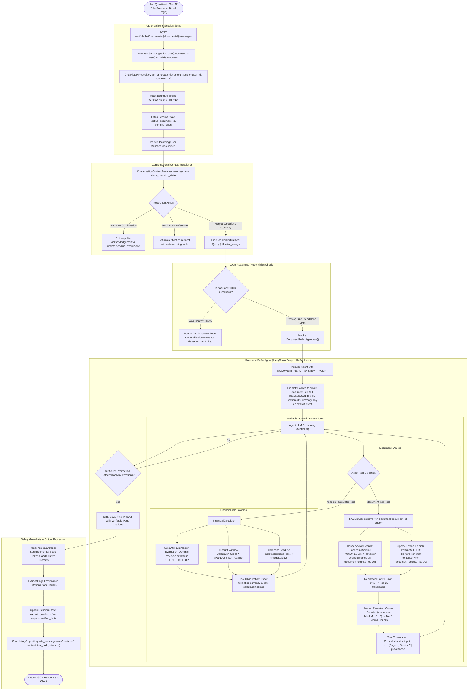
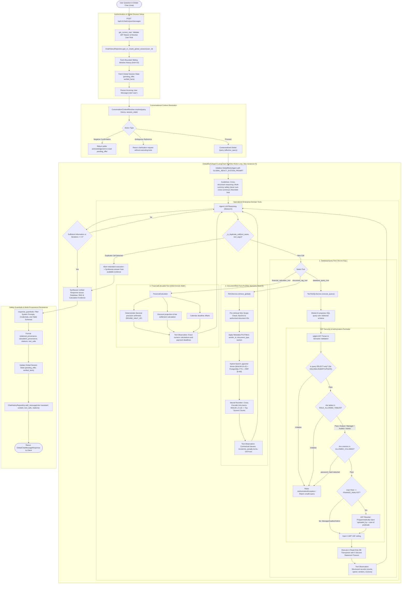

# Enterprise Financial Document Intelligence (EFDI)

> An enterprise-grade financial document automation, validation, and conversational intelligence platform for **Accounts Payable (AP)** and **Record-to-Report (R2R)** operations. EFDI transforms manual document processing into an intelligent, auditable workflow using layout-aware OCR (Docling), automated classification, hybrid LLM/rule extraction, deterministic reconciliation, business validation, approval governance, and dual-mode conversational AI (scoped Document Assistant and portfolio-wide Global ReAct Assistant).

---

## Table of Contents

- [Overview](#overview)
- [System Architecture](#system-architecture)
- [Technology Stack](#technology-stack)
- [Repository Structure](#repository-structure)
- [Document Processing Pipeline](#document-processing-pipeline)
  - [Document Ingestion](#document-ingestion)
  - [OCR Pipeline — Docling](#ocr-pipeline--docling)
  - [Document Classification](#document-classification)
  - [Intelligent Data Extraction & Reconciliation](#intelligent-data-extraction--reconciliation)
  - [Business Rule Validation](#business-rule-validation)
  - [Workflow Management & Approval Lifecycle](#workflow-management--approval-lifecycle)
- [RAG Architecture](#rag-architecture)
  - [Chunking & Indexing Pipeline](#chunking--indexing-pipeline)
  - [Hybrid Dense/Sparse Retrieval & Neural Reranking](#hybrid-densesparse-retrieval--neural-reranking)
- [Chatbot Architecture](#chatbot-architecture)
  - [Document-Level Chatbot](#document-level-chatbot)
  - [Global-Level Chatbot](#global-level-chatbot)
- [Security and Access Control](#security-and-access-control)
  - [Authentication & Role-Based Access Control (RBAC)](#authentication--role-based-access-control-rbac)
  - [AST-Level SQL Security & Tenant Isolation](#ast-level-sql-security--tenant-isolation)
  - [Response Guardrails & Prompt Protection](#response-guardrails--prompt-protection)
- [Database Architecture](#database-architecture)
- [API Architecture](#api-architecture)
- [End-to-End Workflow](#end-to-end-workflow)
- [Setup & Running the Application](#setup--running-the-application)
  - [Prerequisites](#prerequisites)
  - [Docker Compose Deployment](#docker-compose-deployment)
  - [Local Development Setup](#local-development-setup)
- [Architectural Findings & Implementation Notes](#architectural-findings--implementation-notes)

---

## Overview

Modern corporate finance teams manage high volumes of invoices, purchase orders, receipts, utility bills, and payment advices. These documents feature heterogeneous layouts, localized tax conventions (e.g., GST, VAT, sales tax), multi-page itemized tables, and complex contractual payment clauses. 

EFDI resolves operational bottlenecks by providing:
1. **Layout-Preserving Document Ingestion:** Native vector PDF stream extraction and neural table recognition powered by IBM's Docling and TableFormer.
2. **Hybrid Extraction with Deterministic Reconciliation:** Dual execution of rule-based regex and Mistral AI LLM extraction, reconciled field-by-field against table grounding and format validity without hallucinated defaults.
3. **Normalized Relational Business Schema:** Automatic projection of unstructured documents into queryable first-class relational entities (`invoices`, `vendors`, `invoice_line_items`, `payment_obligations`).
4. **Document-Level Conversational Copilot:** Scoped question-answering with structure-aware chunk retrieval and verifiable page-level citations.
5. **Portfolio-Wide Financial Intelligence Agent:** Multi-hop ReAct agent dynamically orchestrating AST-governed Text-to-SQL, corpus semantic search, and deterministic `Decimal` financial arithmetic.
6. **Defense-in-Depth Governance:** AST-based SQL query rewriting via `sqlglot` for tenant data isolation, strict table/column allowlists, output sanitization, and immutable audit logging.

---

## System Architecture

The following diagram illustrates the complete EFDI system architecture across the client SPA, API gateway, application tier, AI/ML inference layer, and data persistence tier.



---

## Technology Stack

### Frontend
- **Framework & Core:** React 19, TypeScript 5, Vite
- **Styling & UI:** Tailwind CSS, Radix UI primitives, Lucide React icons
- **State & Routing:** React Router v6 (`createBrowserRouter`), Context API (`AuthContext`, `ThemeContext`, `ToastContext`)
- **HTTP Client:** Axios with centralized error handling and JWT bearer interceptor
- **Rendering:** `react-markdown` with `remark-gfm` for rendering tables and citations

### Backend
- **Framework:** FastAPI (Python 3.12)
- **ASGI & Production Servers:** Uvicorn, Gunicorn
- **Configuration & Validation:** Pydantic v2, `pydantic-settings`
- **Database ORM & Migrations:** SQLAlchemy 2.0, Alembic
- **Security & Hashing:** Passlib with Bcrypt, PyJWT (HS256)

### AI, Machine Learning & OCR
- **Document Conversion & OCR:** IBM Docling (`docling` DocumentConverter with TableFormer neural network architecture), with legacy fallback support for EasyOCR, PaddleOCR, and Stub engine
- **LLM Provider:** Mistral AI (`mistral-small-2603`) via Chat Completion endpoint with `json_schema` strict structured outputs
- **Agent Framework:** LangChain core message abstraction (`SystemMessage`, `HumanMessage`, `AIMessage`, `ToolMessage`) orchestrated in custom iterative ReAct loops
- **Embeddings:** `sentence-transformers/all-MiniLM-L6-v2` (384-dimensional dense vectors)
- **Neural Reranking:** `cross-encoder/ms-marco-MiniLM-L-6-v2`
- **SQL Security & AST Parsing:** `sqlglot` for syntax verification, dialect translation, and AST manipulation
- **Arithmetic Engine:** Python standard library `ast` with `decimal.Decimal` (`ROUND_HALF_UP`)

### Data & Persistence
- **Primary Database:** PostgreSQL 16
- **Vector Search Extension:** `pgvector` (`vector(384)` with cosine distance operator `<=>`)
- **Lexical Search:** PostgreSQL Native Full-Text Search (`tsvector`, `to_tsquery('english', ...)`)
- **File Storage:** Local secure disk storage (`uploads/` for permanent storage, `intake/` for folder scans)

### Infrastructure & Deployment
- **Containerization:** Docker, Docker Compose
- **Web Server:** Nginx (reverse proxy and static asset server)
- **Volume Management:** Named volumes for PostgreSQL data, file uploads, logs, and ML model weights cache

---

## Repository Structure

```text
EFDI/
├── backend/
│   ├── alembic/                         # Database schema migrations
│   │   ├── versions/                    # Versioned migration scripts
│   │   └── env.py                       # Alembic environment runner
│   ├── app/
│   │   ├── audit/                       # Audit logging utilities
│   │   ├── classification/              # Rule-based and ML document classifiers
│   │   ├── core/                        # Centralized settings, exceptions, logging, security
│   │   ├── database/                    # SQLAlchemy engine, session management, base model
│   │   ├── extraction/                  # Parallel orchestrator, LLM & rule extractors, reconciliation
│   │   ├── models/                      # SQLAlchemy ORM database models (documents, invoices, chunks, chat)
│   │   ├── ocr/                         # Docling engine, TableFormer, preprocessing, quality scoring
│   │   ├── rag/                         # Embeddings, chunking, reranker, ReAct agents, tools, guardrails
│   │   │   ├── tools/                   # DatabaseQueryTool, DocumentRAGTool, FinancialCalculatorTool
│   │   │   ├── chunking.py              # StructureAwareChunker & DoclingNativeChunker
│   │   │   ├── document_agent.py        # Scoped Document ReAct Agent
│   │   │   ├── global_agent.py          # Portfolio-wide Global ReAct Agent
│   │   │   └── response_guardrails.py   # Output sanitization and prompt protection
│   │   ├── repositories/                # Database repository abstraction layer
│   │   ├── routers/                     # FastAPI endpoint definitions (/api/v1/*)
│   │   ├── schemas/                     # Pydantic request/response schemas
│   │   ├── services/                    # Business service layer (OCR, Extraction, RAG, Chat, Text-to-SQL)
│   │   └── utils/                       # File storage, clock, temporal prompt helpers
│   ├── tests/                           # 460 automated test cases across 38 suites
│   ├── Dockerfile                       # Backend container definition
│   ├── requirements.txt                 # Core backend dependencies
│   └── requirements-ocr.txt             # Optional heavy OCR/ML dependencies
├── frontend/
│   ├── src/
│   │   ├── components/                  # UI components (DocumentChat, StatusBadge, Tables, Modals)
│   │   ├── context/                     # AuthContext, ThemeContext
│   │   ├── hooks/                       # Custom React hooks (useDocumentPipeline, useApiErrorToast)
│   │   ├── layouts/                     # AppShell navigation layout
│   │   ├── lib/                         # Formatting utilities, Axios API client
│   │   ├── pages/                       # DocumentsList, DocumentDetail, Upload, GlobalChat, Audit, Users
│   │   ├── services/                    # Frontend API integration services
│   │   └── types/                       # TypeScript domain interfaces and enums
│   ├── Dockerfile                       # Multi-stage frontend container build
│   └── package.json                     # Frontend dependencies and build scripts
├── docs/                                # Technical specifications, evidence inventories, report updates
├── docker-compose.yml                   # Multi-container orchestration definition
├── .env.example                         # Environment template documentation
└── README.md                            # Authoritative repository documentation
```

---

## Document Processing Pipeline

The EFDI document processing pipeline advances documents through a deterministic state machine:
`UPLOADED` $\to$ `OCR_COMPLETED` $\to$ `EXTRACTED` $\to$ `VALIDATED` $\to$ `PENDING_APPROVAL` $\to$ `APPROVED` (or `REJECTED`).

```text
[Document Upload] ──> [Docling OCR] ──> [Classification] ──> [Hybrid Extraction & Reconciliation] ──> [Business Validation] ──> [Approval Workflow]
                             │                                             │
                             ▼                                             ▼
                 [Async RAG Ingestion]                       [Relational Invoices Projection]
```

### Document Ingestion
1. **Intake Channels:** Single or batch upload via multipart form (`POST /api/v1/documents/upload`) or folder-based staging scan (`POST /api/v1/documents/bulk-intake`).
2. **Integrity & Storage:** Generates a SHA-256 cryptographic checksum to detect duplicate uploads. Stores the file with a UUID-based filename in `uploads/` to prevent directory traversal and filename collisions.
3. **Tracking Record:** Initializes a row in `documents` with status `UPLOADED`, capturing MIME type, file size, original filename, and uploading user ID.

---

### OCR Pipeline — Docling

EFDI utilizes **IBM Docling** as its primary OCR and document reconstruction engine (`app/ocr/docling_engine.py`). For vector PDFs and images, Docling processes files directly from disk, bypassing lossy rasterization and ad-hoc OpenCV preprocessing.



**Docling Key Capabilities:**
- **TableFormer Recognition:** Recovers complex multi-line, borderless, and merged financial tables as clean pipe-delimited Markdown tables.
- **Visual Provenance:** Maps text bounding boxes to page geometry to preserve exact visual coordinates for audit inspection.
- **Quality Scoring:** Evaluates OCR output confidence, structural completeness, and numeric sanity, assigning quality scores (0–100) and grades (A to D).
- **Asynchronous Ingestion Trigger:** Upon reaching `OCR_COMPLETED`, asynchronously hands the native `DoclingDocument` object to `RAGIngestionService` to index chunks into pgvector without blocking HTTP response latency.

---

### Document Classification
- **Endpoint:** `POST /api/v1/classification/documents/{id}/classify`
- **Engines:** `RuleBasedClassifier` (default keyword and structural signal evaluator) and `MLClassifier` (scikit-learn architecture ready for offline training).
- **Taxonomy:** Supports standard financial document types: Non-PO Invoice (`NPO`), PO-based Invoice (`POI`), Itemized Medical/Expense Claim (`IMA`), Receipt (`REC`), Bank Statement (`BST`), Credit Note (`CRN`), Debit Note (`DBN`), Purchase Order (`PO`), and Payment Advice (`ADV`).
- **Human Correction:** Enables users to override misclassified types via `POST /api/v1/classification/documents/{id}/correct`. Updating the type immediately retargets downstream extraction to use the corrected schema.

---

### Intelligent Data Extraction & Reconciliation

EFDI employs a **Hybrid Extraction and Deterministic Reconciliation Engine** (`app/extraction/parallel_orchestrator.py` and `app/extraction/reconciliation.py`).



**Reconciliation Engine Rules:**
1. **Equivalence Detection:** Normalizes numbers (`$1,250.00` $\to$ `1250.00`) and dates (`12/04/2026` $\to$ `2026-04-12`) before comparison.
2. **Agreement Boost:** If both engines agree, confidence is boosted to 0.95–1.0 with provenance `both_agree`.
3. **Table Grounding:** If total amounts conflict, candidate values are validated against the sum of parsed table line items.
4. **No Hallucinated Defaults:** Missing values remain explicitly `None` rather than falling back to fictitious placeholders.
5. **Relational Synchronization:** Raw extractions are mirrored into queryable relational entities (`invoices`, `vendors`, `invoice_line_items`, `payment_obligations`) via `InvoicePersistenceService`.

---

### Business Rule Validation
- **Endpoint:** `POST /api/v1/validation/documents/{id}/validate`
- **Validation Rules:**
  - **Mandatory Fields:** Ensures mandatory fields exist for the document taxonomy.
  - **Mathematical Integrity:** Reconciles line item subtotal, tax amount, and discount against grand total:
    $$\text{Subtotal} + \text{Tax} - \text{Discount} = \text{Grand Total} \quad (\pm 0.05 \text{ rounding tolerance})$$
  - **Line Items Arithmetic:** Verifies that $\text{Quantity} \times \text{Unit Price} = \text{Amount}$ per line item.
  - **Duplicate Invoice Detection:** Checks whether the same vendor and invoice number already exist in the database.
- **Outcome:** Validated documents transition to `VALIDATED`. Discrepancies are flagged as structured validation issues without blocking manual review.

---

### Workflow Management & Approval Lifecycle
- **Endpoint:** `POST /api/v1/workflow/documents/{id}/transition`
- **State Machine:**
  - `SUBMIT`: Advances a `VALIDATED` document to `PENDING_APPROVAL`.
  - `APPROVE`: Authorized Finance Managers or Admins transition the document to `APPROVED`.
  - `REJECT`: Rejects the document with required audit reasoning to `REJECTED`.
- **Audit Trail:** Every status change is captured in `workflow_history` and `audit_logs` with timestamps and user IDs.

---

## RAG Architecture

EFDI implements a dual-mode Retrieval-Augmented Generation subsystem backed by PostgreSQL 16, `pgvector`, and local neural rerankers.

### Chunking & Indexing Pipeline
- **Chunkers:** 
  - `DoclingNativeChunker`: Leverages Docling's structural document tree, producing discrete chunks for document headers, itemized table blocks, narrative summaries, and contractual payment clauses.
  - `StructureAwareChunker`: Legacy spatial bounding-box chunker for raw text blocks.
- **Dense Embeddings:** `sentence-transformers/all-MiniLM-L6-v2` produces 384-dimensional dense vectors stored in `document_chunks.embedding`.
- **Lexical Indexing:** Generated PostgreSQL `tsvector` column (`tsv_content`) indexed via GIN for native BM25-style full-text search.
- **Idempotency:** When OCR re-runs, existing chunks for the document ID are deleted and re-indexed.

### Hybrid Dense/Sparse Retrieval & Neural Reranking
When a user submits a query to either conversational assistant, EFDI executes a **5-stage hybrid retrieval pipeline**:

```text
User Query
   │
   ├──> [Dense Retrieval]  : pgvector Cosine Distance (<=>) ───────────> Top-30 Chunks
   │
   └──> [Sparse Retrieval] : PostgreSQL FTS (to_tsvector @@ to_tsquery) ──> Top-30 Chunks
                                  │
                                  ▼
                   [Reciprocal Rank Fusion (RRF, k=60)]
                                  │
                                  ▼
                        Top-25 Fused Candidates
                                  │
                                  ▼
             [Cross-Encoder Reranker (ms-marco-MiniLM-L-6-v2)]
                                  │
                                  ▼
                      Top-5 Grounded Chunks with Page Provenance
```

---

## Chatbot Architecture

EFDI provides two distinct conversational copilots, cleanly separated by scope and security boundaries:
1. **Document-Level Chatbot:** Scoped strictly to a single document without database/SQL tool exposure.
2. **Global-Level Chatbot:** Operates portfolio-wide with Text-to-SQL, multi-document semantic search, and exact financial arithmetic.

---

### Document-Level Chatbot

Mounted directly inside the Document Detail view under the **"Ask AI"** tab (`POST /api/v1/chat/documents/{documentId}/messages`).



**Key Features:**
- **Strict Isolation:** The agent is completely unaware of and has no access to `DatabaseQueryTool`.
- **OCR Precondition Check:** Inquiries about document content are rejected if OCR has not run yet. Pure standalone math expressions (e.g., `Calculate 150000 * 0.98`) are allowed without OCR.
- **Accounts Payable (AP) Summary Directive:** Produces an operational 5-section invoice summary (`Invoice Overview`, `Payment Details`, `Amount Breakdown`, `Items / Services`, `AP Attention`) **only** when explicitly requested (e.g. *"Summarize this invoice"*). For normal specific inquiries (e.g. *"What is the invoice date?"*), the agent answers directly without prepending the summary structure.

---

### Global-Level Chatbot

Available at the top navigation route `/chat` (`POST /api/v1/chat/corpus/messages`), enabling finance managers, analysts, and auditors to query the enterprise portfolio.



**Key Features:**
- **Dynamic Tool Coordination:** Orchestrates multi-step reasoning across database aggregations (Text-to-SQL), semantic policy/clause lookups (Document RAG), and exact calculations (Financial Calculator).
- **Execution Loop Protection:** Capped at `MAX_ITERATIONS = 5`. The `_is_duplicate_call` helper detects repeating arguments and prevents infinite tool execution loops.
- **Global Timeout Budget:** Enforces a 30-second global request timeout to safeguard ASGI worker availability.
- **Multi-Currency Safety:** The system prompt explicitly forbids summing or ranking monetary figures across heterogeneous currency codes without conversion, enforcing currency grouping.

---

## Security and Access Control

### Authentication & Role-Based Access Control (RBAC)
- **JWT Authentication:** OAuth2 Bearer tokens signed with HS256 (`SECRET_KEY`).
- **Role Hierarchy:**
  - `FINANCE_ANALYST`: Can upload, run OCR, extract, and validate documents. Scoped strictly to documents uploaded by their user ID in Global Chat (`uploaded_by = user.id`).
  - `FINANCE_MANAGER`: Full document oversight; can approve or reject workflow transitions; portfolio-wide visibility.
  - `AUDITOR`: Read-only access across all documents, workflow histories, and immutable audit logs.
  - `ADMIN`: Complete system access, user administration (`/api/v1/users`), and configuration management.

### AST-Level SQL Security & Tenant Isolation
The `TextToSQLService` (`app/services/text_to_sql_service.py`) protects the database against SQL injection, privilege escalation, and data exfiltration:
1. **SELECT-Only Enforcement:** Uses `sqlglot` to parse the proposed SQL query into an Abstract Syntax Tree (AST). Rejects any query containing DDL or DML statements (`INSERT`, `UPDATE`, `DELETE`, `DROP`, `ALTER`, `TRUNCATE`, `GRANT`, `REVOKE`, etc.).
2. **Table & Column Allowlists:** Queries are restricted to pre-approved tables. Sensitive fields (`users.password_hash`) are strictly excluded.
3. **Programmatic AST Tenant Rewriting:** When a `FINANCE_ANALYST` issues a natural language query, the AST rewriter traverses the query tree and programmatically injects `uploaded_by = user.id` predicates into table join conditions, preventing unauthorized data access.
4. **Execution Boundaries:** Enforces read-only database connections, a 5-second PostgreSQL statement timeout (`SET statement_timeout = 5000`), and a hard `LIMIT 100` result ceiling.

### Response Guardrails & Prompt Protection
- **Prompt Isolation:** `response_guardrails.py` sanitizes assistant outputs, stripping any accidental leaks of system instructions, internal table schemas, or database credentials.
- **State Query Refusal:** Refuses user attempts to probe agent internal states or bypass security policies.

---

## Database Architecture

EFDI runs on **PostgreSQL 16** with the `pgvector` extension. The schema is organized into four logical clusters:

```text
┌────────────────────────────────────────────────────────────────────────┐
│                        PostgreSQL 16 Database                          │
├────────────────────────┬───────────────────────┬───────────────────────┤
│ Relational Entities    │ Processing Results    │ AI & Vector Storage   │
├────────────────────────┼───────────────────────┼───────────────────────┤
│ • users                │ • ocr_results         │ • document_chunks     │
│ • documents            │ • classification_res  │   (embedding: Vector) │
│ • invoices             │ • extraction_results  │   (tsv: TSVECTOR)     │
│ • vendors              │ • validation_results  ├───────────────────────┤
│ • vendor_aliases       │ • workflow_history    │ Conversational State  │
│ • invoice_line_items   │ • audit_logs          ├───────────────────────┤
│ • payment_obligations  │                       │ • chat_sessions       │
│ • invoice_payments     │                       │ • chat_messages       │
└────────────────────────┴───────────────────────┴───────────────────────┘
```

1. **Document Management:**
   - `documents`: Authoritative tracking record (`status`, `mime_type`, `sha256_hash`, `stored_filename`, `uploaded_by`).
   - `audit_logs`: Append-only immutable log of every action, status change, and user activity.
   - `workflow_history`: State machine audit trail for `SUBMIT`, `APPROVE`, and `REJECT` actions.
2. **Normalized Financial Projections:**
   - `invoices`: 1:1 projection of extracted invoice data (`invoice_number`, `invoice_date`, `currency`, `subtotal_amount`, `tax_amount`, `grand_total_amount`, `source_extraction_result_id`).
   - `vendors` & `vendor_aliases`: Master vendor entity and naming variations.
   - `invoice_line_items`: 1:N normalized item rows (`description`, `quantity`, `unit_price`, `amount`, `line_number`).
   - `payment_obligations`: Tracks due dates, payment statuses, and early payment discount terms.
   - `invoice_payments`: Settlement logs (deliberately isolated from extraction).
3. **Vector & Full-Text Search:**
   - `document_chunks`: Stores semantic text blocks. Contains `embedding` (`vector(384)`) indexed via HNSW/IVFFlat and `tsv_content` (`tsvector`) indexed via GIN.
4. **Chat & Session State:**
   - `chat_sessions`: Tracks `session_type` (`DOCUMENT` vs `GLOBAL`), user associations, and `state_json` (pending conversational offers, verified facts).
   - `chat_messages`: Turn history storing user queries, assistant responses, structured `tool_calls` JSON, and `citations` JSON.

---

## API Architecture

The FastAPI backend exposes versioned endpoints under `/api/v1`:

| Router Prefix | Primary Endpoints | Description |
| :--- | :--- | :--- |
| `/auth` | `POST /login`, `POST /refresh`, `GET /me` | JWT login, token rotation, and current user profile |
| `/users` | `GET /`, `POST /`, `PATCH /{id}/role` | Admin-only user management and role assignment |
| `/documents` | `POST /upload`, `POST /bulk-intake`, `GET /`, `GET /{id}` | File intake, deduplication, search, and download |
| `/ocr` | `POST /documents/{id}/run`, `GET /documents/{id}/result` | Trigger Docling OCR, view full text and bounding boxes |
| `/classification` | `POST /documents/{id}/classify`, `POST /documents/{id}/correct` | Run document classification and human correction |
| `/extraction` | `POST /documents/{id}/extract`, `PATCH /documents/{id}/fields/{key}` | Hybrid extraction, reconciliation, and field corrections |
| `/validation` | `POST /documents/{id}/validate`, `GET /documents/{id}/result` | Run mathematical and business rule consistency checks |
| `/workflow` | `POST /documents/{id}/transition`, `GET /documents/{id}/history` | State machine transitions (`SUBMIT`, `APPROVE`, `REJECT`) |
| `/audit` | `GET /logs`, `GET /documents/{id}/logs` | Query append-only audit trail with filtering |
| `/chat` | `POST /documents/{id}/messages`, `GET /documents/{id}/history` | Scoped Document Assistant conversational endpoint |
| `/chat/corpus` | `POST /messages`, `GET /history`, `DELETE /history` | Global Portfolio Multi-Tool Assistant conversational endpoint |

---

## End-to-End Workflow

```text
1. INGESTION
   User uploads invoice (PDF/image) ──> SHA-256 deduplication ──> Save UUID file to uploads/ ──> Document status = UPLOADED

2. OCR (DOCLING)
   POST /ocr/documents/{id}/run ──> Docling converts file ──> TableFormer parses tables ──> Status = OCR_COMPLETED
   └──> Non-blocking trigger: RAGIngestionService chunks and embeds document into pgvector

3. CLASSIFICATION
   POST /classification/documents/{id}/classify ──> Rule/ML engine evaluates signals ──> document_type set (e.g. NPO)

4. HYBRID EXTRACTION & RECONCILIATION
   POST /extraction/documents/{id}/extract ──> Parallel execution:
   ├── Thread 1: RuleBasedExtractor (regex + spatial heuristics)
   └── Thread 2: LLMBasedExtractor (Mistral AI structured JSON schema)
   ReconciliationEngine reconciles candidates ──> Status = EXTRACTED
   └──> Syncs relational entities into invoices, vendors, invoice_line_items, payment_obligations

5. BUSINESS VALIDATION
   POST /validation/documents/{id}/validate ──> Math check: Subtotal + Tax - Discount == Grand Total
   └──> Zero discrepancies: Status = VALIDATED (Errors flagged for review)

6. WORKFLOW APPROVAL
   Analyst triggers SUBMIT ──> Status = PENDING_APPROVAL
   Manager triggers APPROVE ──> Status = APPROVED

7. CONVERSATIONAL INTELLIGENCE
   • Scoped: Analyst opens "Ask AI" tab ──> Queries payment terms with page citations
   • Global: Manager visits /chat ──> Queries spend totals (SQL) + penalty clauses (RAG) + discount (Calculator)
```

---

## Setup & Running the Application

### Prerequisites
- Docker Engine $\ge 24.0$ and Docker Compose v2
- Node.js $\ge 18$ and npm (for standalone frontend development)
- Python 3.12 (for standalone backend development)
- PostgreSQL 16 with `pgvector` extension

---

### Docker Compose Deployment

1. **Clone the repository and prepare environment variables:**
   ```bash
   cp .env.example .env
   ```
2. **Configure mandatory settings in `.env`:**
   - Set `SECRET_KEY` to a random 64-character hex string (`openssl rand -hex 32`).
   - Set `MISTRAL_API_KEY` to your Mistral AI API key.
   - Adjust `POSTGRES_PASSWORD` and `DATABASE_URL`.
3. **Build and start services:**
   ```bash
   docker compose up --build -d
   ```
4. **Access the application:**
   - **Frontend Web UI:** `http://localhost` (or `${FRONTEND_PORT:-80}`)
   - **Interactive API Documentation (Swagger):** `http://localhost:8000/api/docs`
   - **Health Check Probe:** `http://localhost:8000/health`
5. **Initial Setup:**
   - Navigate to `http://localhost/register` and create your administrative account.

---

### Local Development Setup

#### 1. Database Setup
Ensure PostgreSQL 16 is running locally with the `pgvector` extension enabled:
```sql
CREATE DATABASE efdi;
\c efdi
CREATE EXTENSION IF NOT EXISTS vector;
```

#### 2. Backend Setup
```bash
cd backend
python -m venv .venv

# On Linux/macOS:
source .venv/bin/activate
# On Windows:
.venv\Scripts\activate

pip install -r requirements.txt

# Run database migrations
alembic upgrade head

# Launch backend development server
uvicorn app.main:app --reload --port 8000
```

#### 3. Frontend Setup
```bash
cd frontend
npm install
npm run dev
```
The frontend Vite development server will start at `http://localhost:5173`.

---

## Architectural Findings & Implementation Notes

During the codebase audit, the following architectural implementations and design patterns were verified:

1. **Direct File Handoff for Docling:** In `app/services/ocr_service.py`, files processed via Docling are passed directly by filesystem path to `engine.extract_from_file(file_path)`. This bypasses PyMuPDF rasterization and OpenCV preprocessing, delegating layout detection, OCR, and table structure recovery entirely to Docling's native vector parser and TableFormer model.
2. **In-Memory Post-OCR Table Analysis:** Following Docling Markdown export, `parse_markdown_table` extracts structured line items in-memory to compute OCR quality metrics, validation scores, and table counts for the audit log without altering Docling's raw output.
3. **Fault-Isolated Hybrid Extraction:** In `app/extraction/parallel_orchestrator.py`, a `ThreadPoolExecutor(max_workers=2)` runs `RuleBasedExtractor` and `LLMBasedExtractor` concurrently with exception trapping. If the LLM API fails or times out, the rule extractor's results are preserved, preventing extraction pipeline halts.
4. **Relational Synchronization Separation:** Extraction results are persisted in `extraction_results` as canonical JSONB fields. In parallel, `InvoicePersistenceService` syncs these into normalized relational tables (`invoices`, `vendors`, `invoice_line_items`, `payment_obligations`) to support safe Text-to-SQL querying. `invoice_payments` is deliberately excluded from invoice extraction to prevent premature payment logging.
5. **AST Tenant Scoping via `sqlglot`:** In `app/services/text_to_sql_service.py`, tenant isolation for `FINANCE_ANALYST` users is enforced by rewriting the AST. The system programmatically injects `uploaded_by = user.id` into table joins rather than relying on prompt compliance.
6. **Pre-Warmed Neural Models:** In `app/main.py`, the FastAPI lifespan context manager warms the `SentenceTransformers` embedding model and `CrossEncoder` reranker at startup. This eliminates a cold-start latency spike on the user's first conversational query.
7. **In-Process Daemon Threading for RAG Ingestion:** `RAGIngestionService.ingest_document_async` runs via an in-process daemon thread with an independent database session context (`get_db_context()`), keeping document OCR response times fast without requiring an external task broker.
