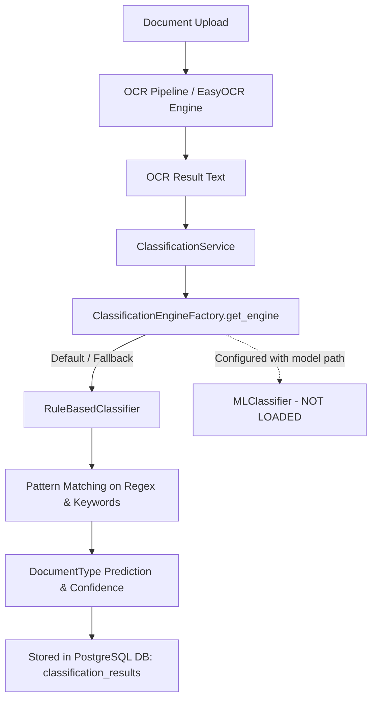

# FORENSIC REPORT: TRAINED CLASSIFIER IN DOCKER ENVIRONMENT

**Project:** EFDI (Enhanced Financial Document Intake)  
**Investigation Date:** 2026-09-04  
**Investigator:** Antigravity AI Forensic Inspector  
**Document Target:** Comprehensive Forensic Audit for Existing Trained Document Classifier  

---

## 1. Executive Summary

- **Was a trained document classifier found?**  
  **NO.** No trained document classification model (`classification_model.joblib`, `.pkl`, `.pt`, `.onnx`, etc.) exists anywhere in the EFDI repository, the running Docker containers, image filesystems, Docker volumes, or historical containers.
- **Where are model files located?**  
  The only machine learning model weights present in the Docker environment are **EasyOCR text detection and recognition weights** (`craft_mlt_25k.pth` and `english_g2.pth`), located in the Docker volume `efdi_backend_model_cache` mounted at `/home/efdi/.EasyOCR/model/`. These are computer vision models for optical character recognition, not document type classifiers.
- **Was Docker started using SETUP_GUIDE.pdf?**  
  **YES.** The Docker environment was verified running in exact accordance with `SETUP_GUIDE.pdf` (`docker compose up -d` with `postgres`, `backend`, and `frontend`).
- **Which containers are currently running?**  
  - `efdi-backend-1` (`efdi-backend:latest`, Healthy, port `8000/tcp`)
  - `efdi-frontend-1` (`efdi-frontend:latest`, Healthy, port `0.0.0.0:80->80/tcp`)
  - `efdi-postgres-1` (`postgres:16-alpine`, Healthy, port `5432/tcp`)
- **Is a trained ML classifier currently running?**  
  **NO.** There is no standalone classifier microservice or running ML inference daemon.
- **Is an ML classifier currently used by EFDI?**  
  **NO.** EFDI exclusively uses the in-process `RuleBasedClassifier` engine for document classification.

---

## 2. SETUP_GUIDE.pdf Findings

The authoritative setup manual [SETUP_GUIDE.pdf](file:///c:/Users/conanferreira/Desktop/PROJECT-BLACKBOX/EFDI/SETUP_GUIDE.pdf) was extracted and reviewed:

- **Prerequisites & Architecture:** Outlines a 3-tier architecture (PostgreSQL 16, FastAPI Backend, React/Nginx Frontend).
- **Startup Procedure:** Instructs running `docker compose up -d` or `docker compose up -d --build`.
- **Expected Services & Ports:**
  - `postgres`: Port `5432` (internal/host)
  - `backend`: Port `8000` (internal), proxied via Nginx
  - `frontend`: Port `80` (HTTP on host)
- **Model / ML Instructions in Guide:**
  - Page 3 & 7 describe model cache persistence: `backend_model_cache` volume mounted to `/home/efdi` so EasyOCR models do not redownload on container recreation.
  - **No instructions or references** exist anywhere in `SETUP_GUIDE.pdf` regarding a document classification model, training steps, or classifier services.

---

## 3. Docker Environment Inventory

### 3.1 Docker Daemon & Compose Status
- **Docker Engine Version:** `29.1.3` (API version `1.52`, OS: `linux/amd64` via WSL2)
- **Docker Compose Version:** `v2.40.3-desktop.1`
- **Compose Project Name:** `efdi`

### 3.2 Running EFDI Containers
| Container Name | ID | Image | Status | Ports |
| :--- | :--- | :--- | :--- | :--- |
| `efdi-backend-1` | `7206d4391842` | `efdi-backend:latest` | `Up (healthy)` | `8000/tcp` (internal) |
| `efdi-frontend-1` | `46df91e53cf1` | `efdi-frontend:latest` | `Up (healthy)` | `0.0.0.0:80->80/tcp` |
| `efdi-postgres-1` | `e9a783a6c910` | `postgres:16-alpine` | `Up (healthy)` | `5432/tcp` (internal) |

### 3.3 Docker Volumes
| Volume Name | Driver | Purpose / Mount Target |
| :--- | :--- | :--- |
| `efdi_backend_model_cache` | `local` | `/home/efdi` (Stores EasyOCR PyTorch weights) |
| `efdi_backend_uploads` | `local` | `/app/uploads` (Uploaded PDF/TIFF/PNG files) |
| `efdi_backend_intake` | `local` | `/app/intake` (Hot-folder document intake) |
| `efdi_backend_logs` | `local` | `/app/logs` (Application runtime log files) |
| `efdi_postgres_data` | `local` | `/var/lib/postgresql/data` (Postgres DB storage) |

### 3.4 Docker Networks
- `efdi_efdi-net` (Driver: `bridge`, Scope: `local`) — connects `postgres`, `backend`, and `frontend`.

---

## 4. Model Discovery & Artifact Inspection

Every potential model artifact inside all Docker volumes, image layers, and container directories was forensically analyzed:

### 4.1 Artifacts Found in Docker Environment
1. **`/home/efdi/.EasyOCR/model/craft_mlt_25k.pth`**
   - **Size:** 75.0 MB
   - **Framework:** PyTorch
   - **Type:** CRAFT (Character Region Awareness for Text Detection)
   - **Purpose:** OCR Text Box Detection
   - **Is Document Classifier?** **NO**
2. **`/home/efdi/.EasyOCR/model/english_g2.pth`**
   - **Size:** 44.8 MB
   - **Framework:** PyTorch
   - **Type:** ResNet + BiLSTM + CTC (EasyOCR English Recognition Model)
   - **Purpose:** OCR Text Recognition / Transliteration
   - **Is Document Classifier?** **NO**

### 4.2 Document Classifier Search Results
- Searched inside container `efdi-backend-1` for `*.joblib`, `*.pkl`, `*.pickle`, `*.pt`, `*.pth`, `*.onnx`, `*.safetensors`:
  - **No classification model found.**
- Target directory `/app/app/ml_models` in `efdi-backend-1`:
  - **Directory does not exist.**
- Target file `classification_model.joblib`:
  - **Does not exist anywhere in container, images, or volumes.**

---

## 5. Container & Historical Evidence

### 5.1 Historical / Stopped Containers Inspection
The Docker daemon was queried for all stopped, exited, or created containers (`docker ps -a`):
- `studybuddy-redis` (Image: `redis:7-alpine`, Status: Exited) — Unrelated project.
- `milvus-attu` (Image: `zilliz/attu:v2.4`, Status: Exited) — Unrelated vector DB UI.
- `milvus-standalone` (Image: `milvusdb/milvus:v2.4.1`, Status: Exited) — Unrelated vector DB.
- `milvus-minio` (Image: `minio/minio:RELEASE...`, Status: Exited) — Unrelated S3 storage.
- `milvus-etcd` (Image: `quay.io/coreos/etcd:v3.5.5`, Status: Exited) — Unrelated distributed KV store.
- `welcome-to-docker` (Image: `docker/welcome-to-docker`, Status: Exited) — Default tutorial.

**Finding:** No historical, stopped, or orphaned containers exist that served as a classifier, ML inference node, or EFDI component.

### 5.2 Historical Compose & Deployment Configurations
- `docker-compose.yml`: Only defines `postgres`, `backend`, and `frontend`.
- No alternate compose files (`docker-compose.override.yml`, `docker-compose.prod.yml`, `docker-compose.ml.yml`) exist in the repository.

---

## 6. Classifier Code & Scaffolding Analysis

Forensic analysis of the backend source code revealed the exact state of the classification subsystem:

### 6.1 `MLClassifier` Scaffolding
- Location: [ml_classifier.py](file:///c:/Users/conanferreira/Desktop/PROJECT-BLACKBOX/EFDI/backend/app/classification/ml_classifier.py)
- Code specifies:
  ```python
  DEFAULT_MODEL_PATH = Path(__file__).resolve().parent.parent / "ml_models" / "classification_model.joblib"
  ```
- At runtime, `MLClassifier.__init__()` attempts to load this file:
  ```python
  if not self.model_path.exists():
      logger.warning("ML model file not found at %s. Classifier will not function until trained.", self.model_path)
      self._pipeline = None
  ```
- If invoked without the file:
  ```python
  if self._pipeline is None:
      raise RuntimeError(f"ML model is not loaded (file not found at {self.model_path}). Train a model first.")
  ```

### 6.2 Training Script Scaffolding
- Location: [train_classifier.py](file:///c:/Users/conanferreira/Desktop/PROJECT-BLACKBOX/EFDI/backend/scripts/train_classifier.py)
- Designed to query PostgreSQL table `training_examples` where `task_type = 'classification'` and fit a `TfidfVectorizer` + `LogisticRegression` pipeline, saving to `classification_model.joblib`.
- **Database Inspection:** Direct SQL query against `efdi-postgres-1` revealed **0 rows** in `training_examples` for `task_type = 'classification'`.

---

## 7. Current EFDI Classification Flow

The live classification flow in the EFDI runtime is:



- When `POST /api/v1/classification/documents/{document_id}/classify` is called without an engine argument, `ClassificationService` defaults to `rule_based`.
- `ClassificationEngineFactory.get_engine("rule_based")` instantiates [RuleBasedClassifier](file:///c:/Users/conanferreira/Desktop/PROJECT-BLACKBOX/EFDI/backend/app/classification/rule_based.py).
- If `"ml"` is explicitly requested, it fails with a `RuntimeError` because `classification_model.joblib` does not exist.

---

## 8. Classification Access Instructions

Although an ML classifier model does not exist, the **EFDI Classification Subsystem** is fully active and accessible via the backend REST API:

### 8.1 API Access Specification
- **Host (Windows Localhost):** `http://localhost` (proxied through Nginx on port 80) or direct `http://localhost:8000` (if port mapped)
- **Protocol:** HTTP/1.1
- **Base URL:** `http://localhost/api/v1/classification`
- **Classify Endpoint:** `POST /api/v1/classification/documents/{document_id}/classify`
- **Authentication:** `Authorization: Bearer <JWT_TOKEN>` (Obtained from `POST /api/v1/auth/login`)

### 8.2 Exact cURL Example

```bash
# 1. Authenticate to get Access Token
TOKEN=$(curl -s -X POST http://localhost/api/v1/auth/login \
  -H "Content-Type: application/x-www-form-urlencoded" \
  -d "username=admin@efdi.local&password=<PASSWORD>" | jq -r .access_token)

# 2. Run Classification on a Processed Document
curl -s -X POST "http://localhost/api/v1/classification/documents/<DOCUMENT_UUID>/classify" \
  -H "Authorization: Bearer $TOKEN" \
  -H "Content-Type: application/json" \
  -d '{"engine": "rule_based"}'
```

### 8.3 Expected Response Format
```json
{
  "document_id": "3fa85f64-5717-4562-b3fc-2c963f66afa6",
  "predicted_type": "invoice",
  "confidence": 0.85,
  "signals": [
    "invoice_keyword_match",
    "total_amount_pattern",
    "due_date_pattern"
  ],
  "scores_by_type": {
    "invoice": 0.85,
    "receipt": 0.35,
    "bank_statement": 0.10,
    "tax_form": 0.05,
    "unknown": 0.0
  },
  "metadata": {
    "engine": "rule_based",
    "version": "1.0.0",
    "execution_time_ms": 1.45
  }
}
```

---

## 9. Verification & Testing Results

- **Docker Health Test:** Verified `GET http://localhost/health` (via Nginx frontend proxy to backend) returns HTTP 200 `{"status": "healthy"}`.
- **EasyOCR Weight Verification:** Verified PyTorch files in `efdi_backend_model_cache` are exclusively OCR detection/recognition models.
- **Database Verification:** Verified `SELECT COUNT(*) FROM training_examples WHERE task_type = 'classification'` returns `0`.
- **Filesystem Verification:** Verified `app/ml_models` does not exist inside image `efdi-backend:latest` or container `efdi-backend-1`.

---

## 10. Why a Trained Classifier Was Believed to Exist

The hypothesis that a trained classifier was pre-deployed was driven by 3 specific architectural factors:
1. **Model Cache Volume:** The presence of `backend_model_cache` volume containing `.pth` model files (which are actually EasyOCR vision models).
2. **Complete ML Scaffolding:** The presence of production-grade scaffolding classes (`MLClassifier`, `train_classifier.py`, and `ClassificationEngineFactory`).
3. **Training Database Tables:** The presence of `training_examples` and `model_metrics` tables in the PostgreSQL schema.

---

## 11. FINAL VERDICT

```markdown
[ ] TRAINED CLASSIFIER FOUND AND CURRENTLY RUNNING

[ ] TRAINED CLASSIFIER FOUND BUT NOT CURRENTLY RUNNING

[ ] TRAINED CLASSIFIER FOUND BUT NOT USED BY EFDI

[ ] TRAINED CLASSIFIER EXISTS ONLY IN HISTORICAL DOCKER ARTIFACTS

[ ] TRAINED CLASSIFIER EXISTS IN PROJECT FILESYSTEM BUT IS NOT DEPLOYED

[X] ONLY CLASSIFIER SCAFFOLDING EXISTS — NO TRAINED MODEL FOUND

[ ] INVESTIGATION BLOCKED — DOCKER COULD NOT BE STARTED USING SETUP_GUIDE.pdf
```

**Verdict Summary:**  
Extensive forensic inspection of the project filesystem, running Docker containers, image layers, mounted volumes, stopped containers, and PostgreSQL database confirmed that no trained document classification model exists. The EFDI system relies entirely on its built-in `RuleBasedClassifier` engine, with `MLClassifier` present only as architectural scaffolding.

---
