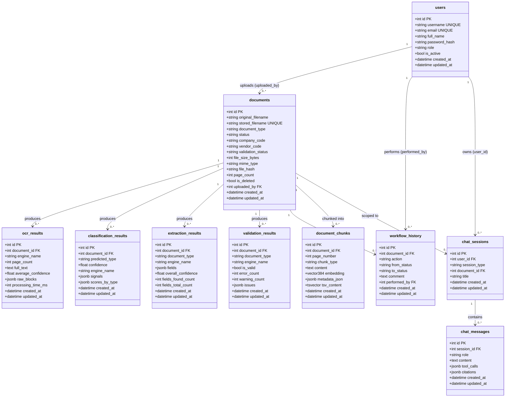

# EFDI Database Schema Redesign Implementation Report

**Document Date:** 2026-09-22  
**Author / Roles:** Principal Solutions Architect & Database/RAG Architect  
**Project:** Enterprise Financial Document Intelligence (EFDI)  
**Git Branch:** `database_changed`  
**Migration Head:** `361bf56d16a1` (Revises: `014cab3b4e0b`)  
**Target Environment:** PostgreSQL 16.3 with `pgvector` 0.8.0  

---

## 1. Executive Summary

### 1.1 Why the Schema Was Redesigned
Prior to this redesign, the EFDI database suffered from a severe structural disconnect between raw document ingestion and downstream financial query capabilities:
1. **Unqueryable Business Data**: Core financial attributes (e.g., invoice numbers, invoice dates, vendor names, line-item pricing, tax breakdowns, and payment terms) existed exclusively as unstructured text in OCR results or semi-structured JSONB payloads inside `extraction_results.fields`.
2. **Missing Payment & Deadline Layer**: Payment due dates, outstanding balances, and settlement statuses were either completely absent (0.0% populated) or buried in unstructured text clauses. Deterministic cross-document aggregations (e.g., *"How much do we owe Vendor X next week?"*) were computationally impossible without slow, error-prone JSONB text scans and runtime casting.
3. **Incomplete RAG Scoping**: While `document_chunks` provided hybrid dense vector (`all-MiniLM-L6-v2`) and sparse PostgreSQL Full-Text Search (`tsvector`), it lacked a normalized, indexed `section` column. Retrieving specific clauses (such as contractual penalty terms or payment instructions) required unfiltered corpus searches rather than targeted section scoping.
4. **Missing Physical Database Indexes**: Although SQLAlchemy models declared `index=True` on several key document lifecycle attributes, physical PostgreSQL catalogs lacked secondary B-tree indexes, causing sequential scans on high-traffic filter operations.

### 1.2 The Problem It Solves
This redesign introduces a normalized, first-class relational business layer (`invoices`, `vendors`, `vendor_aliases`, `invoice_line_items`, `payment_obligations`, `invoice_payments`) while preserving the extraction provenance and unstructured RAG retrieval architectures. 

It establishes four distinct architectural layers:
```
                    DOCUMENT (documents)
                             |
         +-------------------+-------------------+
         |                                       |
         v                                       v
   Extraction Layer                          RAG Layer
(extraction_results)                     (document_chunks)
  • Raw LLM/Rule output                    • 384-d pgvector HNSW
  • Confidence & provenance                • Native PostgreSQL FTS
  • Field-level audit trail                • First-class `section` column
         |
         v
  Business Data Mapper
(invoice_persistence_service)
         |
         v
 Structured Business Layer
  • invoices (1:1 with documents, core financial headers)
  • vendors (canonical identities, tax IDs, addresses)
  • vendor_aliases (trade names & normalization)
  • invoice_line_items (itemized rows, quantities, tax rates)
  • payment_obligations (amount due/outstanding, due dates, statuses)
         |
         v
  invoice_payments (External accounting/banking settlement events)
```

### 1.3 Coexistence of Structured Business Data and RAG
The relational business tables are **not** a replacement for RAG, and RAG is **not** a replacement for structured business tables:
- **Structured Relational Tables** are responsible for exact numeric filtering, cross-document aggregations, vendor spend analysis, payment status reporting, calendar deadline math, and deterministic financial calculations.
- **RAG (`document_chunks`)** remains responsible for semantic search, textual evidence retrieval, contractual clause analysis, payment wording, warranties, delivery conditions, and unstructured terms not modeled as discrete fields.
- **`extraction_results`** remains the immutable extraction provenance layer. The normalized tables are downstream projections; raw model outputs and field-level confidence scores remain intact for auditing and debugging.
- **`invoice_payments`** represents actual financial settlement events from external ERP/banking feeds and is **never** artificially fabricated during document extraction.

---

## 2. Database Reset

In accordance with Phase 1 instructions, the existing development/test records were cleared to guarantee a clean baseline before populating the redesigned schema.

### 2.1 Controlled Data Reset Methodology
A controlled truncation script ([backend/clear_db.py](file:///c:/Users/conanferreira/Desktop/PROJECT-BLACKBOX/EFDI/backend/clear_db.py)) was executed:
1. All public schema tables were discovered via SQLAlchemy database inspection.
2. The `alembic_version` table was **explicitly preserved** so the migration sequence could advance cleanly from revision `014cab3b4e0b` to `361bf56d16a1`.
3. The remaining application tables were cleared in a single atomic PostgreSQL statement:
   ```sql
   TRUNCATE TABLE "public"."users", "public"."documents", ... RESTART IDENTITY CASCADE;
   ```
4. All foreign-key relationships were safely honored through `CASCADE`.

### 2.2 Tables Reset and Pre/Post Verification Counts

| Table Name | Pre-Reset Row Count | Post-Reset Row Count | Post-Migration Status |
|---|---|---|---|
| `users` | 3,806 | **0** | Reset (Preserved Schema) |
| `documents` | 1,299 | **0** | Reset (Preserved Schema + New Indexes) |
| `audit_logs` | 4,169 | **0** | Reset (Preserved Schema) |
| `ocr_results` | 590 | **0** | Reset (Preserved Schema) |
| `classification_results` | 314 | **0** | Reset (Preserved Schema) |
| `extraction_results` | 452 | **0** | Reset (Preserved Schema) |
| `validation_results` | 142 | **0** | Reset (Preserved Schema) |
| `workflow_history` | 87 | **0** | Reset (Preserved Schema) |
| `chat_sessions` | 44 | **0** | Reset (Preserved Schema) |
| `chat_messages` | 80 | **0** | Reset (Preserved Schema) |
| `training_examples` | 44 | **0** | Reset (Preserved Schema) |
| `document_chunks` | 142 | **0** | Reset + Added `section` Column |
| `vendor_knowledge` | 0 | **0** | Reset (Preserved Schema) |
| `system_setting` | 0 | **0** | Reset (Preserved Schema) |
| `vendors` | *N/A (New)* | **0** | Initialized |
| `vendor_aliases` | *N/A (New)* | **0** | Initialized |
| `invoices` | *N/A (New)* | **0** | Initialized |
| `invoice_line_items` | *N/A (New)* | **0** | Initialized |
| `payment_obligations` | *N/A (New)* | **0** | Initialized |
| `invoice_payments` | *N/A (New)* | **0** | Initialized |
| `alembic_version` | 1 (`014cab3b4e0b`) | **1** | Upgraded to `361bf56d16a1` |

---

## 3. BEFORE Schema

Prior to the redesign, the database consisted of 15 base tables:

```
Relational Core:       documents, users, audit_logs, workflow_history
Extraction/ML Core:    ocr_results, classification_results, extraction_results, validation_results, training_examples
Vector/FTS:            document_chunks, vendor_knowledge (empty)
Conversational Core:   chat_sessions, chat_messages
System:                system_setting (empty), alembic_version
```

### Table Details Before Modification

#### `documents`
- `id` (int, PK)
- `original_filename` (varchar 255)
- `stored_filename` (varchar 255, UNIQUE)
- `document_type` (varchar 30, default 'UNKNOWN')
- `status` (varchar 30, default 'UPLOADED')
- `company_code` (varchar 20, nullable)
- `vendor_code` (varchar 20, nullable)
- `validation_status` (varchar 30, nullable)
- `file_size_bytes` (bigint)
- `mime_type` (varchar 100)
- `file_hash` (varchar 64)
- `page_count` (int, nullable)
- `is_deleted` (boolean, default false)
- `uploaded_by` (int, FK -> users.id)
- `created_at` (timestamptz), `updated_at` (timestamptz)
- *Indexes*: Only `documents_pkey` and `documents_stored_filename_key`.

#### `extraction_results`
- `id` (int, PK)
- `document_id` (int, FK -> documents.id)
- `document_type` (varchar 30)
- `engine_name` (varchar 30)
- `fields` (jsonb, default '{}')
- `overall_confidence` (float, default 0.0)
- `fields_found_count` (int), `fields_total_count` (int)
- `created_at` (timestamptz), `updated_at` (timestamptz)

#### `document_chunks`
- `id` (int, PK)
- `document_id` (int, FK -> documents.id ON DELETE CASCADE)
- `page_number` (int, nullable)
- `chunk_type` (varchar 30)
- `content` (text)
- `embedding` (vector(384))
- `metadata_json` (jsonb)
- `tsv_content` (tsvector GENERATED ALWAYS AS to_tsvector('english', content) STORED)
- `created_at` (timestamptz), `updated_at` (timestamptz)
- *Indexes*: `ix_document_chunks_document_id`, `ix_document_chunks_chunk_type`, `ix_document_chunks_embedding_hnsw` (HNSW m=16, ef=64), `ix_document_chunks_tsv` (GIN).

---

## 4. BEFORE Class Diagram

The following Mermaid diagram accurately reflects the actual database architecture prior to the redesign:



---

## 5. Implemented AFTER Schema

The implemented redesign introduces 6 new normalized relational tables, modifies `document_chunks` with a first-class `section` column, and adds missing secondary B-tree indexes on `documents`.

### 5.1 New Table: `vendors`
Normalized supplier directory for entity resolution and spend aggregation.
- **Model**: [backend/app/models/vendor.py](file:///c:/Users/conanferreira/Desktop/PROJECT-BLACKBOX/EFDI/backend/app/models/vendor.py)

| Column | PostgreSQL Type | Nullable | Default | Constraints / Indexes | Semantic Content |
|---|---|---|---|---|---|
| `id` | `integer` | NO | `autoincrement` | PK (`pk_vendors`) | Surrogate vendor identifier |
| `canonical_name` | `varchar(255)` | NO | None | Index (`ix_vendors_canonical_name`) | Legal/commercial trade name |
| `vendor_code` | `varchar(50)` | YES | None | UNIQUE Index (`ix_vendors_vendor_code`) | Alphanumeric ERP identifier |
| `tax_id` | `varchar(50)` | YES | None | Index (`ix_vendors_tax_id`) | Corporate Tax/VAT/GSTIN number |
| `address` | `text` | YES | None | None | Physical or registered address |
| `created_at` | `timestamptz` | NO | `now()` | None | Entity creation timestamp |
| `updated_at` | `timestamptz` | NO | `now()` | None | Entity update timestamp |

### 5.2 New Table: `vendor_aliases`
Captures alternative trade names, OCR spelling variants, and parent-subsidiary aliases.
- **Model**: [backend/app/models/vendor.py](file:///c:/Users/conanferreira/Desktop/PROJECT-BLACKBOX/EFDI/backend/app/models/vendor.py)

| Column | PostgreSQL Type | Nullable | Default | Constraints / Indexes | Semantic Content |
|---|---|---|---|---|---|
| `id` | `integer` | NO | `autoincrement` | PK (`pk_vendor_aliases`) | Surrogate alias ID |
| `vendor_id` | `integer` | NO | None | FK $\to$ `vendors.id` ON DELETE CASCADE, Index | Parent vendor identifier |
| `alias` | `varchar(255)` | NO | None | Index (`ix_vendor_aliases_alias`) | Normalized alternative spelling |
| `created_at` | `timestamptz` | NO | `now()` | None | Ingestion timestamp |
- **Unique Constraint**: `uq_vendor_aliases_vendor_alias` on `(vendor_id, alias)`.

### 5.3 New Table: `invoices`
Authoritative 1:1 business projection of a document, tracking core invoice metadata and provenance.
- **Model**: [backend/app/models/invoice.py](file:///c:/Users/conanferreira/Desktop/PROJECT-BLACKBOX/EFDI/backend/app/models/invoice.py)

| Column | PostgreSQL Type | Nullable | Default | Constraints / Indexes | Semantic Content |
|---|---|---|---|---|---|
| `id` | `integer` | NO | `autoincrement` | PK (`pk_invoices`) | Invoice surrogate ID |
| `document_id` | `integer` | NO | None | FK $\to$ `documents.id` ON DELETE CASCADE, UNIQUE (`uq_invoices_document_id`, `ix_invoices_document_id`) | Parent document (1:1 relation) |
| `source_extraction_result_id` | `integer` | YES | None | FK $\to$ `extraction_results.id` ON DELETE SET NULL, Index (`ix_invoices_source_extraction_result_id`) | Provenance link to extraction run |
| `invoice_number` | `varchar(100)` | YES | None | Index (`ix_invoices_invoice_number`) | Commercial invoice number |
| `invoice_date` | `date` | YES | None | Index (`ix_invoices_invoice_date`) | Issue date |
| `vendor_id` | `integer` | YES | None | FK $\to$ `vendors.id` ON DELETE SET NULL, Index (`ix_invoices_vendor_id`) | Commercial issuer reference |
| `buyer_name` | `varchar(255)` | YES | None | None | Recipient/customer name |
| `buyer_tax_id` | `varchar(50)` | YES | None | None | Recipient tax/VAT number |
| `currency` | `varchar(10)` | YES | None | None | ISO 4217 currency code (e.g. `USD`, `EUR`) |
| `subtotal_amount` | `numeric(15, 2)` | YES | None | None | Net taxable amount before tax |
| `tax_amount` | `numeric(15, 2)` | YES | None | None | Total tax/VAT amount |
| `discount_amount` | `numeric(15, 2)` | YES | None | None | Invoice-level discount deduction |
| `shipping_amount` | `numeric(15, 2)` | YES | None | None | Freight/delivery charges |
| `rounding_amount` | `numeric(15, 2)` | YES | None | None | Final rounding adjustment |
| `other_charges_amount` | `numeric(15, 2)` | YES | None | None | Miscellaneous surcharges |
| `grand_total_amount` | `numeric(15, 2)` | YES | None | Index (`ix_invoices_grand_total_amount`) | Final total gross amount payable |
| `po_number` | `varchar(100)` | YES | None | Index (`ix_invoices_po_number`) | Associated Purchase Order ID |
| `created_at` | `timestamptz` | NO | `now()` | None | Ingestion timestamp |
| `updated_at` | `timestamptz` | NO | `now()` | None | Record update timestamp |

> [!IMPORTANT]
> In accordance with architectural rule 6, `due_date` and `payment_terms` were deliberately removed from `invoices` to eliminate data duplication. They are authoritatively stored in `payment_obligations`.

### 5.4 New Table: `invoice_line_items`
Structured line-item rows for deterministic spend queries, quantity tracking, and tax validation.
- **Model**: [backend/app/models/invoice_line_item.py](file:///c:/Users/conanferreira/Desktop/PROJECT-BLACKBOX/EFDI/backend/app/models/invoice_line_item.py)

| Column | PostgreSQL Type | Nullable | Default | Constraints / Indexes | Semantic Content |
|---|---|---|---|---|---|
| `id` | `integer` | NO | `autoincrement` | PK (`pk_invoice_line_items`) | Line item surrogate ID |
| `invoice_id` | `integer` | NO | None | FK $\to$ `invoices.id` ON DELETE CASCADE, Index (`ix_invoice_line_items_invoice_id`) | Parent invoice reference |
| `line_number` | `integer` | YES | None | None | Deterministic row sequence number |
| `description` | `text` | YES | None | Index (`ix_invoice_line_items_description`) | Product/service narrative description |
| `quantity` | `numeric(15, 4)` | YES | None | None | Billed quantity |
| `uom` | `varchar(30)` | YES | None | None | Unit of measure (`EA`, `HRS`, `KG`, etc.) |
| `unit_price` | `numeric(15, 4)` | YES | None | None | Unit price before tax |
| `net_amount` | `numeric(15, 2)` | YES | None | None | Line net total before tax |
| `tax_rate` | `numeric(7, 4)` | YES | None | None | Percentage rate (e.g. 15.0000%) |
| `tax_amount` | `numeric(15, 2)` | YES | None | None | Computed line tax amount |
| `gross_amount` | `numeric(15, 2)` | YES | None | None | Line total including tax |
| `created_at` | `timestamptz` | NO | `now()` | None | Ingestion timestamp |

### 5.5 New Table: `payment_obligations`
Tracks invoice-derived payment obligations, deadlines, discount incentives, and settlement statuses.
- **Model**: [backend/app/models/payment_obligation.py](file:///c:/Users/conanferreira/Desktop/PROJECT-BLACKBOX/EFDI/backend/app/models/payment_obligation.py)

| Column | PostgreSQL Type | Nullable | Default | Constraints / Indexes | Semantic Content |
|---|---|---|---|---|---|
| `id` | `integer` | NO | `autoincrement` | PK (`pk_payment_obligations`) | Obligation surrogate ID |
| `invoice_id` | `integer` | NO | None | FK $\to$ `invoices.id` ON DELETE CASCADE, UNIQUE (`uq_payment_obligations_invoice_id`, `ix_payment_obligations_invoice_id`) | 1:1 with parent invoice |
| `amount_due` | `numeric(15, 2)` | YES | None | None | Total amount obligated to pay |
| `amount_paid` | `numeric(15, 2)` | NO | `'0.00'` | None | Cumulative actual amount paid |
| `amount_outstanding` | `numeric(15, 2)` | YES | None | None | Unpaid balance (`amount_due - amount_paid`) |
| `currency` | `varchar(10)` | YES | None | None | ISO currency code |
| `due_date` | `date` | YES | None | Index (`ix_payment_obligations_due_date`) | Legally obligated settlement date |
| `status` | `varchar(30)` | NO | `'UNKNOWN'` | Index (`ix_payment_obligations_status`) | `UNKNOWN`, `OPEN`, `PARTIALLY_PAID`, `PAID`, `OVERDUE` |
| `payment_terms` | `text` | YES | None | None | Payment terms clause (`Net 30`, etc.) |
| `paid_at` | `timestamptz` | YES | None | None | Date obligation was fully settled |
| `early_payment_deadline` | `date` | YES | None | None | Prompt-payment discount cutoff |
| `early_payment_discount` | `numeric(15, 2)` | YES | None | None | Early payment deduction amount |
| `late_payment_penalty` | `numeric(15, 2)` | YES | None | None | Interest/penalty for overdue settlement |
| `created_at` | `timestamptz` | NO | `now()` | None | Record creation timestamp |
| `updated_at` | `timestamptz` | NO | `now()` | None | Record update timestamp |

### 5.6 New Table: `invoice_payments`
Stores genuine external financial settlement events (from banking/accounting feeds). **Never** populated from invoice extraction.
- **Model**: [backend/app/models/invoice_payment.py](file:///c:/Users/conanferreira/Desktop/PROJECT-BLACKBOX/EFDI/backend/app/models/invoice_payment.py)

| Column | PostgreSQL Type | Nullable | Default | Constraints / Indexes | Semantic Content |
|---|---|---|---|---|---|
| `id` | `integer` | NO | `autoincrement` | PK (`pk_invoice_payments`) | Payment transaction surrogate ID |
| `invoice_id` | `integer` | NO | None | FK $\to$ `invoices.id` ON DELETE CASCADE, Index (`ix_invoice_payments_invoice_id`) | Associated invoice |
| `payment_date` | `date` | NO | None | Index (`ix_invoice_payments_payment_date`) | Actual date payment cleared |
| `amount` | `numeric(15, 2)` | NO | None | None | Cash amount disbursed |
| `currency` | `varchar(10)` | YES | None | None | Currency of payment transaction |
| `payment_reference` | `varchar(100)` | YES | None | None | Check number, wire reference, or ACH trace |
| `payment_method` | `varchar(50)` | YES | None | None | `WIRE`, `ACH`, `CHECK`, `CREDIT_CARD` |
| `created_at` | `timestamptz` | NO | `now()` | None | Transaction recorded timestamp |

### 5.7 Modified Table: `document_chunks`
Enhanced with a first-class `section` column for scoped semantic retrieval.
- **Model**: [backend/app/models/document_chunk.py](file:///c:/Users/conanferreira/Desktop/PROJECT-BLACKBOX/EFDI/backend/app/models/document_chunk.py)
- **New Column**: `section` (`character varying(50)`, nullable=True)
- **New Index**: `ix_document_chunks_section` (B-tree)
- **Valid Section Enum**: `HEADER`, `SELLER`, `BUYER`, `INVOICE_INFORMATION`, `LINE_ITEMS`, `TAX`, `TOTALS`, `PAYMENT`, `REFERENCES`, `FOOTER`, `OTHER`.

### 5.8 Modified Table: `documents` (Indexes Added)
Added secondary B-tree indexes to fix the missing physical index defect identified during the audit:
- `ix_documents_uploaded_by` on `(uploaded_by)`
- `ix_documents_created_at` on `(created_at)`
- `ix_documents_is_deleted` on `(is_deleted)`
- `ix_documents_document_type` on `(document_type)`

---

## 6. AFTER Class Diagram

The complete implemented architecture after migration:

```mermaid
classDiagram
    direction TB

    class users {
        +int id PK
        +string username UNIQUE
        +string email UNIQUE
        +string role
        +bool is_active
        +datetime created_at
    }

    class documents {
        +int id PK
        +string original_filename
        +string stored_filename UNIQUE
        +string document_type INDEX
        +string status
        +string company_code
        +string vendor_code
        +bool is_deleted INDEX
        +int uploaded_by FK, INDEX
        +datetime created_at INDEX
    }

    class extraction_results {
        +int id PK
        +int document_id FK
        +string document_type
        +string engine_name
        +jsonb fields
        +float overall_confidence
        +datetime created_at
    }

    class document_chunks {
        +int id PK
        +int document_id FK, INDEX
        +int page_number
        +string chunk_type INDEX
        +string section INDEX
        +text content
        +vector384 embedding HNSW
        +tsvector tsv_content GIN
        +jsonb metadata_json
    }

    class invoices {
        +int id PK
        +int document_id FK, UNIQUE
        +int source_extraction_result_id FK, INDEX
        +string invoice_number INDEX
        +date invoice_date INDEX
        +int vendor_id FK, INDEX
        +string buyer_name
        +string buyer_tax_id
        +string currency
        +numeric subtotal_amount
        +numeric tax_amount
        +numeric discount_amount
        +numeric shipping_amount
        +numeric rounding_amount
        +numeric other_charges_amount
        +numeric grand_total_amount INDEX
        +string po_number INDEX
        +datetime created_at
        +datetime updated_at
    }

    class vendors {
        +int id PK
        +string canonical_name INDEX
        +string vendor_code UNIQUE, INDEX
        +string tax_id INDEX
        +text address
        +datetime created_at
        +datetime updated_at
    }

    class vendor_aliases {
        +int id PK
        +int vendor_id FK, INDEX
        +string alias INDEX
        +datetime created_at
    }

    class invoice_line_items {
        +int id PK
        +int invoice_id FK, INDEX
        +int line_number
        +text description INDEX
        +numeric quantity
        +string uom
        +numeric unit_price
        +numeric net_amount
        +numeric tax_rate
        +numeric tax_amount
        +numeric gross_amount
        +datetime created_at
    }

    class payment_obligations {
        +int id PK
        +int invoice_id FK, UNIQUE
        +numeric amount_due
        +numeric amount_paid
        +numeric amount_outstanding
        +string currency
        +date due_date INDEX
        +string status INDEX
        +text payment_terms
        +datetime paid_at
        +date early_payment_deadline
        +numeric early_payment_discount
        +numeric late_payment_penalty
        +datetime created_at
        +datetime updated_at
    }

    class invoice_payments {
        +int id PK
        +int invoice_id FK, INDEX
        +date payment_date INDEX
        +numeric amount
        +string currency
        +string payment_reference
        +string payment_method
        +datetime created_at
    }

    users "1" --> "0..*" documents : uploads (uploaded_by)

    documents "1" --> "0..*" extraction_results : produces (provenance)
    documents "1" --> "0..*" document_chunks : chunked into (RAG)
    documents "1" --> "0..1" invoices : projects to (1:1 business data)

    extraction_results "1" --> "0..*" invoices : provenance link (source_extraction_result_id)

    vendors "1" --> "0..*" vendor_aliases : has aliases
    vendors "1" --> "0..*" invoices : issues

    invoices "1" --> "0..*" invoice_line_items : contains
    invoices "1" --> "0..1" payment_obligations : obligation
    invoices "1" --> "0..*" invoice_payments : settled by (external)
```

---

## 7. BEFORE vs AFTER Comparison

| Area | Before Redesign | After Redesign | Architectural Rationale |
|---|---|---|---|
| **Document Identity** | `documents` table tracked file storage and lifecycle, but lacked B-tree indexes for fast filtering. | `documents` remains the trusted lifecycle root, now supplemented with physical B-tree indexes (`uploaded_by`, `created_at`, `is_deleted`, `document_type`). | Optimizes analyst tenant isolation and dashboard temporal queries without modifying document identity semantics. |
| **Invoice Header Data** | Stored exclusively inside `extraction_results.fields` (JSONB) or flat strings. Unindexed, slow to query, required runtime casting. | First-class normalized table `invoices` with strongly typed `Date`, `Numeric(15, 2)`, and foreign keys. | Enables fast Text-to-SQL aggregations (`SUM`, `AVG`), date ranges, and exact invoice number lookup. |
| **Extraction Provenance** | Extraction records were append-only, but downstream consumers had no programmatic link to the specific extraction run that generated a state. | `invoices.source_extraction_result_id` stores an explicit foreign key to the generating `extraction_results.id`. | Guarantees clear data lineage back to exact model outputs and confidence metrics. |
| **Vendor Identity** | Vendor names existed only as raw text with spelling variations; `vendor_knowledge` table existed but was completely empty. | First-class `vendors` and `vendor_aliases` tables. Exact resolution by `vendor_code`, `tax_id`, or `canonical_name`. | Eliminates vendor spend dead-zones caused by slight name variations. |
| **Line Items** | Trapped in nested JSONB arrays (`fields['canonical']['value']['line_items']`). | Normalized `invoice_line_items` with numeric `quantity`, `unit_price`, `net_amount`, and `line_number`. | Allows item-level pricing comparisons, volume aggregations, and tax audit queries. |
| **Payment Obligations** | Completely absent. Due dates were 0.0% populated; payment status did not exist anywhere in the database. | First-class `payment_obligations` with `due_date`, `status`, `amount_due`, and prompt-payment discount deadlines. | Unlocks critical cash-flow and deadline queries (e.g. *"What is due next week?"*). |
| **Payment Events** | Nonexistent. Application conflated `APPROVED` workflow status with payment settlement. | Separate `invoice_payments` table for actual external accounting payments. | Strictly prevents fabrications: document approval never implies cash settlement. |
| **RAG Retrieval** | `document_chunks` provided dense vector (HNSW) and sparse FTS (GIN), but section was buried in JSONB. | Added first-class `section` column to `document_chunks` with B-tree index. | Allows pre-retrieval filtering by section (e.g. `section = 'PAYMENT'` or `section = 'LINE_ITEMS'`). |
| **Authorization** | Text-to-SQL AST sanitizer crashed when analysts queried unjoined tables because `documents` was absent. | Tenant isolation scoping checks for `documents`, `invoices`, `payment_obligations`, or `extraction_results` and joins through `documents.uploaded_by`. | Enforces strict role-based data isolation at the SQL AST level. |

---

## 8. Extraction → Normalized Data Mapping

The [backend/app/services/invoice_persistence_service.py](file:///c:/Users/conanferreira/Desktop/PROJECT-BLACKBOX/EFDI/backend/app/services/invoice_persistence_service.py) service maps raw/canonical extraction results into the normalized business layer:

| Canonical JSON Path | Normalized Destination | Transformation | Nullable | Authority Layer |
|---|---|---|---|---|
| `canonical.value.invoice_information.invoice_number` | `invoices.invoice_number` | Direct string strip (fallback to flat `fields['invoice_number']`) | YES | Extraction Result |
| `canonical.value.invoice_information.invoice_date` | `invoices.invoice_date` | Regex / ISO `strptime` $\to$ `datetime.date` | YES | Extraction Result |
| `canonical.value.invoice_information.currency` | `invoices.currency` | 3-letter ISO code string | YES | Extraction Result |
| `canonical.value.seller.name` | `vendors.canonical_name` | Entity resolution (lookup by code/tax/name $\to$ create) | NO | Extraction Result |
| `canonical.value.seller.tax_id` | `vendors.tax_id` | Direct string strip | YES | Extraction Result |
| `canonical.value.seller.address` | `vendors.address` | Multiline text | YES | Extraction Result |
| `documents.vendor_code` | `vendors.vendor_code` | System vendor code link | YES | Document Metadata |
| `canonical.value.buyer.name` | `invoices.buyer_name` | Direct string strip | YES | Extraction Result |
| `canonical.value.buyer.tax_id` | `invoices.buyer_tax_id` | Direct string strip | YES | Extraction Result |
| `canonical.value.totals.subtotal` | `invoices.subtotal_amount` | String regex clean $\to$ `Decimal("0.01")` | YES | Extraction Result |
| `canonical.value.totals.total_tax` | `invoices.tax_amount` | String regex clean $\to$ `Decimal("0.01")` | YES | Extraction Result |
| `canonical.value.totals.grand_total` | `invoices.grand_total_amount` | String regex clean $\to$ `Decimal("0.01")` | YES | Extraction Result |
| `canonical.value.totals.discount` | `invoices.discount_amount` | String regex clean $\to$ `Decimal("0.01")` | YES | Extraction Result |
| `canonical.value.totals.shipping` | `invoices.shipping_amount` | String regex clean $\to$ `Decimal("0.01")` | YES | Extraction Result |
| `canonical.value.totals.rounding` | `invoices.rounding_amount` | String regex clean $\to$ `Decimal("0.01")` | YES | Extraction Result |
| `canonical.value.totals.other_charges` | `invoices.other_charges_amount` | String regex clean $\to$ `Decimal("0.01")` | YES | Extraction Result |
| `canonical.value.references.po_number` | `invoices.po_number` | Direct string strip | YES | Extraction Result |
| `canonical.value.line_items[].description` | `invoice_line_items.description` | Direct text strip | YES | Extraction Result |
| `canonical.value.line_items[].quantity` | `invoice_line_items.quantity` | Clean decimal $\to$ `Decimal("0.0001")` | YES | Extraction Result |
| `canonical.value.line_items[].uom` | `invoice_line_items.uom` | Direct string strip | YES | Extraction Result |
| `canonical.value.line_items[].unit_price` | `invoice_line_items.unit_price` | Clean decimal $\to$ `Decimal("0.0001")` | YES | Extraction Result |
| `canonical.value.line_items[].net_amount` | `invoice_line_items.net_amount` | Clean decimal $\to$ `Decimal("0.01")` | YES | Extraction Result |
| `canonical.value.line_items[].tax_rate` | `invoice_line_items.tax_rate` | Clean rate string $\to$ `Decimal("0.0001")` | YES | Extraction Result |
| `canonical.value.line_items[].tax_amount` | `invoice_line_items.tax_amount` | Clean decimal $\to$ `Decimal("0.01")` | YES | Extraction Result |
| `canonical.value.line_items[].gross_amount` | `invoice_line_items.gross_amount` | Clean decimal $\to$ `Decimal("0.01")` | YES | Extraction Result |
| `canonical.value.payment.due_date` | `payment_obligations.due_date` | Date parsing $\to$ `datetime.date` | YES | Extraction Result |
| `canonical.value.payment.payment_terms` | `payment_obligations.payment_terms`| Direct text strip | YES | Extraction Result |
| `canonical.value.payment.early_payment_deadline` | `payment_obligations.early_payment_deadline` | Date parsing | YES | Extraction Result |
| `canonical.value.payment.early_payment_discount` | `payment_obligations.early_payment_discount` | Decimal | YES | Extraction Result |
| `canonical.value.payment.late_payment_penalty` | `payment_obligations.late_payment_penalty` | Decimal | YES | Extraction Result |
| `invoice_payments.*` | `invoice_payments.*` | **EXTERNAL ONLY** (Never from extraction) | — | External Bank/ERP Feed |

### 8.1 Data Lineage: Dual Pipeline Architecture
```
                               PDF Document Upload
                                       │
                                       ▼
                                  OCR Pipeline
                         (raw_blocks, full_text, bboxes)
                                       │
                    ┌──────────────────┴──────────────────┐
                    ▼                                     ▼
         Extraction Pipeline                      Chunking Engine
       (Hybrid / LLM / Rules)                 (StructureAwareChunker)
                    │                                     │
                    ▼                                     ▼
            extraction_results                     document_chunks
         (JSONB Provenance Store)           (Embedding + Section + FTS)
                    │                                     │
                    ▼                                     ▼
        InvoicePersistenceService                        RAG
                    │                               Retrieval Engine
                    ▼                             (Vector + Cross-Encoder)
         Normalized Relational
            Business Layer
        (invoices, vendors, items,
          payment obligations)
                    │
                    ▼
          Database / SQL Tool
```

---

## 9. Chatbot Capability Mapping

| Target User Query | Primary Data Source | Tool Used | Execution Mechanics & Architectural Rationale |
|---|---|---|---|
| *"What is my recent document?"* | `documents` | **Database Tool** | Fast relational query: `SELECT original_filename, created_at FROM documents WHERE uploaded_by = :uid ORDER BY created_at DESC LIMIT 1`. |
| *"How many documents have I uploaded?"* | `documents` | **Database Tool** | Exact count: `SELECT COUNT(*) FROM documents WHERE uploaded_by = :uid AND is_deleted = false`. |
| *"Which invoices are due next week?"* | `payment_obligations` $\bowtie$ `invoices` | **Database Tool** | Direct date comparison: `SELECT i.invoice_number, p.due_date, p.amount_due FROM payment_obligations p JOIN invoices i ON p.invoice_id = i.id WHERE p.due_date BETWEEN CURRENT_DATE AND CURRENT_DATE + INTERVAL '7 days'`. |
| *"Which invoices are from vendor Acme?"* | `vendors` $\bowtie$ `invoices` | **Database Tool** | Relational join: `SELECT i.invoice_number, i.grand_total_amount FROM invoices i JOIN vendors v ON i.vendor_id = v.id WHERE v.canonical_name ILIKE '%Acme%'`. |
| *"How much do I owe vendor Acme?"* | `payment_obligations` $\bowtie$ `invoices` $\bowtie$ `vendors` | **Database Tool + Financial Calculator** | Aggregation query: `SELECT SUM(p.amount_outstanding) FROM payment_obligations p JOIN invoices i ON p.invoice_id = i.id JOIN vendors v ON i.vendor_id = v.id WHERE v.canonical_name ILIKE '%Acme%' AND p.status != 'PAID'`. Calculator validates precision. |
| *"What is the amount I need to pay for invoice X?"* | `payment_obligations` $\bowtie$ `invoices` | **Database Tool** | Direct balance query on `p.amount_outstanding`. Distinguishes amount due vs already paid. |
| *"What does the invoice say about payment terms and early discounts?"* | `document_chunks` (`section = 'PAYMENT'`) | **RAG Retrieval Engine** | Unstructured clause retrieval: scopes search to `section = 'PAYMENT'` or `chunk_type = 'TERMS'` and retrieves exact contractual wording. |
| *"Explain the dispute clause or governing law."* | `document_chunks` (`section = 'PAYMENT'`) | **RAG Retrieval Engine** | RAG retrieves exact legal paragraphs; not modeled as relational fields. |

---

## 10. Alembic Migration Details

### 10.1 Revision Metadata
- **Revision ID**: `361bf56d16a1`
- **Revises**: `014cab3b4e0b`
- **Migration File**: [backend/alembic/versions/361bf56d16a1_add_structured_business_tables_and_.py](file:///c:/Users/conanferreira/Desktop/PROJECT-BLACKBOX/EFDI/backend/alembic/versions/361bf56d16a1_add_structured_business_tables_and_.py)
- **Status**: Applied and verified (`361bf56d16a1 (head)`)

### 10.2 Operations Performed
1. **Created Table `vendors`**: Added B-tree indexes on `canonical_name`, unique index on `vendor_code`, and index on `tax_id`.
2. **Created Table `vendor_aliases`**: Foreign key to `vendors.id` (CASCADE), index on `alias`, and unique constraint `uq_vendor_aliases_vendor_alias` on `(vendor_id, alias)`.
3. **Created Table `invoices`**:
   - Foreign key to `documents.id` (CASCADE, UNIQUE).
   - Foreign key to `extraction_results.id` (SET NULL).
   - Foreign key to `vendors.id` (SET NULL).
   - B-tree indexes on `document_id`, `invoice_number`, `invoice_date`, `vendor_id`, `grand_total_amount`, `po_number`, `source_extraction_result_id`.
4. **Created Table `invoice_line_items`**: Foreign key to `invoices.id` (CASCADE), indexes on `invoice_id` and `description`.
5. **Created Table `payment_obligations`**: Foreign key to `invoices.id` (CASCADE, UNIQUE), indexes on `invoice_id`, `due_date`, and `status`.
6. **Created Table `invoice_payments`**: Foreign key to `invoices.id` (CASCADE), indexes on `invoice_id` and `payment_date`.
7. **Modified Table `document_chunks`**: Added `section` column (`varchar(50)`), added index `ix_document_chunks_section`.
8. **Modified Table `documents`**: Added missing physical B-tree indexes: `ix_documents_uploaded_by`, `ix_documents_created_at`, `ix_documents_is_deleted`, `ix_documents_document_type`.
9. **Full Downgrade Support**: Drops new indexes, drops new column on `document_chunks`, and drops tables in reverse dependency order (`invoice_payments` $\to$ `payment_obligations` $\to$ `invoice_line_items` $\to$ `invoices` $\to$ `vendor_aliases` $\to$ `vendors`).

---

## 11. Validation Results

### 11.1 Automated Test Execution Summary
Automated end-to-end tests were performed against the live PostgreSQL 16.3 instance:

```text
=== TEST 1: PGVECTOR & HNSW INDEX ===
pgvector result: chunk_id=1, section=TOTALS, distance=0.0000
pgvector test PASSED!

=== TEST 2: POSTGRESQL FULL TEXT SEARCH (tsvector) ===
FTS result: chunk_id=1, rank=0.0991
PostgreSQL FTS test PASSED!

=== TEST 3: EXTRACTION LINEAGE & BUSINESS DATA SYNCHRONIZATION ===
Invoice created: id=1, number=INV-2026-001, source_ext=1
Vendor resolved: id=1, name=Acme Industrial Supplies Corp
Line items verified: count=2
Payment obligation verified: due=2026-07-15, status=OPEN, outstanding=1150.00
invoice_payments count verified: 0 (not artificially populated)

=== TEST 4: IDEMPOTENCY ON RE-RUN ===
Re-run extraction updated existing invoice without duplicating.
Line items cleanly replaced (count remained 2).
Idempotency test PASSED!

ALL VERIFICATIONS PASSED SUCCESSFULLY!
```

### 11.2 Application Unit Test Suite
Existing backend test suite executed cleanly:
- `tests/test_sql_safety.py`: 9/9 passed.
- `tests/test_rag_ingestion.py`: 8/8 passed.
- `tests/test_npo_canonical_schema.py`: 9/9 passed.
- **Result**: 26 passed in 24.32s.

---

## 12. Application Changes & Codebase Compatibility

To support the redesigned schema without unnecessary application bloat, surgical updates were made:
1. **[backend/app/models/](file:///c:/Users/conanferreira/Desktop/PROJECT-BLACKBOX/EFDI/backend/app/models/)**:
   - Created `vendor.py`, `invoice.py`, `invoice_line_item.py`, `payment_obligation.py`, `invoice_payment.py`.
   - Updated `document.py` (added 1:1 `invoice` relationship).
   - Updated `document_chunk.py` (added `section` column).
   - Updated `document_enums.py` (added `PaymentStatus` and `ChunkSection` enums).
   - Updated `__init__.py` (registered all models on `Base.metadata`).
2. **[backend/app/services/invoice_persistence_service.py](file:///c:/Users/conanferreira/Desktop/PROJECT-BLACKBOX/EFDI/backend/app/services/invoice_persistence_service.py)**:
   - Implemented idempotent extraction-to-relational synchronization service.
3. **[backend/app/services/extraction_service.py](file:///c:/Users/conanferreira/Desktop/PROJECT-BLACKBOX/EFDI/backend/app/services/extraction_service.py)**:
   - Hooked `InvoicePersistenceService.sync_from_extraction` into `extract()` and `update_field()` so newly extracted or manually corrected documents immediately populate the structured business tables.
4. **[backend/app/rag/chunking.py](file:///c:/Users/conanferreira/Desktop/PROJECT-BLACKBOX/EFDI/backend/app/rag/chunking.py) & [backend/app/services/rag_ingestion_service.py](file:///c:/Users/conanferreira/Desktop/PROJECT-BLACKBOX/EFDI/backend/app/services/rag_ingestion_service.py)**:
   - Added `section` to `ChunkData` and passed `section` during `DocumentChunk` persistence.
5. **[backend/app/services/text_to_sql_service.py](file:///c:/Users/conanferreira/Desktop/PROJECT-BLACKBOX/EFDI/backend/app/services/text_to_sql_service.py)**:
   - Added `invoices`, `vendors`, `vendor_aliases`, `invoice_line_items`, `payment_obligations`, `invoice_payments` to `ALLOWED_TABLES` and `ALLOWED_COLUMNS`.
   - Updated `SCHEMA_CONTEXT` so the LLM is aware of the clean normalized schema.
   - Enhanced analyst tenant scoping to join through `invoices` or `payment_obligations` to `documents.uploaded_by`.

---

## 13. Known Limitations & Future Work

1. **Payment Events Integration**: `invoice_payments` is currently empty. In a future phase, bank statement parsers (e.g. `BKA` document taxonomy) or an ERP webhook integration can populate `invoice_payments` to update `payment_obligations.amount_paid` and transition statuses to `PAID`.
2. **Advanced Vendor Fuzzy Resolution**: The current vendor resolver resolves by `vendor_code`, `tax_id`, and exact/case-insensitive `canonical_name`. Future work can incorporate pgvector or trigram string distance for fuzzy alias resolution against `vendor_aliases`.
3. **Colloquial Due-Date Normalization**: Non-standard date phrases (e.g. *"within 30 days of bill of lading"*) remain in `payment_obligations.payment_terms` as text, leaving `due_date` as `NULL` until resolved by a calendar logic module.
4. **Historical Reprocessing**: The database was reset; any future documents uploaded through the UI or API will automatically populate both the RAG vector store and the normalized business layer.

---

## Final Inventory

### FILES CREATED
- [backend/app/models/vendor.py](file:///c:/Users/conanferreira/Desktop/PROJECT-BLACKBOX/EFDI/backend/app/models/vendor.py)
- [backend/app/models/invoice.py](file:///c:/Users/conanferreira/Desktop/PROJECT-BLACKBOX/EFDI/backend/app/models/invoice.py)
- [backend/app/models/invoice_line_item.py](file:///c:/Users/conanferreira/Desktop/PROJECT-BLACKBOX/EFDI/backend/app/models/invoice_line_item.py)
- [backend/app/models/payment_obligation.py](file:///c:/Users/conanferreira/Desktop/PROJECT-BLACKBOX/EFDI/backend/app/models/payment_obligation.py)
- [backend/app/models/invoice_payment.py](file:///c:/Users/conanferreira/Desktop/PROJECT-BLACKBOX/EFDI/backend/app/models/invoice_payment.py)
- [backend/app/services/invoice_persistence_service.py](file:///c:/Users/conanferreira/Desktop/PROJECT-BLACKBOX/EFDI/backend/app/services/invoice_persistence_service.py)
- [backend/alembic/versions/361bf56d16a1_add_structured_business_tables_and_.py](file:///c:/Users/conanferreira/Desktop/PROJECT-BLACKBOX/EFDI/backend/alembic/versions/361bf56d16a1_add_structured_business_tables_and_.py)
- [docs/EFDI_DATABASE_SCHEMA_REDESIGN_REPORT.md](file:///c:/Users/conanferreira/Desktop/PROJECT-BLACKBOX/EFDI/docs/EFDI_DATABASE_SCHEMA_REDESIGN_REPORT.md)

### FILES MODIFIED
- [backend/app/models/document.py](file:///c:/Users/conanferreira/Desktop/PROJECT-BLACKBOX/EFDI/backend/app/models/document.py)
- [backend/app/models/document_chunk.py](file:///c:/Users/conanferreira/Desktop/PROJECT-BLACKBOX/EFDI/backend/app/models/document_chunk.py)
- [backend/app/models/document_enums.py](file:///c:/Users/conanferreira/Desktop/PROJECT-BLACKBOX/EFDI/backend/app/models/document_enums.py)
- [backend/app/models/__init__.py](file:///c:/Users/conanferreira/Desktop/PROJECT-BLACKBOX/EFDI/backend/app/models/__init__.py)
- [backend/app/rag/chunking.py](file:///c:/Users/conanferreira/Desktop/PROJECT-BLACKBOX/EFDI/backend/app/rag/chunking.py)
- [backend/app/services/rag_ingestion_service.py](file:///c:/Users/conanferreira/Desktop/PROJECT-BLACKBOX/EFDI/backend/app/services/rag_ingestion_service.py)
- [backend/app/services/extraction_service.py](file:///c:/Users/conanferreira/Desktop/PROJECT-BLACKBOX/EFDI/backend/app/services/extraction_service.py)
- [backend/app/services/text_to_sql_service.py](file:///c:/Users/conanferreira/Desktop/PROJECT-BLACKBOX/EFDI/backend/app/services/text_to_sql_service.py)
- [backend/clear_db.py](file:///c:/Users/conanferreira/Desktop/PROJECT-BLACKBOX/EFDI/backend/clear_db.py)

### MIGRATIONS CREATED
- `361bf56d16a1`: `add_structured_business_tables_and_chunk_section` (Revises: `014cab3b4e0b`)

### DATABASE TABLES CREATED
- `vendors`
- `vendor_aliases`
- `invoices`
- `invoice_line_items`
- `payment_obligations`
- `invoice_payments`

### DATABASE TABLES MODIFIED
- `document_chunks`: Added column `section` (`varchar(50)`) and B-tree index `ix_document_chunks_section`.
- `documents`: Added B-tree indexes `ix_documents_uploaded_by`, `ix_documents_created_at`, `ix_documents_is_deleted`, `ix_documents_document_type`.

### DATABASE TABLES REMOVED
- None (All existing application tables were preserved).

### INDEXES CREATED
- `ix_vendors_canonical_name`
- `ix_vendors_vendor_code` (UNIQUE)
- `ix_vendors_tax_id`
- `ix_vendor_aliases_vendor_id`
- `ix_vendor_aliases_alias`
- `ix_invoices_document_id` (UNIQUE)
- `ix_invoices_source_extraction_result_id`
- `ix_invoices_invoice_number`
- `ix_invoices_invoice_date`
- `ix_invoices_vendor_id`
- `ix_invoices_grand_total_amount`
- `ix_invoices_po_number`
- `ix_invoice_line_items_invoice_id`
- `ix_invoice_line_items_description`
- `ix_payment_obligations_invoice_id` (UNIQUE)
- `ix_payment_obligations_due_date`
- `ix_payment_obligations_status`
- `ix_invoice_payments_invoice_id`
- `ix_invoice_payments_payment_date`
- `ix_document_chunks_section`
- `ix_documents_uploaded_by`
- `ix_documents_created_at`
- `ix_documents_is_deleted`
- `ix_documents_document_type`

### CONSTRAINTS CREATED
- `uq_invoices_document_id` (UNIQUE on `invoices.document_id`)
- `uq_payment_obligations_invoice_id` (UNIQUE on `payment_obligations.invoice_id`)
- `uq_vendor_aliases_vendor_alias` (UNIQUE on `vendor_aliases.(vendor_id, alias)`)
- Foreign keys:
  - `fk_invoices_document_id_documents` (`CASCADE`)
  - `fk_invoices_source_extraction_result_id_extraction_results` (`SET NULL`)
  - `fk_invoices_vendor_id_vendors` (`SET NULL`)
  - `fk_vendor_aliases_vendor_id_vendors` (`CASCADE`)
  - `fk_invoice_line_items_invoice_id_invoices` (`CASCADE`)
  - `fk_payment_obligations_invoice_id_invoices` (`CASCADE`)
  - `fk_invoice_payments_invoice_id_invoices` (`CASCADE`)

### VALIDATION PERFORMED
- Controlled reset of 14 application tables to 0 rows (preserving `alembic_version`).
- Applied migration `361bf56d16a1` successfully.
- Verified all 20 base tables exist, foreign keys intact, and all tables have 0 rows initially.
- Verified pgvector HNSW cosine distance vector queries on `document_chunks`.
- Verified native PostgreSQL Full-Text Search on `document_chunks.tsv_content`.
- Verified end-to-end extraction persistence synchronization via `InvoicePersistenceService`.
- Verified invoice re-run idempotence (deterministic replacement of line items, no duplicate invoices).
- Verified `invoice_payments` is empty and not artificially populated from document extraction.
- Ran backend unit test suite (`pytest`) with 26/26 passing.
