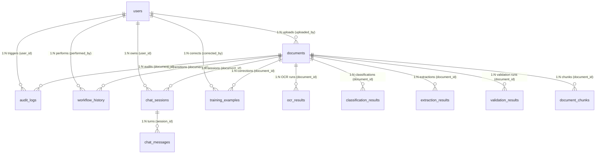

# EFDI Chatbot Final Data Model & Codebase Audit

**Audit Report Date:** 2026-09-21  
**Auditor Roles:** Senior Database Architect, Principal Solutions Architect, AI/RAG Architect, Backend Codebase Auditor  
**Mode:** READ-ONLY DATABASE & ARCHITECTURE AUDIT  
**Scope:** Exhaustive factual baseline of PostgreSQL schema, live records, extraction structures, RAG chunk metadata, and business query capabilities.  
**Target Architecture Reference:** [docs/EFDI_CHATBOT_FINAL_ARCHITECTURE.mmd](file:///c:/Users/conanferreira/Desktop/PROJECT-BLACKBOX/EFDI/docs/EFDI_CHATBOT_FINAL_ARCHITECTURE.mmd)  
**Database System:** PostgreSQL 16.3 on port 5342 (Database: `EFDI`), `pgvector` 0.8.0  
**Application Backend:** FastAPI / SQLAlchemy 2.0.38 / Alembic (Migration Head: `014cab3b4e0b`)

---

## 1. Executive Summary & Audit Methodology

This report establishes the complete, unvarnished factual baseline of the EFDI data model, storage mechanisms, extraction records, retrieval pipelines, and authorization boundaries. The findings here will directly govern the architectural design of:
1. **RAG chunk metadata and pre-retrieval SQL filtering**;
2. **The relational schema and semantic prompt contract exposed to the Database / Text-to-SQL Tool**;
3. **The strict backend authorization gateway** separating `FINANCE_ANALYST`, `FINANCE_MANAGER`, `AUDITOR`, and `ADMIN`;
4. **Normalized relational schema fields** required to eliminate current operational dead zones (such as payment deadlines and vendor aggregations);
5. **Chat conversation session, state, and history persistence**.

### Strict Epistemic Classification

Every statement in this report adheres strictly to the following three epistemic markers:
- **`[CURRENT FACT]`**: An empirical reality directly verified from live PostgreSQL catalog tables, database records, Alembic migrations, or active Python application code.
- **`[INFERENCE]`**: A logical deduction derived directly from verified current facts.
- **`[GAP]`**: A capability, schema column, metadata field, or service required by the target architecture or expected chatbot queries that is completely absent in the current implementation.

---

## PART 1 — COMPLETE DATABASE INVENTORY

`[CURRENT FACT]` The EFDI database runs on a single PostgreSQL 16.3 instance with the `pgvector` extension enabled. Exactly **15 base tables** exist in the `public` schema. There are **no views** and **no materialized views**.

All table and column statistics below were extracted directly from `information_schema.tables`, `information_schema.columns`, `pg_indexes`, and live table counts.

```
+---------------------------------------------------------------------------------------------------+
|                                   POSTGRESQL 16.3 (EFDI DATABASE)                                 |
|                                                                                                   |
|  [Relational Core]          [Vector & FTS Store]        [Chat & Session Store]  [Audit & ML Logs] |
|  - documents (1,299)        - document_chunks (142)     - chat_sessions (44)    - audit_logs(4169)|
|  - extraction_results (452) - vendor_knowledge (0)      - chat_messages (80)    - workflow_hist(87|
|  - users (3,806)                                                                - training_ex (44)|
|  - validation_results (142)                                                     - system_set (0)  |
|  - classification_results (314)                                                 - alembic_ver (1) |
+---------------------------------------------------------------------------------------------------+
```

---

### Table 1: `documents`
- **Purpose:** Central entity representing an uploaded financial document. Governs file storage, lifecycle workflow status, file hash integrity, soft-delete state, and user ownership.
- **Model:** [backend/app/models/document.py](file:///c:/Users/conanferreira/Desktop/PROJECT-BLACKBOX/EFDI/backend/app/models/document.py)
- **Live Row Count:** 1,299 rows
- **Primary Key:** `id` (`integer`)

| Column | PostgreSQL Type | Nullable | Default | PK/FK | Unique | Indexed | Purpose / Semantic Content |
|---|---|---|---|---|---|---|---|
| `id` | `integer` | NO | `nextval('documents_id_seq')` | PK | YES | `documents_pkey` (btree) | Document surrogate identifier |
| `original_filename` | `character varying(255)` | NO | None | None | NO | NO | User-supplied upload filename |
| `stored_filename` | `character varying(255)` | NO | None | None | YES | `documents_stored_filename_key` (btree) | Disk storage filename (UUIDv4 + ext) |
| `document_type` | `character varying(30)` | NO | `'UNKNOWN'` | None | NO | NO | Taxonomy type (`POI`, `NPO`, `JER`, `UNKNOWN`) |
| `status` | `character varying(30)` | NO | `'UPLOADED'` | None | NO | NO | State machine status (`UPLOADED`, `APPROVED`, etc.)|
| `company_code` | `character varying(20)` | YES | None | None | NO | NO | Corporate company code (e.g. `CC100`) |
| `vendor_code` | `character varying(20)` | YES | None | None | NO | NO | Vendor identifier code (e.g. `V100`) |
| `validation_status` | `character varying(30)` | YES | None | None | NO | NO | Post-extraction validation state |
| `file_size_bytes` | `bigint` | NO | None | None | NO | NO | Byte size of physical file |
| `mime_type` | `character varying(100)` | NO | None | None | NO | NO | MIME type (`application/pdf`, `image/png`) |
| `file_hash` | `character varying(64)` | NO | None | None | NO | NO | SHA-256 hex digest for duplicate detection |
| `page_count` | `integer` | YES | None | None | NO | NO | Document page count |
| `is_deleted` | `boolean` | NO | `false` | None | NO | NO | Soft-delete flag (never physically deleted via API)|
| `uploaded_by` | `integer` | NO | None | FK $\to$ `users.id` | NO | NO | Authenticated user who uploaded the file |
| `created_at` | `timestamp with time zone` | NO | `now()` | None | NO | NO | System ingestion timestamp |
| `updated_at` | `timestamp with time zone` | NO | `now()` | None | NO | NO | Record last modified timestamp |

> [!WARNING]
> `[CURRENT FACT]` Although the SQLAlchemy model declares `index=True` for `document_type`, `status`, `company_code`, `vendor_code`, `validation_status`, `file_hash`, and `uploaded_by`, live PostgreSQL inspection confirms that **only two indexes exist** on `documents`: `documents_pkey` and `documents_stored_filename_key`. Secondary btree indexes are completely absent in the physical database.

---

### Table 2: `extraction_results`
- **Purpose:** Append-only historical store of structured field data (stored in JSONB) generated by rule-based, LLM-based, or hybrid extraction pipelines.
- **Model:** [backend/app/models/extraction_result.py](file:///c:/Users/conanferreira/Desktop/PROJECT-BLACKBOX/EFDI/backend/app/models/extraction_result.py)
- **Live Row Count:** 452 rows (spanning 439 distinct documents)
- **Primary Key:** `id` (`integer`)

| Column | PostgreSQL Type | Nullable | Default | PK/FK | Unique | Indexed | Purpose / Semantic Content |
|---|---|---|---|---|---|---|---|
| `id` | `integer` | NO | `nextval('extraction_results_id_seq')` | PK | YES | `extraction_results_pkey` (btree) | Extraction record surrogate ID |
| `document_id` | `integer` | NO | None | FK $\to$ `documents.id` | NO | NO | Parent document reference |
| `document_type` | `character varying(30)` | NO | None | None | NO | NO | Type snapshotted at extraction time |
| `engine_name` | `character varying(30)` | NO | None | None | NO | NO | Engine (`hybrid`, `rule_based`, `llm_based`) |
| `fields` | `jsonb` | NO | `'{}'::jsonb` | None | NO | NO | Extracted fields, values, confidence, matched text |
| `overall_confidence`| `double precision` | NO | `0.0` | None | NO | NO | Aggregate confidence score (0.0 to 1.0) |
| `fields_found_count`| `integer` | NO | `0` | None | NO | NO | Number of non-null extracted fields |
| `fields_total_count`| `integer` | NO | `0` | None | NO | NO | Total schema field count for document type |
| `created_at` | `timestamp with time zone` | NO | `now()` | None | NO | NO | Extraction execution timestamp |
| `updated_at` | `timestamp with time zone` | NO | `now()` | None | NO | NO | Extraction modification timestamp |

---

### Table 3: `document_chunks`
- **Purpose:** Stores semantic text chunks, 384-dimensional dense vectors, and generated tsvectors for hybrid retrieval (Dense Vector + Sparse PostgreSQL FTS).
- **Model:** [backend/app/models/document_chunk.py](file:///c:/Users/conanferreira/Desktop/PROJECT-BLACKBOX/EFDI/backend/app/models/document_chunk.py)
- **Live Row Count:** 142 rows (spanning 123 distinct documents)
- **Primary Key:** `id` (`integer`)

| Column | PostgreSQL Type | Nullable | Default | PK/FK | Unique | Indexed | Purpose / Semantic Content |
|---|---|---|---|---|---|---|---|
| `id` | `integer` | NO | `nextval('document_chunks_id_seq')` | PK | YES | `document_chunks_pkey` (btree) | Chunk surrogate identifier |
| `document_id` | `integer` | NO | None | FK $\to$ `documents.id` | NO | YES | `ix_document_chunks_document_id` (btree, CASCADE)|
| `page_number` | `integer` | YES | None | None | NO | NO | Source page number (1-indexed) |
| `chunk_type` | `character varying(30)` | NO | None | None | NO | YES | `ix_document_chunks_chunk_type` (btree: TERMS, etc.)|
| `content` | `text` | NO | None | None | NO | NO | Clean text content of the chunk |
| `embedding` | `USER-DEFINED (vector(384))` | NO | None | None | NO | YES | `ix_document_chunks_embedding_hnsw` (`hnsw (embedding vector_cosine_ops) WITH (m=16, ef_construction=64)`) |
| `metadata_json` | `jsonb` | YES | `'{}'::jsonb` | None | NO | NO | Chunk layout markers & bounding boxes |
| `tsv_content` | `tsvector` | YES | Stored Generated | None | NO | YES | `ix_document_chunks_tsv` (GIN index on stored tsvector)|
| `created_at` | `timestamp with time zone` | NO | `now()` | None | NO | NO | Ingestion timestamp |
| `updated_at` | `timestamp with time zone` | NO | `now()` | None | NO | NO | Record last modified timestamp |

---

### Table 4: `users`
- **Purpose:** Authenticated user directory, password hashes, and RBAC role assignments.
- **Model:** [backend/app/models/user.py](file:///c:/Users/conanferreira/Desktop/PROJECT-BLACKBOX/EFDI/backend/app/models/user.py)
- **Live Row Count:** 3,806 rows
- **Primary Key:** `id` (`integer`)

| Column | PostgreSQL Type | Nullable | Default | PK/FK | Unique | Indexed | Purpose / Semantic Content |
|---|---|---|---|---|---|---|---|
| `id` | `integer` | NO | `nextval('users_id_seq')` | PK | YES | `users_pkey` (btree) | User surrogate identifier |
| `username` | `character varying(50)` | NO | None | None | YES | `users_username_key` (btree) | Login username |
| `email` | `character varying(120)` | NO | None | None | YES | `users_email_key` (btree) | Corporate email address |
| `full_name` | `character varying(120)` | NO | None | None | NO | NO | User display name |
| `password_hash` | `character varying(255)` | NO | None | None | NO | NO | Bcrypt password hash |
| `role` | `character varying(30)` | NO | `'FINANCE_ANALYST'` | None | NO | NO | RBAC role (`ANALYST`, `MANAGER`, `AUDITOR`, `ADMIN`)|
| `is_active` | `boolean` | NO | `true` | None | NO | NO | Active account status flag |
| `created_at` | `timestamp with time zone` | NO | `now()` | None | NO | NO | Account creation timestamp |
| `updated_at` | `timestamp with time zone` | NO | `now()` | None | NO | NO | Account last modified timestamp |

---

### Table 5: `audit_logs`
- **Purpose:** Append-only system-wide security, operational, and user action audit trail.
- **Model:** [backend/app/models/audit_log.py](file:///c:/Users/conanferreira/Desktop/PROJECT-BLACKBOX/EFDI/backend/app/models/audit_log.py)
- **Live Row Count:** 4,169 rows
- **Primary Key:** `id` (`integer`)

| Column | PostgreSQL Type | Nullable | Default | PK/FK | Unique | Indexed | Purpose / Semantic Content |
|---|---|---|---|---|---|---|---|
| `id` | `integer` | NO | `nextval('audit_logs_id_seq')` | PK | YES | `audit_logs_pkey` (btree) | Audit event primary key |
| `action` | `character varying(50)` | NO | None | None | NO | NO | Action enum string (`DOCUMENT_UPLOADED`, etc.) |
| `user_id` | `integer` | YES | None | FK $\to$ `users.id` | NO | NO | Acting user ID (NULL for failed logins) |
| `document_id` | `integer` | YES | None | FK $\to$ `documents.id` | NO | NO | Target document ID (NULL for auth events) |
| `details` | `jsonb` | YES | None | None | NO | NO | Event-specific metadata payload |
| `created_at` | `timestamp with time zone` | NO | `now()` | None | NO | NO | Event timestamp |
| `updated_at` | `timestamp with time zone` | NO | `now()` | None | NO | NO | Record last modified timestamp |

---

### Table 6: `ocr_results`
- **Purpose:** Stores raw OCR full-text, confidence score, and per-block spatial coordinate JSONB.
- **Model:** [backend/app/models/ocr_result.py](file:///c:/Users/conanferreira/Desktop/PROJECT-BLACKBOX/EFDI/backend/app/models/ocr_result.py)
- **Live Row Count:** 590 rows (spanning 385 distinct documents)
- **Primary Key:** `id` (`integer`)

| Column | PostgreSQL Type | Nullable | Default | PK/FK | Unique | Indexed | Purpose / Semantic Content |
|---|---|---|---|---|---|---|---|
| `id` | `integer` | NO | `nextval('ocr_results_id_seq')` | PK | YES | `ocr_results_pkey` (btree) | OCR run sequence ID |
| `document_id` | `integer` | NO | None | FK $\to$ `documents.id` | NO | NO | Parent document ID |
| `engine_name` | `character varying(30)` | NO | None | None | NO | NO | OCR engine (`easyocr`, `paddleocr`, `stub`) |
| `page_count` | `integer` | NO | `0` | None | NO | NO | Total pages recognized |
| `full_text` | `text` | NO | `''::text` | None | NO | NO | Extracted raw text string |
| `average_confidence`| `double precision` | NO | `0.0` | None | NO | NO | Average recognition confidence |
| `raw_blocks` | `jsonb` | NO | `'[]'::jsonb` | None | NO | NO | Block-level text, confidence, bounding boxes |
| `processing_time_ms`| `integer` | YES | None | None | NO | NO | Execution duration in ms |
| `created_at` | `timestamp with time zone` | NO | `now()` | None | NO | NO | Creation timestamp |
| `updated_at` | `timestamp with time zone` | NO | `now()` | None | NO | NO | Record update timestamp |

---

### Table 7: `chat_sessions`
- **Purpose:** Manages conversation sessions for Document-Level and Global Assistant conversations.
- **Model:** [backend/app/models/chat.py](file:///c:/Users/conanferreira/Desktop/PROJECT-BLACKBOX/EFDI/backend/app/models/chat.py)
- **Live Row Count:** 44 rows (24 `GLOBAL`, 20 `DOCUMENT`)
- **Primary Key:** `id` (`integer`)

| Column | PostgreSQL Type | Nullable | Default | PK/FK | Unique | Indexed | Purpose / Semantic Content |
|---|---|---|---|---|---|---|---|
| `id` | `integer` | NO | `nextval('chat_sessions_id_seq')` | PK | YES | `chat_sessions_pkey` (btree) | Session surrogate ID |
| `user_id` | `integer` | NO | None | FK $\to$ `users.id` | NO | YES | `ix_chat_sessions_user_id` (CASCADE) |
| `session_type` | `character varying(20)` | NO | `'DOCUMENT'` | None | NO | YES | `ix_chat_sessions_session_type` (`DOCUMENT`/`GLOBAL`) |
| `document_id` | `integer` | YES | None | FK $\to$ `documents.id`| NO | YES | `ix_chat_sessions_document_id` (CASCADE, NULL if global) |
| `title` | `character varying(255)` | YES | None | None | NO | NO | Human-readable conversation label |
| `created_at` | `timestamp with time zone` | NO | None | None | NO | NO | Session start timestamp |
| `updated_at` | `timestamp with time zone` | NO | None | None | NO | NO | Session last active timestamp |

---

### Table 8: `chat_messages`
- **Purpose:** Stores conversation turns, user queries, assistant replies, tool execution traces, and grounding citations.
- **Model:** [backend/app/models/chat.py](file:///c:/Users/conanferreira/Desktop/PROJECT-BLACKBOX/EFDI/backend/app/models/chat.py)
- **Live Row Count:** 80 rows
- **Primary Key:** `id` (`integer`)

| Column | PostgreSQL Type | Nullable | Default | PK/FK | Unique | Indexed | Purpose / Semantic Content |
|---|---|---|---|---|---|---|---|
| `id` | `integer` | NO | `nextval('chat_messages_id_seq')` | PK | YES | `chat_messages_pkey` (btree) | Turn surrogate ID |
| `session_id` | `integer` | NO | None | FK $\to$ `chat_sessions.id`| NO | YES | `ix_chat_messages_session_id` (CASCADE) |
| `role` | `character varying(20)` | NO | None | None | NO | NO | Message sender (`user`, `assistant`) |
| `content` | `text` | NO | None | None | NO | NO | Message textual body |
| `tool_calls` | `jsonb` | YES | None | None | NO | NO | JSON array of executed tool names, SQL, calc results |
| `citations` | `jsonb` | YES | None | None | NO | NO | JSON array of chunk IDs, doc IDs, snippets, bboxes |
| `created_at` | `timestamp with time zone` | NO | None | None | NO | NO | Message timestamp |
| `updated_at` | `timestamp with time zone` | NO | None | None | NO | NO | Turn last modified timestamp |

---

### Table 9: `classification_results`
- **Purpose:** Append-only history of document taxonomy classification runs.
- **Model:** [backend/app/models/classification_result.py](file:///c:/Users/conanferreira/Desktop/PROJECT-BLACKBOX/EFDI/backend/app/models/classification_result.py)
- **Live Row Count:** 314 rows
- **Primary Key:** `id` (`integer`)

| Column | PostgreSQL Type | Nullable | Default | PK/FK | Unique | Indexed | Purpose / Semantic Content |
|---|---|---|---|---|---|---|---|
| `id` | `integer` | NO | `nextval('classification_results_id_seq')` | PK | YES | `classification_results_pkey` (btree) | Run primary key |
| `document_id` | `integer` | NO | None | FK $\to$ `documents.id` | NO | NO | Target document ID |
| `predicted_type` | `character varying(30)` | NO | `'UNKNOWN'` | None | NO | NO | Predicted category (`POI`, `NPO`, `JER`, etc.) |
| `confidence` | `double precision` | NO | `0.0` | None | NO | NO | Top prediction confidence score |
| `engine_name` | `character varying(30)` | NO | None | None | NO | NO | Classification engine (`rule_based`, etc.) |
| `signals` | `jsonb` | NO | `'[]'::jsonb` | None | NO | NO | Matched keyword rules and weights |
| `scores_by_type` | `jsonb` | NO | `'{}'::jsonb` | None | NO | NO | Score breakdown across all taxonomy classes |
| `created_at` | `timestamp with time zone` | NO | `now()` | None | NO | NO | Execution timestamp |
| `updated_at` | `timestamp with time zone` | NO | `now()` | None | NO | NO | Update timestamp |

---

### Table 10: `validation_results`
- **Purpose:** Append-only store of post-extraction business validation rule evaluations.
- **Model:** [backend/app/models/validation_result.py](file:///c:/Users/conanferreira/Desktop/PROJECT-BLACKBOX/EFDI/backend/app/models/validation_result.py)
- **Live Row Count:** 142 rows
- **Primary Key:** `id` (`integer`)

| Column | PostgreSQL Type | Nullable | Default | PK/FK | Unique | Indexed | Purpose / Semantic Content |
|---|---|---|---|---|---|---|---|
| `id` | `integer` | NO | `nextval('validation_results_id_seq')` | PK | YES | `validation_results_pkey` (btree) | Validation run ID |
| `document_id` | `integer` | NO | None | FK $\to$ `documents.id` | NO | NO | Target document ID |
| `document_type` | `character varying(30)` | NO | None | None | NO | NO | Document type validated |
| `engine_name` | `character varying(50)` | NO | None | None | NO | NO | Validation engine name |
| `is_valid` | `boolean` | NO | `false` | None | NO | NO | Boolean validation verdict |
| `error_count` | `integer` | NO | `0` | None | NO | NO | Number of blocking errors |
| `warning_count` | `integer` | NO | `0` | None | NO | NO | Number of non-blocking warnings |
| `issues` | `jsonb` | NO | `'[]'::jsonb` | None | NO | NO | List of issue objects (rule, field, message) |
| `created_at` | `timestamp with time zone` | NO | `now()` | None | NO | NO | Execution timestamp |
| `updated_at` | `timestamp with time zone` | NO | `now()` | None | NO | NO | Update timestamp |

---

### Table 11: `workflow_history`
- **Purpose:** Append-only audit trail of approval state-machine transitions.
- **Model:** [backend/app/models/workflow_history.py](file:///c:/Users/conanferreira/Desktop/PROJECT-BLACKBOX/EFDI/backend/app/models/workflow_history.py)
- **Live Row Count:** 87 rows
- **Primary Key:** `id` (`integer`)

| Column | PostgreSQL Type | Nullable | Default | PK/FK | Unique | Indexed | Purpose / Semantic Content |
|---|---|---|---|---|---|---|---|
| `id` | `integer` | NO | `nextval('workflow_history_id_seq')` | PK | YES | `workflow_history_pkey` (btree) | Transition event ID |
| `document_id` | `integer` | NO | None | FK $\to$ `documents.id` | NO | NO | Target document ID |
| `action` | `character varying(30)` | NO | None | None | NO | NO | Action (`APPROVE`, `REJECT`, `REQUEST_APPROVAL`) |
| `from_status` | `character varying(30)` | NO | None | None | NO | NO | Prior workflow status |
| `to_status` | `character varying(30)` | NO | None | None | NO | NO | Resulting workflow status |
| `comment` | `text` | YES | None | None | NO | NO | Reviewer remarks |
| `performed_by` | `integer` | NO | None | FK $\to$ `users.id` | NO | NO | Reviewing user ID |
| `created_at` | `timestamp with time zone` | NO | `now()` | None | NO | NO | Action timestamp |
| `updated_at` | `timestamp with time zone` | NO | `now()` | None | NO | NO | Record update timestamp |

---

### Table 12: `vendor_knowledge`
- **Purpose:** Directory of vendor reference data with 384-d semantic vectors for entity lookup.
- **Model:** [backend/app/models/vendor_knowledge.py](file:///c:/Users/conanferreira/Desktop/PROJECT-BLACKBOX/EFDI/backend/app/models/vendor_knowledge.py)
- **Live Row Count:** **0 rows (Empty Table)**
- **Primary Key:** `id` (`integer`)

| Column | PostgreSQL Type | Nullable | Default | PK/FK | Unique | Indexed | Purpose / Semantic Content |
|---|---|---|---|---|---|---|---|
| `id` | `integer` | NO | `nextval('vendor_knowledge_id_seq')` | PK | YES | `vendor_knowledge_pkey` (btree) | Vendor surrogate ID |
| `vendor_code` | `character varying(20)` | NO | None | None | YES | `vendor_knowledge_vendor_code_key` (btree) | Unique alphanumeric vendor code |
| `vendor_name` | `character varying(255)` | NO | None | None | NO | NO | Official vendor business name |
| `tax_id` | `character varying(50)` | YES | None | None | NO | NO | Corporate tax ID / VAT number |
| `default_gl_account`| `character varying(30)` | YES | None | None | NO | NO | Default general ledger account |
| `default_cost_center`| `character varying(30)`| YES | None | None | NO | NO | Default cost center code |
| `search_text` | `text` | NO | None | None | NO | NO | Searchable representation |
| `embedding` | `USER-DEFINED (vector(384))`| NO| None | None | NO | NO | Semantic embedding vector |
| `metadata_json` | `jsonb` | YES | `'{}'::jsonb` | None | NO | NO | Supplementary address & contact data |
| `created_at` | `timestamp with time zone` | NO | `now()` | None | NO | NO | Creation timestamp |
| `updated_at` | `timestamp with time zone` | NO | `now()` | None | NO | NO | Update timestamp |

---

### Table 13: `training_examples`
- **Purpose:** Human reviewer correction logging for machine learning model fine-tuning.
- **Model:** [backend/app/models/training_example.py](file:///c:/Users/conanferreira/Desktop/PROJECT-BLACKBOX/EFDI/backend/app/models/training_example.py)
- **Live Row Count:** 44 rows
- **Primary Key:** `id` (`integer`)

| Column | PostgreSQL Type | Nullable | Default | PK/FK | Unique | Indexed | Purpose / Semantic Content |
|---|---|---|---|---|---|---|---|
| `id` | `integer` | NO | `nextval('training_examples_id_seq')` | PK | YES | `training_examples_pkey` (btree) | Record ID |
| `document_id` | `integer` | NO | None | FK $\to$ `documents.id` | NO | NO | Corrected document |
| `corrected_by` | `integer` | NO | None | FK $\to$ `users.id` | NO | NO | User who made the correction |
| `task_type` | `character varying(20)` | NO | None | None | NO | NO | Task (`classification` / `extraction`) |
| `document_type` | `character varying(30)` | NO | None | None | NO | NO | Document taxonomy type |
| `source_text` | `text` | NO | None | None | NO | NO | Original raw text snippet |
| `field_key` | `character varying(50)` | YES | None | None | NO | NO | Field key corrected (NULL if classification)|
| `predicted_value` | `text` | YES | None | None | NO | NO | Machine prediction |
| `corrected_value` | `text` | NO | None | None | NO | NO | Human verified ground truth |
| `extra_context` | `jsonb` | YES | None | None | NO | NO | Feature engineering bag |
| `created_at` | `timestamp with time zone` | NO | `now()` | None | NO | NO | Event timestamp |
| `updated_at` | `timestamp with time zone` | NO | `now()` | None | NO | NO | Record update timestamp |

---

### Table 14: `system_setting`
- **Purpose:** Key-value configuration table (e.g., default OCR engine fallback).
- **Model:** [backend/app/models/system_setting.py](file:///c:/Users/conanferreira/Desktop/PROJECT-BLACKBOX/EFDI/backend/app/models/system_setting.py)
- **Live Row Count:** **0 rows (Empty Table)**
- **Primary Key:** `id` (`integer`)

| Column | PostgreSQL Type | Nullable | Default | PK/FK | Unique | Indexed | Purpose / Semantic Content |
|---|---|---|---|---|---|---|---|
| `id` | `integer` | NO | `nextval('system_setting_id_seq')` | PK | YES | `system_setting_pkey` (btree) | Setting ID |
| `key` | `character varying(255)` | NO | None | None | YES | `system_setting_key_key` (btree) | Configuration key name |
| `value` | `character varying(1024)` | NO | None | None | NO | NO | Arbitrary setting string |
| `created_at` | `timestamp with time zone` | NO | `now()` | None | NO | NO | Creation timestamp |
| `updated_at` | `timestamp with time zone` | NO | `now()` | None | NO | NO | Modification timestamp |

---

### Table 15: `alembic_version`
- **Purpose:** Tracks the active schema migration revision for Alembic.
- **Live Row Count:** 1 row
- **Primary Key:** `version_num` (`character varying(32)`)
- **Current Live Head:** `'014cab3b4e0b'`

---

## PART 2 — COMPLETE RELATIONSHIP / DATA LINEAGE MAP



### 2.1 Complete Relationship Matrix

| Source Table | Source Field | Target Table | Target Field | Cardinality | Postgres FK Enforced? | Nullable? | Multiple Records Possible? | Application Authority / Usage |
|---|---|---|---|---|---|---|---|---|
| `users` | `id` | `documents` | `uploaded_by` | 1 : N | YES (`NO ACTION`) | NO | YES | Tracks document ownership. Evaluated by `DocumentService.get_for_user`. |
| `users` | `id` | `audit_logs` | `user_id` | 1 : N | YES (`NO ACTION`) | YES | YES | Tracks who performed an action. Nullable for failed logins. |
| `users` | `id` | `workflow_history` | `performed_by`| 1 : N | YES (`NO ACTION`) | NO | YES | Identifies approver/reviewer. |
| `users` | `id` | `chat_sessions` | `user_id` | 1 : N | YES (`CASCADE`) | NO | YES | Scopes conversation sessions to specific users. |
| `documents` | `id` | `ocr_results` | `document_id` | 1 : N | YES (`NO ACTION`) | NO | YES (205 docs have >1) | Append-only OCR history. App selects `ORDER BY created_at DESC LIMIT 1`. |
| `documents` | `id` | `classification_results`| `document_id`| 1 : N | YES (`NO ACTION`)| NO | YES (10 docs have >1) | Append-only classification history. App selects `ORDER BY created_at DESC LIMIT 1`. |
| `documents` | `id` | `extraction_results`| `document_id`| 1 : N | YES (`NO ACTION`)| NO | YES (13 docs have >1) | Append-only extraction history. App selects `ORDER BY created_at DESC LIMIT 1`. |
| `documents` | `id` | `validation_results`| `document_id`| 1 : N | YES (`NO ACTION`)| NO | YES | Append-only validation history. App selects `ORDER BY created_at DESC LIMIT 1`. |
| `documents` | `id` | `workflow_history`| `document_id` | 1 : N | YES (`NO ACTION`)| NO | YES (up to 4 transitions)| Approval state machine transition log. |
| `documents` | `id` | `document_chunks` | `document_id` | 1 : N | YES (`CASCADE`) | NO | YES (up to 6 per doc) | Vector/FTS search store. Idempotently purged on re-ingestion. |
| `documents` | `id` | `chat_sessions` | `document_id` | 1 : N | YES (`CASCADE`) | YES | YES | Document chat association. NULL for global portfolio sessions. |
| `chat_sessions`| `id` | `chat_messages` | `session_id` | 1 : N | YES (`CASCADE`) | NO | YES | Stores message turns, tool calls, and citations. |

---

## PART 3 — `EXTRACTION_RESULTS` DEEP AUDIT

`[CURRENT FACT]` `extraction_results.fields` is the **only repository of extracted business data** in the entire database. Across the 452 live extraction records, exactly **185 records** contain the canonical hierarchical structure under `fields->'canonical'`.

### 3.1 Architecture of `fields.canonical`

Inspection of live rows confirms `fields['canonical']` is stored as an extraction payload:
```json
{
  "value": {
    "invoice_information": { ... },
    "seller": { ... },
    "buyer": { ... },
    "totals": { ... },
    "payment": { ... },
    "line_items": [ ... ],
    "taxes": [ ... ],
    "references": { ... },
    "metadata": { ... }
  },
  "is_found": true,
  "confidence": 0.95,
  "provenance": "llm",
  "matched_text": null,
  "conflict_value": null,
  "manually_entered": false
}
```

### 3.2 Canonical Section & Nested Field Population Statistics (185 Records Inspected)

#### Section A: `canonical.invoice_information`
| JSON Path | Data Type | Populated | % Populated | Representative Sample | Normalized? | Source Layer |
|---|---|---|---|---|---|---|
| `invoice_information.invoice_number` | string | 174 / 185 | **94.1%** | `"INV-2026-9001"`, `"51109338"` | Partially | LLM / Rule Extractor |
| `invoice_information.invoice_date` | string | 170 / 185 | **91.9%** | `"2026-06-15"`, `"2013-04-13"` | YES (`YYYY-MM-DD`)| LLM / Rule Extractor |
| `invoice_information.currency` | string | 170 / 185 | **91.9%** | `"USD"`, `"ZAR"`, `"INR"` | YES (3-letter ISO)| LLM / Rule Extractor |
| `invoice_information.document_type` | string | 8 / 185 | **4.3%** | `"INVOICE"`, `"Tax Invoice"` | NO (Freeform text)| LLM Extractor |

#### Section B: `canonical.seller`
| JSON Path | Data Type | Populated | % Populated | Representative Sample | Normalized? | Source Layer |
|---|---|---|---|---|---|---|
| `seller.name` | string | 169 / 185 | **91.4%** | `"Acme Corp Global"`, `"Global Tech Corp"` | NO (Raw text) | LLM / Rule Extractor |
| `seller.tax_id` | string | 149 / 185 | **80.5%** | `"US123456789"`, `"945-82-2137"` | NO | LLM / Rule Extractor |
| `seller.address` | string | 1 / 185 | **0.5%** | `"Plot 14, MIDC Industrial Area..."` | NO | LLM Extractor |

#### Section C: `canonical.buyer`
| JSON Path | Data Type | Populated | % Populated | Representative Sample | Normalized? | Source Layer |
|---|---|---|---|---|---|---|
| `buyer.name` | string | 169 / 185 | **91.4%** | `"Beta Solutions LLC"`, `"Becker Ltd"` | NO (Raw text) | LLM / Rule Extractor |
| `buyer.tax_id` | string | 1 / 185 | **0.5%** | `"259-92-5388"` | NO | LLM Extractor |
| `buyer.address` | string | 145 / 185 | **78.4%** | `"456 Market St, Boston, MA"` | NO | LLM Extractor |

#### Section D: `canonical.totals`
| JSON Path | Data Type | Populated | % Populated | Representative Sample | Normalized? | Source Layer |
|---|---|---|---|---|---|---|
| `totals.grand_total` | string (decimal) | 175 / 185 | **94.6%** | `"1150.00"`, `"5204.20"`, `"9999.50"` | YES (Numeric string)| LLM / Reconciled |
| `totals.subtotal` | string (decimal) | 156 / 185 | **84.3%** | `"1000.00"`, `"2640.17"` | YES (Numeric string)| LLM / Reconciled |
| `totals.total_tax` | string (decimal) | 156 / 185 | **84.3%** | `"150.00"`, `"2564.03"` | YES (Numeric string)| LLM / Reconciled |
| `totals.discount` | null | 0 / 185 | **0.0%** | `None` | N/A | Missing |
| `totals.shipping` | null | 0 / 185 | **0.0%** | `None` | N/A | Missing |
| `totals.rounding` | null | 0 / 185 | **0.0%** | `None` | N/A | Missing |
| `totals.other_charges` | null | 0 / 185 | **0.0%** | `None` | N/A | Missing |

#### Section E: `canonical.payment`
| JSON Path | Data Type | Populated | % Populated | Representative Sample | Normalized? | Source Layer |
|---|---|---|---|---|---|---|
| `payment.due_date` | null | 0 / 185 | **0.0%** | `None` | N/A | **Completely Unpopulated** |
| `payment.payment_terms` | string | 1 / 185 | **0.5%** | `"NET60"` (Note: 37 rows populated in legacy flat field) | NO | LLM Extractor |
| `payment.payment_method` | null | 0 / 179 | **0.0%** | `None` | N/A | Missing |
| `payment.bank_account` | null | 0 / 179 | **0.0%** | `None` | N/A | Missing |
| `payment.iban` | null | 0 / 179 | **0.0%** | `None` | N/A | Missing |
| `payment.swift_bic` | null | 0 / 179 | **0.0%** | `None` | N/A | Missing |
| `payment.remittance_reference`| null | 0 / 179 | **0.0%** | `None` | N/A | Missing |

#### Section F: `canonical.line_items` (142 Documents with Tables, 311 Total Item Rows)
| JSON Path | Data Type | Populated | % Populated | Representative Sample | Normalized? | Source Layer |
|---|---|---|---|---|---|---|
| `line_items[].description` | string | 304 / 311 | **97.7%** | `"Hydraulic Valve A1"`, `"Service Item 1"` | NO | OCR Table Parser / LLM |
| `line_items[].quantity` | string (number) | 303 / 311 | **97.4%** | `"1"`, `"10"`, `"20"` | YES | OCR Table Parser / LLM |
| `line_items[].unit_price` | string (decimal)| 304 / 311 | **97.7%** | `"100.00"`, `"500.00"` | YES | OCR Table Parser / LLM |
| `line_items[].net_amount` | string (decimal)| 302 / 311 | **97.1%** | `"500.00"`, `"1000.00"` | YES | OCR Table Parser / LLM |
| `line_items[].uom` | string | 31 / 311 | **10.0%** | `"each"`, `"pcs"` | NO | OCR Table Parser / LLM |
| `line_items[].tax_rate` | string | 31 / 311 | **10.0%** | `"10%"`, `"15%"` | NO | OCR Table Parser / LLM |
| `line_items[].tax_amount` | null | 0 / 311 | **0.0%** | `None` | N/A | Missing |
| `line_items[].gross_amount` | string (decimal)| 3 / 311 | **1.0%** | `"58674.00"`, `"523900.30"` | YES | OCR Table Parser / LLM |

#### Section G: `canonical.taxes` (138 Documents, 147 Breakdown Entries)
| JSON Path | Data Type | Populated | % Populated | Representative Sample | Normalized? | Source Layer |
|---|---|---|---|---|---|---|
| `taxes[].tax_type` | string | 147 / 147 | **100.0%** | `"VAT"`, `"Tax"`, `"Sales Tax"` | NO | LLM / Rule Extractor |
| `taxes[].tax_rate` | string | 147 / 147 | **100.0%** | `"15"`, `"10"` | YES | LLM / Rule Extractor |
| `taxes[].tax_amount` | string (decimal)| 147 / 147 | **100.0%** | `"150.00"`, `"829.99"` | YES | LLM / Rule Extractor |
| `taxes[].taxable_amount`| string (decimal)| 3 / 147 | **2.0%** | `"5533.29"`, `"731133.00"` | YES | LLM / Rule Extractor |

#### Section H: `canonical.references`
| JSON Path | Data Type | Populated | % Populated | Representative Sample | Normalized? | Source Layer |
|---|---|---|---|---|---|---|
| `references.po_number` | null | 0 / 185 | **0.0%** | `None` (Note: 193 rows populated in legacy flat field) | N/A | Missing in canonical |
| `references.order_number` | string | 1 / 179 | **0.6%** | `"ORD-STAGE2-VERIFIED"` | NO | LLM Extractor |
| `references.contract_number`| null | 0 / 179 | **0.0%** | `None` | N/A | Missing |
| `references.delivery_note_number`| null | 0 / 179 | **0.0%** | `None` | N/A | Missing |
| `references.other_reference`| null | 0 / 179 | **0.0%** | `None` | N/A | Missing |

---

## PART 4 — EXTRACTION RECORD VERSIONING & AUTHORITY

`[CURRENT FACT]`
1. **Multiple Rows Exist:** Exactly **13 documents** have multiple rows in `extraction_results` (e.g. Document 3371 has 2 rows, Document 3658 has 2 rows).
2. **Reason for Multiple Rows:** Re-running extraction (e.g. switching engines between `rule_based` and `hybrid`) creates a new appended row rather than overwriting existing data ([extraction_result.py:L10-L15](file:///c:/Users/conanferreira/Desktop/PROJECT-BLACKBOX/EFDI/backend/app/models/extraction_result.py#L10-L15)).
3. **Identification of Current Record:** The application determines the authoritative record purely by convention:
   ```python
   # ExtractionResultRepository.get_latest_for_document()
   stmt = (
       select(ExtractionResult)
       .where(ExtractionResult.document_id == document_id)
       .order_by(ExtractionResult.created_at.desc())
       .limit(1)
   )
   ```
4. **No Versioning / Status Flag in Schema:** There is **no `is_current` column**, no `version` number, and no `status` column on `extraction_results`.
5. **Decoupling from Other Pipeline Stages:**
   - `validation_results` stores `document_id`, but **does not store `extraction_result_id`**.
   - `document_chunks` stores `document_id`, but **does not store `ocr_result_id` or `extraction_result_id`**.
   - `chat_messages` records the user's turn and citations, but does not pin the extraction row ID.
6. **In-Place Mutation on Manual Correction:** When a human reviewer corrects a field via `POST /extraction/{id}/correct-field`, `ExtractionResultRepository.update_field()` **mutates the JSONB dictionary in place on that existing row** rather than creating a new revision.

---

## PART 5 — CONSOLIDATED BUSINESS FIELD INVENTORY

This master matrix audits every business field against the 12 explicit structural criteria required by the prompt.

### 5.1 Document Identity & Core Metadata

| Field | 1. Exists? | 2. Exact Location | 3. Structured? | 4. Normalized? | 5. Population Rate | 6. Authoritative? | 7. Queryable via SQL? | 8. In RAG? | 9. Needs JSONB? | 10. Needs JOIN? | 11. Needs Calc? | 12. Reliable for Filtering? |
|---|---|---|---|---|---|---|---|---|---|---|---|---|
| `document_id` | YES | `documents.id` | YES (Integer) | YES | 1,299 / 1,299 (100%) | YES (PK) | YES | YES | NO | NO | NO | **YES** |
| `original_filename` | YES | `documents.original_filename` | YES (Varchar) | NO | 1,299 / 1,299 (100%) | YES | YES | NO | NO | NO | NO | **YES** |
| `stored_filename` | YES | `documents.stored_filename` | YES (UUID) | YES | 1,299 / 1,299 (100%) | YES (Unique) | YES | NO | NO | NO | NO | **YES** |
| `document_type` | YES | `documents.document_type` | YES (Varchar) | YES (Enum) | 1,299 / 1,299 (100%) | YES | YES | NO | NO | NO | NO | **YES** |
| `workflow_status` | YES | `documents.status` | YES (Varchar) | YES (Enum) | 1,299 / 1,299 (100%) | YES | YES | NO | NO | NO | NO | **YES** |
| `invoice_number` | YES | `extraction_results.fields->'invoice_number'->>'value'` | YES (JSON) | Partially | 360 / 452 (79.6%) | YES (Extraction) | YES | In text | **YES** | **YES** | NO | **Partially** (Missing in 20.4%) |
| `invoice_date` | YES | `extraction_results.fields->'invoice_date'->>'value'` | YES (JSON) | YES (`YYYY-MM-DD`)| 357 / 452 (79.0%) | YES (Extraction) | YES | In text | **YES** | **YES** | NO | **Partially** (Missing in 21.0%) |
| `po_number` | YES | `extraction_results.fields->'po_number'->>'value'` | YES (JSON) | Partially | 193 / 452 (42.7%) | YES (Extraction) | YES | In text | **YES** | **YES** | NO | **Poor** (Missing in 57.3%) |
| `company_code` | YES | `documents.company_code` | YES (Varchar) | Partially | 223 / 1,299 (17.2%) | YES | YES | NO | NO | NO | NO | **Poor** (82.8% NULL) |
| `vendor_code` | YES | `documents.vendor_code` | YES (Varchar) | Partially | 192 / 1,299 (14.8%) | YES | YES | NO | NO | NO | NO | **Poor** (85.2% NULL) |

### 5.2 Parties & Counterparties

| Field | 1. Exists? | 2. Exact Location | 3. Structured? | 4. Normalized? | 5. Population Rate | 6. Authoritative? | 7. Queryable via SQL? | 8. In RAG? | 9. Needs JSONB? | 10. Needs JOIN? | 11. Needs Calc? | 12. Reliable for Filtering? |
|---|---|---|---|---|---|---|---|---|---|---|---|---|
| `vendor_name` / `seller_name` | YES | `extraction_results.fields->'seller_name'->>'value'` | YES (JSON) | **NO** (Raw text) | 357 / 452 (79.0%) | YES (Extraction) | YES | In text (`PARTIES`) | **YES** | **YES** | NO | **Partially** (Name spelling variants exist) |
| `buyer_name` | YES | `extraction_results.fields->'buyer_name'->>'value'` | YES (JSON) | **NO** (Raw text) | 381 / 452 (84.3%) | YES (Extraction) | YES | In text (`PARTIES`) | **YES** | **YES** | NO | **Partially** |
| `seller_tax_id` | YES | `extraction_results.fields->'seller_tax_id'->>'value'` | YES (JSON) | NO | 357 / 452 (79.0%) | YES (Extraction) | YES | In text | **YES** | **YES** | NO | **Partially** |
| `vendor_knowledge` table | NO | `vendor_knowledge` (Table exists but empty) | N/A | N/A | **0 / 0 (0.0%)** | NO | N/A | NO | NO | NO | NO | **UNAVAILABLE** |

### 5.3 Financial Amounts & Currency

| Field | 1. Exists? | 2. Exact Location | 3. Structured? | 4. Normalized? | 5. Population Rate | 6. Authoritative? | 7. Queryable via SQL? | 8. In RAG? | 9. Needs JSONB? | 10. Needs JOIN? | 11. Needs Calc? | 12. Reliable for Filtering? |
|---|---|---|---|---|---|---|---|---|---|---|---|---|
| `grand_total` | YES | `extraction_results.fields->'grand_total_amount'->>'value'`| YES (JSON) | YES (Numeric string)| 363 / 452 (80.3%) | YES (Extraction) | YES | In text (`SUMMARY`) | **YES** | **YES** | NO | **YES** (When cast to numeric) |
| `subtotal_net`| YES | `extraction_results.fields->'subtotal_net_amount'->>'value'`| YES (JSON) | YES (Numeric string)| 345 / 452 (76.3%) | YES (Extraction) | YES | In text | **YES** | **YES** | NO | **YES** (When cast to numeric) |
| `total_tax` | YES | `extraction_results.fields->'total_tax_amount'->>'value'` | YES (JSON) | YES (Numeric string)| 345 / 452 (76.3%) | YES (Extraction) | YES | In text | **YES** | **YES** | NO | **YES** (When cast to numeric) |
| `currency` | YES | `extraction_results.fields->'currency'->>'value'` | YES (JSON) | YES (ISO 4217) | 357 / 452 (79.0%) | YES (Extraction) | YES | In text | **YES** | **YES** | NO | **YES** |
| `line_items` | YES | `canonical.line_items` (JSON array) | YES (Array) | Partially | 142 docs (311 items) | YES (Extraction) | Inconvenient | In text (`LINE_ITEMS`)| **YES** | **YES** | NO | **Poor** (Requires jsonb_to_recordset) |

### 5.4 Payment Terms, Due Dates & Settlement

| Field | 1. Exists? | 2. Exact Location | 3. Structured? | 4. Normalized? | 5. Population Rate | 6. Authoritative? | 7. Queryable via SQL? | 8. In RAG? | 9. Needs JSONB? | 10. Needs JOIN? | 11. Needs Calc? | 12. Reliable for Filtering? |
|---|---|---|---|---|---|---|---|---|---|---|---|---|
| `due_date` | **NO** | `extraction_results.fields->'due_date'` | YES (JSON) | N/A | **0 / 452 (0.0%)** | NO | YES (returns NULL) | In text (`TERMS`) | **YES** | **YES** | NO | **COMPLETELY INCAPABLE** |
| `payment_terms`| YES | `extraction_results.fields->'payment_terms'->>'value'` | YES (JSON) | **NO** (Raw text) | **37 / 452 (8.2%)** | YES (Extraction) | YES | In text (`TERMS`) | **YES** | **YES** | NO | **Poor** (91.8% missing) |
| `payment_status`| **NO** | None | NO | N/A | **0.0%** | NO | NO | NO | NO | NO | NO | **COMPLETELY INCAPABLE** |
| `outstanding_amt`| **NO**| None | NO | N/A | **0.0%** | NO | NO | NO | NO | NO | NO | **COMPLETELY INCAPABLE** |
| `paid_amount` | **NO** | None | NO | N/A | **0.0%** | NO | NO | NO | NO | NO | NO | **COMPLETELY INCAPABLE** |
| `balance_due` | **NO** | None | NO | N/A | **0.0%** | NO | NO | NO | NO | NO | NO | **COMPLETELY INCAPABLE** |
| `discount_deadline`|**NO**| None | NO | N/A | **0.0%** | NO | NO | In text (`TERMS`) | NO | NO | YES | **COMPLETELY INCAPABLE** |

### 5.5 Ownership & Governance

| Field | 1. Exists? | 2. Exact Location | 3. Structured? | 4. Normalized? | 5. Population Rate | 6. Authoritative? | 7. Queryable via SQL? | 8. In RAG? | 9. Needs JSONB? | 10. Needs JOIN? | 11. Needs Calc? | 12. Reliable for Filtering? |
|---|---|---|---|---|---|---|---|---|---|---|---|---|
| `uploaded_by` | YES | `documents.uploaded_by` | YES (Integer) | YES | 1,299 / 1,299 (100%) | YES (Auth FK) | YES | Via JOIN | NO | NO | NO | **YES** (Core auth field) |
| `is_deleted` | YES | `documents.is_deleted` | YES (Boolean) | YES | 1,299 / 1,299 (100%) | YES | YES | Via JOIN | NO | NO | NO | **YES** (Core filter field) |
| `uploader_name`| YES | `users.full_name` / `username` | YES (Varchar) | YES | 3,806 / 3,806 (100%) | YES | YES | Via JOIN | NO | **YES** | NO | **YES** |
| `created_at` | YES | `documents.created_at` | YES (Timestamp)| YES | 1,299 / 1,299 (100%) | YES | YES | Via JOIN | NO | NO | NO | **YES** |

---

## PART 6 — DOCUMENT IDENTITY / REFERENCE RESOLUTION

`[CURRENT FACT]`
1. **Available Identifiers in Database:**
   - `documents.id`: Integer surrogate PK. **Unique, indexed, indexed in pgvector chunks.**
   - `documents.stored_filename`: UUID string. **Unique, indexed.** Not known to human users.
   - `documents.original_filename`: Varchar string. **Not unique** (users can upload identical names). **Not indexed.**
   - `extraction_results.fields->'invoice_number'->>'value'`: String. **Not unique across vendors.** **Not indexed in Postgres.**
2. **Current Resolution Limitations:**
   - There is **no dedicated entity-linking service** or resolver function in the codebase.
   - **Document-Level Chat** (`POST /api/v1/chat/documents/{id}/messages`): Bypasses reference resolution entirely by requiring an explicit integer `document_id` in the URL path.
   - **Global Chat** (`POST /api/v1/chat/corpus/messages`): Receives unstructured text (e.g. *"What is the total of invoice 51109338?"*). It possesses no resolution step before tool routing.
   - If Text-to-SQL is chosen, the LLM must autonomously formulate an SQL join between `documents` and `extraction_results` filtering on `fields->'invoice_number'->>'value' = '51109338'`.
   - If the user refers to a vendor name (e.g. *"Acme invoice"*), Text-to-SQL currently fails because the LLM prompt specifies `vendor_name` instead of `seller_name`.

---

## PART 7 — RAG / `DOCUMENT_CHUNKS` AUDIT

`[CURRENT FACT]`
- **Model:** [backend/app/models/document_chunk.py](file:///c:/Users/conanferreira/Desktop/PROJECT-BLACKBOX/EFDI/backend/app/models/document_chunk.py)
- **Ingestion Pipeline:** [backend/app/services/rag_ingestion_service.py](file:///c:/Users/conanferreira/Desktop/PROJECT-BLACKBOX/EFDI/backend/app/services/rag_ingestion_service.py) consumes `ocr_results.full_text` and chunks via [backend/app/rag/chunking.py](file:///c:/Users/conanferreira/Desktop/PROJECT-BLACKBOX/EFDI/backend/app/rag/chunking.py).
- **Embeddings:** `all-MiniLM-L6-v2` (384 dimensions). Embedding is computed exclusively on `content` (never metadata).
- **HNSW Index:** `ix_document_chunks_embedding_hnsw` on `embedding vector_cosine_ops WITH (m=16, ef_construction=64)`.
- **FTS GIN Index:** `ix_document_chunks_tsv` on generated column `tsv_content` using PostgreSQL `'english'` parser.
- **RRF & Reranking Pipeline:**
  - Dense Top-30 + Sparse Top-30 $\to$ Reciprocal Rank Fusion ($k=60$) $\to$ Top-25 Candidates $\to$ Cross-Encoder (`ms-marco-MiniLM-L-6-v2`) $\to$ Top-5 Grounded Chunks.

### 7.1 Information Directly Present on `document_chunks` (Zero Joins)
Live inspection confirms that without performing an SQL join, a chunk record contains **only layout/structural information**:
- `id` (Chunk ID)
- `document_id` (Parent document foreign key)
- `page_number` (Integer page index)
- `chunk_type` (`TERMS`, `PARTIES`, `HEADER`, `SUMMARY`, `LINE_ITEMS`)
- `content` (Text snippet with markdown tables)
- `metadata_json`: Exactly 7 keys: `chunk_index`, `section`, `page_number`, `has_table`, `table_rows_count`, `line_range`, `bounding_box_refs`.

### 7.2 Candidate Metadata Classification Matrix

| Candidate Field | Classification | Access Path | Performance Impact if Evaluated |
|---|---|---|---|
| `document_id` | **A. Already present on chunk** | `document_chunks.document_id` | Zero join overhead. Indexed via B-tree. |
| `chunk_type` | **A. Already present on chunk** | `document_chunks.chunk_type` | Zero join overhead. Indexed via B-tree. |
| `page_number` | **A. Already present on chunk** | `document_chunks.page_number` | Zero join overhead. Unindexed. |
| `uploaded_by` (User ID)| **B. Document JOIN** | `JOIN documents ON ... documents.uploaded_by` | Standard B-tree join on PK. |
| `is_deleted` | **B. Document JOIN** | `JOIN documents ON ... documents.is_deleted` | Standard B-tree join on PK. |
| `document_type` | **B. Document JOIN** | `JOIN documents ON ... documents.document_type`| Standard B-tree join on PK. |
| `company_code` | **B. Document JOIN** | `JOIN documents ON ... documents.company_code` | Standard B-tree join on PK. |
| `vendor_code` | **B. Document JOIN** | `JOIN documents ON ... documents.vendor_code` | Standard B-tree join on PK. |
| `invoice_number` | **C. Extraction JOIN** | `JOIN extraction_results ... fields->'invoice_number'` | Two joins; unindexed JSONB arrow evaluation. |
| `invoice_date` | **C. Extraction JOIN** | `JOIN extraction_results ... fields->'invoice_date'` | Two joins; unindexed JSONB arrow evaluation. |
| `seller_name` | **C. Extraction JOIN** | `JOIN extraction_results ... fields->'seller_name'` | Two joins; unindexed JSONB text scan. |
| `grand_total` | **C. Extraction JOIN** | `JOIN extraction_results ... fields->'grand_total_amount'`| Two joins; unindexed JSONB numeric cast. |
| `uploader_role` | **D. Another Relational JOIN** | `JOIN documents ... JOIN users ON ... users.role` | Two relational joins (`chunks` $\to$ `docs` $\to$ `users`).|
| `due_date` | **F. Not currently available** | N/A (0.0% populated in database) | Cannot be joined or filtered. |
| `payment_status` | **F. Not currently available** | N/A (Does not exist in database) | Cannot be joined or filtered. |

---

## PART 8 — RAG METADATA CANDIDATE ANALYSIS

`[CURRENT FACT]` & `[INFERENCE]`
We evaluate candidate fields for RAG metadata filtering to determine whether they belong in `document_chunks.metadata_json`, should be filtered relationally via `documents`, or should not be duplicated.

| Candidate Field | Conceptual Level | Authorization Critical? | Retrieval Value | Recommended Architectural Layer | Evidence / Architectural Rationale |
|---|---|---|---|---|---|
| `document_id` | Chunk / Doc | YES | High | **Relational Column on Chunk** | Already on `document_chunks.document_id`. Primary filter for Document Chat. |
| `chunk_type` | Chunk-level | NO | High | **Relational Column on Chunk** | Already on `document_chunks.chunk_type`. Allows scoping to `TERMS` or `LINE_ITEMS`. |
| `page_number` | Chunk-level | NO | Medium | **Relational Column & Chunk Metadata** | Already stored. Useful for page citation. |
| `uploaded_by` | Document-level | **YES** | High (Auth) | **Relational Filter via `documents` JOIN** | **DO NOT DUPLICATE TO CHUNK JSON**. `uploaded_by` is an immutable document property. Joining `documents` during vector search enforces analyst isolation cleanly. |
| `is_deleted` | Document-level | **YES** | High (Auth) | **Relational Filter via `documents` JOIN** | **DO NOT DUPLICATE TO CHUNK JSON**. Soft-delete state changes; duplicating onto chunks creates cache-invalidation risks. |
| `document_type` | Document-level | NO | Medium | **Relational Filter via `documents` JOIN** | Managed on `documents.document_type`. Filtering via join avoids data duplication. |
| `invoice_number` | Document-level | NO | Low (RAG) / High (SQL) | **Normalized Relational Column on `documents`** | RAG retrieves by semantic content, not exact invoice IDs. Invoice IDs belong in relational tables for Text-to-SQL. |
| `vendor_name` | Document-level | NO | Medium | **Normalized Relational Column on `documents`** | Text-to-SQL aggregates vendor spend; RAG uses full-text search over `PARTIES` chunks. |
| `invoice_date` | Document-level | NO | Medium (Temporal) | **Normalized Relational Column on `documents`** | Date filtering is best performed via relational predicates (`WHERE invoice_date >= ...`). |
| `due_date` | Document-level | NO | High (Deadlines) | **Normalized Relational Column on `documents`** | Once extracted, due dates must be queryable via SQL for calendar math. |

---

## PART 9 — DATABASE TOOL / TEXT-TO-SQL AUDIT

Audit of [backend/app/services/text_to_sql_service.py](file:///c:/Users/conanferreira/Desktop/PROJECT-BLACKBOX/EFDI/backend/app/services/text_to_sql_service.py):

### 9.1 Live Security & Execution Rules

1. **Table Allowlist:** `documents`, `extraction_results`, `validation_results`, `classification_results`, `users`.
2. **Forbidden Tables:** `audit_logs`, `chat_sessions`, `chat_messages`, `document_chunks`, `vendor_knowledge`, `workflow_history`, `training_examples`.
3. **Column Allowlist:** Explicitly excludes `users.password_hash`.
4. **AST Parser:** `sqlglot.parse_one(sql, read="postgres")`. Rejects non-`exp.Select` statements.
5. **Forbidden Functions:** `pg_sleep`, `query_to_xml`, `pg_read_file`, `pg_write_file`, `pg_stat_file`, `version`, `current_setting`, `set_config`, `dblink`, `dblink_exec`.
6. **Limit Clamping:** Clamps `LIMIT <= 100` at AST level.
7. **Read-Only Transaction:** Executes with `SET TRANSACTION READ ONLY;` and `SET LOCAL statement_timeout = '5000ms';`.

### 9.2 Current Database Tool Contract by User Role

```
====================================================================================================
CURRENT TEXT-TO-SQL ROLE CONTRACT
====================================================================================================
```

#### 1. FINANCE_ANALYST
- **Tables Visible to LLM Prompt:** `documents`, `extraction_results`, `validation_results`, `classification_results`, `users`.
- **Tables Actually Queryable:** `documents`, `extraction_results`, `validation_results`, `classification_results`, `users`.
- **Injected SQL Scope:**
  - If `documents` in query: Injects `WHERE documents.uploaded_by = :user_id AND documents.is_deleted = false`.
  - If `documents` not in query: Forces `ast.join("documents", on="extraction_results.document_id = documents.id")` and injects `uploaded_by` filter.
- **`[CURRENT FACT]` Critical Implementation Defect:**
  - If a `FINANCE_ANALYST` queries `users` (e.g. `SELECT username, role FROM users`), `"documents"` is not in `tables`. The AST sanitizer attempts to join `documents` on `extraction_results.document_id = documents.id`, causing PostgreSQL to crash with a syntax error because `extraction_results` is not in the query.
  - Furthermore, `users` is in `ALLOWED_TABLES`, allowing analysts to inspect enterprise employee directories if joined through documents.

#### 2. FINANCE_MANAGER
- **Tables Visible to LLM Prompt:** Same 5 allowed tables.
- **Injected SQL Scope:** If `documents` in query: Injects `documents.is_deleted = false`.
- **Ownership Scope:** Unrestricted across all non-deleted documents.

#### 3. AUDITOR
- **Tables Visible to LLM Prompt:** Same 5 allowed tables.
- **`[CURRENT FACT]` Critical Gap:** `audit_logs` is **omitted from `ALLOWED_TABLES`**. Auditors cannot query audit trails through Text-to-SQL.

#### 4. ADMIN
- **Tables Visible to LLM Prompt:** Same 5 allowed tables.
- **Injected SQL Scope:** If `documents` in query: Injects `documents.is_deleted = false`.

### 9.3 Known Semantic Mismatch in LLM Schema Prompt
Line 81 of `text_to_sql_service.py` instructs the LLM:
```text
Table: extraction_results
Columns: ... fields (JSONB: e.g. fields->'vendor_name'->>'value', fields->'invoice_date'->>'value', fields->'grand_total_amount'->>'value', fields->'invoice_number'->>'value')
```
`[CURRENT FACT]` `vendor_name` **does not exist** in `extraction_results.fields`. The actual extracted field is `seller_name` (or `seller.name`). Any SQL query generated by the LLM following this prompt will return `NULL`.

---

## PART 10 — BUSINESS QUERY CAPABILITY MATRIX

Factual assessment of whether the current system can answer representative user inquiries:

| Domain | User Question | DB Tool (SQL)? | RAG? | Required Data | Current Source | JOINs Required? | Current Capability | Reason / Blocking Gap |
|---|---|---|---|---|---|---|---|---|
| **Doc** | *"How many invoices do I have?"* | **YES** | NO | `COUNT(*)`, `uploaded_by` | `documents` | NO | **CAPABLE** | Fully supported via relational SQL query. |
| **Doc** | *"Show my recent invoices."* | **YES** | NO | `id`, `filename`, `created_at` | `documents` | NO | **CAPABLE** | Fully supported via `ORDER BY created_at DESC`. |
| **Doc** | *"What is invoice 51109338?"* | **YES** | YES | `invoice_number`, `totals` | `extraction_results.fields` | YES (`docs` $\to$ `ext`) | **CAPABLE** | Requires unindexed JSONB query. |
| **Doc** | *"What is the invoice total?"* (Doc Chat) | NO | **YES** | `grand_total` | `document_chunks` (`SUMMARY`) | NO | **CAPABLE** | Grounded via `SUMMARY` chunk retrieval. |
| **Doc** | *"What currency is it?"* | **YES** | YES | `currency` | `extraction_results.fields` | YES (`docs` $\to$ `ext`) | **CAPABLE** | Populated in 79.0% of extractions. |
| **Doc** | *"What PO does it reference?"* | **YES** | YES | `po_number` | `extraction_results.fields` | YES (`docs` $\to$ `ext`) | **PARTIALLY CAPABLE**| Only 42.7% populated; missing in 57.3%. |
| **Vendor** | *"Show invoices from vendor Acme."* | **YES** | NO | `seller_name` | `extraction_results.fields` | YES (`docs` $\to$ `ext`) | **PARTIALLY CAPABLE**| Prompt bug: LLM queries `vendor_name` instead of `seller_name`. |
| **Vendor** | *"How much did vendor Acme invoice?"* | **YES** | NO | `seller_name`, `grand_total` | `extraction_results.fields` | YES (`docs` $\to$ `ext`) | **PARTIALLY CAPABLE**| Requires JSONB numeric cast and `seller_name` matching. |
| **Payment** | *"What invoices are due this week?"* | **NO** | **NO** | `due_date` | None | N/A | **INCAPABLE** | `due_date` is **0.0% populated**. |
| **Payment** | *"What invoices are overdue?"* | **NO** | **NO** | `due_date`, `payment_status` | None | N/A | **INCAPABLE** | Neither `due_date` nor `payment_status` exists. |
| **Payment** | *"What needs to be paid by month end?"* | **NO** | **NO** | `due_date`, `payment_status` | None | N/A | **INCAPABLE** | No structured due dates or payment statuses. |
| **Payment** | *"How much do we owe vendor Acme?"* | **NO** | **NO** | `outstanding_amount` | None | N/A | **INCAPABLE** | Cannot distinguish paid vs unpaid invoices. |
| **Payment** | *"Which invoices are unpaid?"* | **NO** | **NO** | `payment_status` | None | N/A | **INCAPABLE** | `payment_status` does not exist. |
| **Payment** | *"Which invoices have early discount?"* | NO | **YES** | Terms clause | `document_chunks` (`TERMS`) | NO | **CAPABLE (RAG)** | Retrieved from unstructured chunk text. |
| **Payment** | *"Which invoices have Net 30 terms?"* | **YES** | YES | `payment_terms` | `extraction_results.fields` | YES (`docs` $\to$ `ext`) | **POOR** | Only 8.2% populated. |
| **Fin** | *"Total invoice amount this month"* | **YES** | NO | `grand_total`, `created_at` | `documents` + `extraction_results` | YES (`docs` $\to$ `ext`) | **CAPABLE** | Requires `SUM((fields->'grand_total_amount'->>'value')::numeric)`. |
| **Fin** | *"Total tax this month"* | **YES** | NO | `total_tax`, `created_at` | `documents` + `extraction_results` | YES (`docs` $\to$ `ext`) | **CAPABLE** | Requires `SUM((fields->'total_tax_amount'->>'value')::numeric)`. |
| **Fin** | *"Total spend by vendor"* | **YES** | NO | `seller_name`, `grand_total` | `extraction_results.fields` | YES (`docs` $\to$ `ext`) | **PARTIALLY CAPABLE**| Works if LLM uses `seller_name`; hindered by spelling variations. |
| **Workflow**| *"How many are pending approval?"* | **YES** | NO | `status` | `documents.status` | NO | **CAPABLE** | Fast relational query on `documents`. |
| **Workflow**| *"Which invoices were rejected?"* | **YES** | NO | `status` | `documents.status` | NO | **CAPABLE** | Fast relational query on `documents`. |
| **Audit** | *"Who uploaded invoice X?"* | **YES** | NO | `uploaded_by`, `users.full_name`| `documents` + `users` | YES (`docs` $\to$ `users`)| **CAPABLE** | Relational join supported. |
| **Audit** | *"When was invoice X uploaded?"* | **YES** | NO | `created_at` | `documents.created_at` | NO | **CAPABLE** | Relational query on `documents`. |
| **Audit** | *"Who approved invoice X?"* | **NO** | NO | `workflow_history.performed_by`| `workflow_history` | YES (`docs` $\to$ `wf`) | **BLOCKED** | `workflow_history` is **forbidden in Text-to-SQL**. |

---

## PART 11 — DATA QUALITY AUDIT

Detailed empirical data quality analysis across 1,299 documents and 452 extractions:

| Field | Total Records | Populated | NULL / Missing | % Populated | Anomalies / Inconsistencies Discovered |
|---|---|---|---|---|---|
| `documents.id` | 1,299 | 1,299 | 0 | 100.0% | Clean serial sequence. |
| `documents.status` | 1,299 | 1,299 | 0 | 100.0% | 801 `UPLOADED`, 204 `OCR_COMPLETED`, 163 `EXTRACTED`, 85 `VALIDATED`, 20 `REJECTED`, 15 `PENDING_APPROVAL`, 11 `APPROVED`. |
| `documents.document_type` | 1,299 | 1,299 | 0 | 100.0% | 957 `UNKNOWN` (73.7%) because classification has not run on raw uploads. |
| `documents.vendor_code` | 1,299 | 192 | 1,107 | 14.8% | 85.2% NULL. Only single value `"V100"` exists in populated rows. |
| `documents.company_code` | 1,299 | 223 | 1,076 | 17.2% | 82.8% NULL. Only single value `"CC100"` exists. |
| `documents.validation_status` | 1,299 | 0 | 1,299 | **0.0%** | **100% NULL**. Validation service writes to `validation_results` table, leaving this column unpopulated. |
| `documents.page_count` | 1,299 | 0 | 1,299 | **0.0%** | **100% NULL** in `documents`. Stored in `ocr_results.page_count` instead. |
| `extraction.invoice_number` | 452 | 360 | 92 | 79.6% | Formats vary: numeric (`"51109338"`), alphanumeric (`"INV-2026-001"`). |
| `extraction.invoice_date` | 452 | 357 | 95 | 79.0% | Dates are cleanly formatted as `YYYY-MM-DD`. |
| `extraction.seller_name` | 452 | 357 | 95 | 79.0% | Unnormalized company strings. Keyed as `seller_name` / `seller.name`. |
| `extraction.grand_total` | 452 | 363 | 89 | 80.3% | Populated as decimal strings. Keyed as `grand_total_amount`. |
| `extraction.currency` | 452 | 357 | 95 | 79.0% | Clean 3-letter codes (`USD`, `INR`, `EUR`, `ZAR`). |
| `extraction.due_date` | 452 | 0 | 452 | **0.0%** | **100% NULL / missing**. Zero values extracted across entire corpus. |
| `extraction.payment_terms` | 452 | 37 | 415 | 8.2% | Extremely sparse. Values: `"Net 30"`, `"NET60"`. |
| `ocr_results.full_text` | 590 | 590 | 0 | 100.0% | Clean text with consistent section and page headers. |
| `document_chunks.content` | 142 | 142 | 0 | 100.0% | Clean markdown text with structured tables intact. |
| `document_chunks.embedding` | 142 | 142 | 0 | 100.0% | 100% populated with valid 384-dimensional float arrays. |

---

## PART 12 — DERIVED / COMPUTED DATA

`[CURRENT FACT]` & `[INFERENCE]`
We identify business fields that are not directly stored but could theoretically be derived from existing data:

1. **Due Date:**
   - *Formula:* `invoice_date + payment_terms_days`
   - *Source Availability:* `invoice_date` is populated in 79.0% of records. `payment_terms` is populated in only 8.2% of records.
   - *Feasibility:* **Currently Impossible for 91.8% of documents** due to absent payment terms. Furthermore, the codebase contains no NLP terms parser (`"Net 30"` $\to$ 30 days).
2. **Outstanding Amount:**
   - *Formula:* `grand_total_amount - paid_amount`
   - *Source Availability:* `grand_total_amount` exists. `paid_amount` is **completely absent**.
   - *Feasibility:* **Impossible**. No ledger or payment execution data exists.
3. **Overdue Status:**
   - *Formula:* `CURRENT_DATE > due_date AND payment_status != 'PAID'`
   - *Feasibility:* **Impossible** because neither `due_date` nor `payment_status` exists.
4. **Payment Urgency:**
   - *Formula:* `due_date - CURRENT_DATE <= 7 days`
   - *Feasibility:* **Impossible** without structured due dates.
5. **Spend by Vendor:**
   - *Formula:* `SUM(grand_total_amount) GROUP BY seller_name`
   - *Feasibility:* **Possible via SQL**, but impeded by vendor name spelling variations and lack of normalized vendor codes.
6. **Financial Calculator Tool State:**
   - `FinancialCalculator.calculate_discount()` exists in Python, but only executes when explicitly passed numbers via regex matching from the user's prompt (e.g. *"2% discount on 1320"*). It does not automatically fetch values from the database.

---

## PART 13 — SECURITY / AUTHORIZATION DATA BOUNDARY

`[CURRENT FACT]`
The target architecture mandates that authorization must be enforced by the trusted backend security gateway, **NEVER by the LLM**.

```
+---------------------------------------------------------------------------------------------------+
|                        BACKEND AUTHORIZATION BOUNDARY (SECURITY GATEWAY)                          |
|                                                                                                   |
|  [Authenticated User Context] ---> [JWT Decode: user.id, user.role]                               |
|                                             │                                                     |
|                      ┌──────────────────────┴──────────────────────┐                              |
|                      ▼                                             ▼                              |
|         [RAG Pre-Retrieval Scoping]                    [Text-to-SQL AST Sanitizer]                |
|  - ANALYST: Document.uploaded_by == user.id    - ANALYST: documents.uploaded_by = user.id        |
|  - MANAGER: Document.is_deleted == false       - MANAGER: documents.is_deleted = false            |
|  - AUDITOR: Document.is_deleted == false       - AUDITOR: documents.is_deleted = false            |
|  - ADMIN: Unrestricted                         - ADMIN: Unrestricted                              |
+---------------------------------------------------------------------------------------------------+
```

### 13.1 Database Fields Required to Enforce Authorization
1. `documents.uploaded_by`: Integer user ID. Mandatory relational predicate for `FINANCE_ANALYST`.
2. `documents.is_deleted`: Boolean flag. Mandatory relational predicate to prevent access to soft-deleted records.
3. `users.role`: String enum (`FINANCE_ANALYST`, `FINANCE_MANAGER`, `AUDITOR`, `ADMIN`). Determines authorization policy.

### 13.2 Security Gaps in Current Implementation
- **Leakage of User Directory:** `users` table is present in `TextToSQLService.ALLOWED_TABLES`. While `password_hash` is excluded, an Analyst can query all enterprise user names and email addresses.
- **AST Join Injection Bug:** If an Analyst writes a query that does not include the `documents` table, the AST sanitizer assumes `extraction_results` is present and joins `documents` on `extraction_results.document_id = documents.id`, crashing non-document queries.
- **Auditor Access Block:** `audit_logs` is excluded from the Text-to-SQL allowlist, preventing Auditors from using the SQL tool for audit analysis.

---

## PART 14 — TARGET ARCHITECTURE COMPATIBILITY

Audit against [docs/EFDI_CHATBOT_FINAL_ARCHITECTURE.mmd](file:///c:/Users/conanferreira/Desktop/PROJECT-BLACKBOX/EFDI/docs/EFDI_CHATBOT_FINAL_ARCHITECTURE.mmd):

| Architecture Component | Status in Codebase | Data-Model & Codebase Compatibility Findings |
|---|---|---|
| **1. Dual Entry Points** | **Implemented** | `POST /chat/corpus/messages` (Global) and `POST /chat/documents/{id}/messages` (Doc Chat) exist. |
| **2. Dynamic ReAct Loops** | **GAP in Global** | Global Chat currently uses hardcoded keyword triggers (`_plan_tool_execution`), not an autonomous dynamic ReAct loop. Doc Chat uses direct RAG retrieval without agent tool calling. |
| **3. Financial Calculator** | **Implemented** | Python Decimal arithmetic in `financial_calculator.py`. Needs semantic parameter feeding from database. |
| **4. Database / Text-to-SQL Tool** | **Implemented** | SQLGlot AST validation active. Prompt schema needs correction (`seller_name` vs `vendor_name`). |
| **5. Hybrid RAG Pipeline** | **Implemented** | Dense pgvector (HNSW) + Sparse FTS (GIN) + RRF ($k=60$) + Cross-Encoder re-ranker active. |
| **6. RAG Authorization Scoping** | **Implemented** | `ChunkRepository._apply_authorization_predicates` enforces `Document.uploaded_by == user.id` via SQL join. |
| **7. Unified PostgreSQL Engine** | **Implemented** | PostgreSQL 16 houses relational, dense vectors, and tsvectors in a single unified engine. |
| **8. `document_chunks` Table** | **Implemented** | Fully operational with HNSW and GIN indexes. |
| **9. Session & State Persistence** | **Implemented** | `chat_sessions` and `chat_messages` tables operational; Global chat needs conversational memory forwarding. |
| **10. Document-Level Scoping** | **Implemented** | Enforced via `DocumentService.get_for_user(document_id, user)`. |

---

## PART 15 — FINAL DECISION INPUT

### 15.1 DATA MODEL DESIGN INPUT

#### A. DATA WE ALREADY HAVE AND SHOULD REUSE
- `documents.id`, `original_filename`, `stored_filename`, `file_hash`, `file_size_bytes`, `mime_type`
- `documents.uploaded_by`, `documents.created_at`, `documents.is_deleted`
- `documents.status`, `documents.document_type`
- `document_chunks.content`, `embedding`, `tsv_content`, `chunk_type`, `page_number`
- `chat_sessions` and `chat_messages` persistence architecture
- `users` directory and role models (`ADMIN`, `FINANCE_MANAGER`, `FINANCE_ANALYST`, `AUDITOR`)

#### B. DATA WE HAVE BUT IS IN AN INCONVENIENT / UNRELIABLE FORM
- `invoice_number`: Buried inside `extraction_results.fields->'invoice_number'->>'value'` (79.6% populated). Requires unindexed JSONB arrow querying.
- `invoice_date`: Buried inside `extraction_results.fields->'invoice_date'->>'value'` (79.0% populated). Cannot be filtered via standard date indexes.
- `seller_name` / `vendor_name`: Buried inside `extraction_results.fields->'seller_name'->>'value'` (79.0% populated). Unnormalized raw text; mismatched with prompt expectation `vendor_name`.
- `grand_total_amount`: Buried inside `extraction_results.fields->'grand_total_amount'->>'value'` (80.3% populated). Requires casting to numeric for SUM/AVG.
- `currency`: Buried inside `extraction_results.fields->'currency'->>'value'` (79.0% populated).
- `payment_terms`: Buried inside `extraction_results.fields->'payment_terms'->>'value'` (only 8.2% populated). Unparsed raw text.
- `vendor_code`: In `documents.vendor_code` (85.2% NULL).

#### C. DATA REQUIRED BY EXPECTED CHAT QUERIES BUT CURRENTLY MISSING
- `due_date`: **0.0% populated** in extractions; absent in relational columns. Required for all deadline queries.
- `payment_status`: **Completely absent**. Required to distinguish paid vs unpaid invoices.
- `outstanding_amount` / `paid_amount` / `balance_due`: **Completely absent**. Required to know what is owed to vendors.
- Normalized `vendor_id` linking invoices to a canonical vendor directory.
- Entity resolution mapping (linking `"INV-1001"` or `"Acme invoice"` to `document_id`).

#### D. DATA THAT SHOULD REMAIN DERIVED / COMPUTED RATHER THAN STORED
- Early payment discount amounts and discount deadlines (derived deterministically by `FinancialCalculator`).
- Mathematical aggregates (e.g. total monthly spend, average invoice amount).
- Dynamic payment urgency flags (e.g. `is_urgent` derived from `due_date - CURRENT_DATE <= 7`).

---

### 15.2 RAG METADATA DESIGN INPUT

| Candidate Metadata Field | Current Location | Population | Data Quality | Retrieval Value | Authorization Value | Duplication Concern | Recommended Architectural Layer |
|---|---|---|---|---|---|---|---|
| `document_id` | `document_chunks.document_id` | 100% | Clean (Integer PK) | High | Critical | None | **Relational Column on Chunk** |
| `chunk_type` | `document_chunks.chunk_type` | 100% | Clean (`TERMS`, etc.) | High | Low | None | **Relational Column on Chunk** |
| `page_number` | `document_chunks.page_number` | 100% | Clean (Integer) | Medium | Low | None | **Relational Column on Chunk** |
| `uploaded_by` | `documents.uploaded_by` | 100% | Clean (User ID FK) | Low | **Critical** | High if duplicated | **JOIN-time Relational Filter** |
| `is_deleted` | `documents.is_deleted` | 100% | Clean (Boolean) | Low | **Critical** | High if duplicated | **JOIN-time Relational Filter** |
| `document_type` | `documents.document_type` | 100% | Clean (Enum) | Medium | Medium | Medium | **JOIN-time Relational Filter** |
| `company_code` | `documents.company_code` | 17.2% | Sparse | Medium | Medium | Low | **JOIN-time Relational Filter** |
| `vendor_code` | `documents.vendor_code` | 14.8% | Sparse | Medium | Low | Low | **JOIN-time Relational Filter** |
| `invoice_date` | `extraction_results.fields` | 79.0% | Clean (`YYYY-MM-DD`)| Medium | Low | High if in chunk JSON | **Relational Normalized Field on `documents`** |
| `due_date` | None | 0.0% | Missing | High | Low | High if in chunk JSON | **Relational Normalized Field on `documents`** |
| `vendor_name` | `extraction_results.fields` | 79.0% | Unnormalized text | Medium | Low | High if in chunk JSON | **Relational Normalized Field on `documents`** |
| `grand_total` | `extraction_results.fields` | 80.3% | Clean numeric string| Low | Low | High if in chunk JSON | **Relational Normalized Field on `documents`** |

---

### 15.3 DATABASE TOOL DESIGN INPUT

| Business Domain | Current Primary Source | Structured? | SQL Queryable? | Reliable? | JOINs Required? | Aggregation Possible? | Critical Gaps |
|---|---|---|---|---|---|---|---|
| **Document Identity**| `documents` | YES | YES | **YES** | None | YES | Filenames not unique; no document code index. |
| **Vendor Identity** | `extraction_results.fields` | Partial | YES | **Partially** | `docs` $\to$ `ext` | Partially | Extracted as `seller_name`; prompt says `vendor_name`; unnormalized. |
| **Buyer Identity** | `extraction_results.fields` | Partial | YES | **Partially** | `docs` $\to$ `ext` | NO | Unnormalized raw text. |
| **Invoice Financials**| `extraction_results.fields` | YES (JSON) | YES | **YES** | `docs` $\to$ `ext` | YES (Needs cast) | Missing relational columns; requires JSON arrow syntax. |
| **Payment & Terms** | `extraction_results.fields` | Very Partial| NO | **NO** | `docs` $\to$ `ext` | **NO** | `due_date` is 0%; `payment_status` is missing; terms 8.2%. |
| **Workflow State** | `documents.status` | YES | YES | **YES** | None | YES | `APPROVED` does not mean `PAID`. |
| **Validation State**| `validation_results` | YES | YES | **YES** | `docs` $\to$ `val` | YES | `documents.validation_status` column is 100% NULL. |
| **Classification** | `classification_results` | YES | YES | **YES** | `docs` $\to$ `class`| YES | 73.7% of raw uploads remain `UNKNOWN`. |
| **Audit Logs** | `audit_logs` | YES | **NO** | **YES** | None | **BLOCKED** | Excluded from Text-to-SQL allowlist. |
| **Ownership** | `documents.uploaded_by` | YES | YES | **YES** | None | YES | User directory exposed to Analyst via SQL tool. |

---

## PART 16 — ABSOLUTE FINAL SUMMARY

### WHAT WE NOW KNOW (PROVEN FACTS)

1. **Unified Engine:** PostgreSQL 16 is already operational as the single data store for relational models, dense vectors (HNSW pgvector), and full-text search (GIN tsvector).
2. **Business Data Partitioning:** Relational tables store file lifecycle metadata; invoice fields exist exclusively in `extraction_results.fields` JSONB.
3. **No Payment Deadlines:** `due_date` is populated in **0.0%** of extractions. Relational columns for `due_date`, `payment_status`, `outstanding_amount`, and `paid_amount` **do not exist**. Deadline inquiries cannot be answered relationally today.
4. **Vendor Name Disconnect:** The vendor is extracted as `seller_name` / `seller.name` (79.0% populated), but Text-to-SQL prompts instruct the LLM to query `vendor_name`, returning NULL. `vendor_knowledge` has 0 rows.
5. **RAG Chunks Contain Only Layout Metadata:** `document_chunks.metadata_json` stores only layout and bounding-box provenance. Authorization and business filtering currently require joining `documents`.
6. **Chat Persistence Exists:** `chat_sessions` and `chat_messages` are fully implemented and persist tool calls and citations. Document Chat has 10-message conversational memory; Global Chat is currently single-turn.
7. **AST Sanitizer Defect:** Injecting `uploaded_by` for Analysts causes SQL errors on non-document queries, and the `users` directory is exposed.

### WHAT IS STILL UNKNOWN (OPEN QUESTIONS)

1. **Client ERP Integration:** Will payment status (`PAID` / `UNPAID`) and payment execution dates eventually be ingested from an ERP/AP ledger, or must they be managed manually in EFDI?
2. **Canonical Vendor Master:** Does the client have an authoritative vendor master list with vendor codes and tax IDs to populate `vendor_knowledge`?
3. **Due Date Rule Defaults:** If an invoice contains no explicit due date or payment terms, should EFDI apply an enterprise fallback (e.g. Net 30 from `invoice_date`)?

### DO NOT DESIGN YET

> [!IMPORTANT]
> **This audit report concludes the read-only factual investigation.**
> No database columns, metadata schemas, migrations, views, or code changes should be implemented until stakeholders have reviewed this report and established the target metadata and schema strategy.

---

## INSPECTION METADATA & EVIDENCE LOG

- **Source Code Files Inspected:**
  - `backend/app/models/document.py`, `extraction_result.py`, `document_chunk.py`, `user.py`, `audit_log.py`, `ocr_result.py`, `chat.py`, `vendor_knowledge.py`, `classification_result.py`, `validation_result.py`, `workflow_history.py`, `system_setting.py`, `training_example.py`, `roles.py`, `document_enums.py`
  - `backend/app/services/text_to_sql_service.py`, `rag_service.py`, `rag_ingestion_service.py`, `chat_service.py`, `document_service.py`, `extraction_service.py`
  - `backend/app/rag/agent_orchestrator.py`, `financial_calculator.py`, `chunking.py`, `embeddings.py`, `reranker.py`, `llm_client.py`
  - `backend/app/repositories/chunk_repository.py`, `chat_history_repository.py`, `extraction_result_repository.py`, `document_repository.py`
  - `backend/app/extraction/field_schemas.py`
  - `backend/alembic/versions/*.py` (All 13 revisions through `014cab3b4e0b`)
- **Database Catalog Tables Queried:**
  - `information_schema.tables`, `information_schema.columns`, `information_schema.table_constraints`, `information_schema.referential_constraints`, `pg_indexes`, `pg_matviews`, `pg_extension`
- **Empirical Record Counts Verified:**
  - `documents`: 1,299 | `extraction_results`: 452 | `document_chunks`: 142 | `users`: 3,806 | `audit_logs`: 4,169 | `ocr_results`: 590 | `chat_sessions`: 44 | `chat_messages`: 80 | `classification_results`: 314 | `validation_results`: 142 | `workflow_history`: 87 | `vendor_knowledge`: 0 | `training_examples`: 44 | `system_setting`: 0 | `alembic_version`: 1
