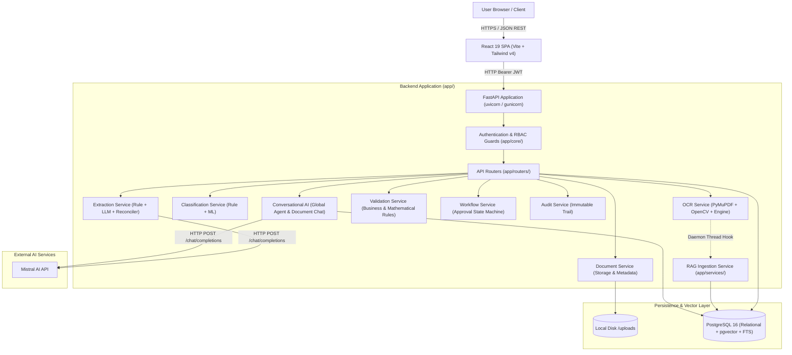
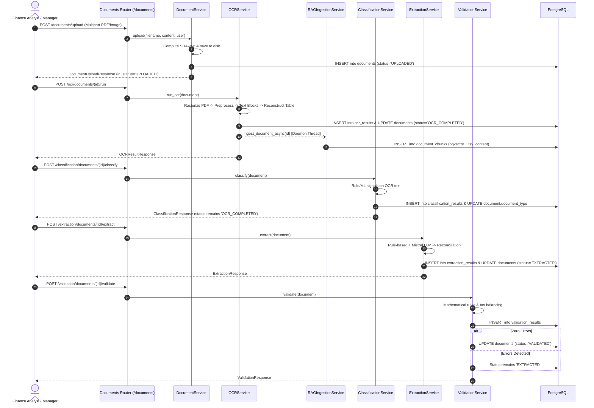
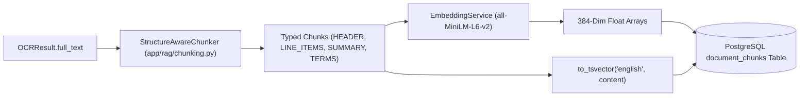
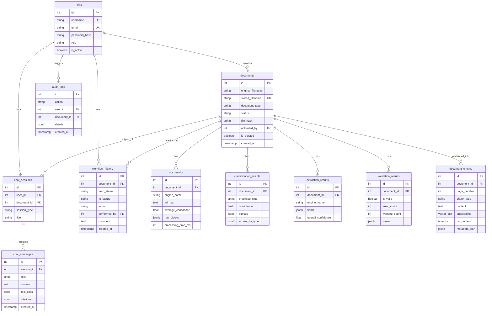
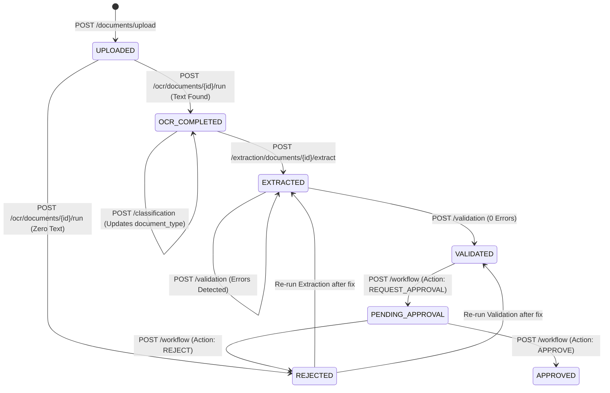

# EFDI (Enterprise Financial Document Intelligence) — Complete System Architecture Baseline

**Document Version:** 1.0.0  
**Audit Date:** 2026-09-21  
**Repository:** Enterprise Financial Document Intelligence (EFDI)  
**Inspection Mode:** READ-ONLY Forensic Architecture Audit  
**Output Target:** `docs/EFDI_SYSTEM_ARCHITECTURE_BASELINE.md`  

---

## 1. Executive Summary

The **Enterprise Financial Document Intelligence (EFDI)** system is a production-oriented enterprise platform designed for Accounts Payable (AP) and Record-to-Report (R2R) financial document ingestion, optical character recognition (OCR), machine-learning classification, field extraction, mathematical validation, approval workflow governance, and conversational intelligence.

This document serves as the authoritative, verified baseline of the **entire EFDI system architecture** prior to any conversational AI or chatbot redesign. Every statement, status, diagram, and workflow described herein is derived strictly from read-only inspection of active source code, configuration manifests, database models, and unit/integration tests.

### Key Architectural Pillars Confirmed:
1. **Synchronous Core Processing Pipeline with Targeted Asynchronous RAG:**
   Document upload, OCR, classification, extraction, validation, and approval workflow state changes are executed **synchronously** within the FastAPI request lifecycle. The sole asynchronous background task in the codebase is post-OCR RAG vector ingestion, which runs in a daemon thread (`threading.Thread`). No Celery, Redis, or external task queues exist.
2. **Dual-Model OCR with Layout & Table Reconstruction:**
   Multi-page PDFs and images are processed via PyMuPDF (`fitz`), deskewed/denoised via OpenCV, and fed to either `paddleocr`, `easyocr`, or a deterministic `stub` engine. Spatial heuristics order text blocks, reconstruct tabular line items, and generate layout-preserving structured text.
3. **Hybrid Information Extraction:**
   Supports rule-based regex extraction, LLM-based extraction via Mistral (`mistral-small-2603`), and a parallel hybrid reconciler (`reconciliation.py`) that deterministically combines candidate fields based on confidence thresholds and validation rules.
4. **Relational Database with Native Vector and Full-Text Search:**
   Built entirely on PostgreSQL 16 using `pgvector` for 384-dimensional dense cosine distance similarity and native PostgreSQL `tsvector` / `websearch_to_tsquery` for BM25-style sparse full-text search.
5. **Rigorous Security Boundaries & AST-Level Authorization:**
   Authentication uses cryptographic JWTs re-verified against PostgreSQL on every request. Document access is scoped by role (`ADMIN`, `FINANCE_MANAGER`, `FINANCE_ANALYST`, `AUDITOR`). Crucially, conversational Text-to-SQL queries are parsed via `sqlglot` to enforce read-only SELECT execution, table/column allowlists, statement timeouts, and programmatic injection of tenant/user authorization predicates (`documents.uploaded_by = <user_id>`).

---

## 2. System Architecture

EFDI is structured as a modular monolithic backend accompanied by a single-page React frontend:



### Communication Protocols:
* **Frontend $\leftrightarrow$ Backend:** HTTP/1.1 REST JSON API with multipart form-data for file uploads.
* **Backend $\leftrightarrow$ PostgreSQL:** Raw TCP connection via SQLAlchemy 2.0 and `psycopg2-binary`, pooling connections.
* **Backend $\leftrightarrow$ Mistral AI:** Direct HTTPS POST requests via Python standard library `urllib.request`.
* **Backend $\leftrightarrow$ File Storage:** Local POSIX filesystem I/O (`pathlib.Path`).

---

## 3. Repository Structure

```text
EFDI/
├── Architecture/                     # Reference architecture specs & flowcharts
├── backend/                          # Backend application root
│   ├── alembic/                      # Database migrations
│   │   └── versions/                 # Migration version scripts
│   ├── app/                          # Core application package
│   │   ├── audit/                    # Audit logging helper logic
│   │   ├── classification/           # Document taxonomy & classification engines
│   │   ├── core/                     # Configuration, security, dependencies, exceptions
│   │   ├── database/                 # SQLAlchemy session and engine management
│   │   ├── extraction/               # Information extraction (Rule, LLM, Hybrid)
│   │   ├── models/                   # SQLAlchemy declarative ORM models
│   │   ├── ocr/                      # OCR engines, preprocessing, layout, table reconstruction
│   │   ├── rag/                      # Chunking, embeddings, reranker, agent orchestrator
│   │   ├── repositories/             # Data access layer (CRUD and queries)
│   │   ├── routers/                  # FastAPI HTTP endpoint definitions
│   │   ├── schemas/                  # Pydantic request/response models
│   │   ├── services/                 # Core domain services
│   │   ├── utils/                    # File storage, hashing, formatting helpers
│   │   ├── validation/               # Mathematical & business validation rules
│   │   ├── workflow/                 # Approval state machine & transitions
│   │   └── main.py                   # FastAPI app factory & middleware
│   ├── requirements.txt              # Production application dependencies
│   ├── requirements-dev.txt          # Pytest and testing dependencies
│   ├── requirements-ocr.txt          # PyTorch, PaddleOCR, EasyOCR dependencies
│   └── tests/                        # 38 pytest test suites covering all phases
├── docs/                             # Architecture reports, audit baselines, plans
├── frontend/                         # Frontend application root
│   ├── src/
│   │   ├── components/               # Reusable UI components (document-chat, markdown, ui/)
│   │   ├── context/                  # AuthContext, ToastContext
│   │   ├── hooks/                    # Custom React hooks
│   │   ├── layouts/                  # AppLayout, Sidebar, Navbar
│   │   ├── pages/                    # 8 Top-level route pages (GlobalChat, Detail, Upload, etc.)
│   │   ├── services/                 # Frontend API client modules (chat, pipeline, auth)
│   │   └── App.tsx                   # React Router route registry
│   ├── package.json                  # Node dependencies (React 19, Tailwind v4, Vite)
│   └── vite.config.ts                # Vite bundler configuration
└── uploads/                          # Local file storage for uploaded document files
```

---

## 4. Component Architecture & Implementation Status

| Subsystem | Directory / Key Module | Status | Implementation Details |
|---|---|---|---|
| **Storage** | `app/utils/file_storage.py` | `IMPLEMENTED` | Local disk storage with SHA-256 deduplication and UUID filename aliasing. |
| **OCR Pipeline** | `app/ocr/` | `IMPLEMENTED` | PyMuPDF rasterization, OpenCV preprocessing, Stub/EasyOCR/Paddle engines, spatial layout ordering, and table reconstruction. |
| **Classification** | `app/classification/` | `IMPLEMENTED` | Keyword/regex rule-based classifier + Scikit-learn ML model classifier for AP/R2R taxonomy. |
| **Extraction** | `app/extraction/` | `IMPLEMENTED` | Rule-based regex extractors, Mistral LLM JSON schema extractor, and hybrid reconciler with confidence scoring. |
| **Validation** | `app/validation/` | `IMPLEMENTED` | Deterministic mathematical validation, tax/total balancing, cross-field reconciliation, and duplicate invoice detection. |
| **Workflow** | `app/workflow/` | `IMPLEMENTED` | Static 3-state approval state machine (`VALIDATED` $\to$ `PENDING_APPROVAL` $\to$ `APPROVED`/`REJECTED`) with role gating. |
| **Audit Trail** | `app/services/audit_service.py` | `IMPLEMENTED` | Immutable audit log table recording all security, document lifecycle, OCR, and workflow events. |
| **RAG Ingestion** | `app/services/rag_ingestion_service.py` | `IMPLEMENTED` | Background daemon thread triggered on `OCR_COMPLETED`. Employs `StructureAwareChunker` and `all-MiniLM-L6-v2`. |
| **RAG Retrieval** | `app/services/rag_service.py` | `IMPLEMENTED` | 5-stage hybrid retrieval: pgvector dense (top-30) + PostgreSQL FTS (top-30) $\to$ RRF ($k=60$) $\to$ Cross-Encoder reranker. |
| **Text-to-SQL** | `app/services/text_to_sql_service.py` | `IMPLEMENTED` | LLM-assisted SQL proposal + `sqlglot` AST security validation + programmatic tenant authorization injection. |
| **Calculator** | `app/rag/financial_calculator.py` | `IMPLEMENTED` | Safe `Decimal` arithmetic using AST parsing and calendar discount offset math. |
| **Global Agent** | `app/rag/agent_orchestrator.py` | `IMPLEMENTED (STATIC)` | Deterministic keyword substring router. Executes tools linearly without ReAct loop or model tool-calling. |
| **Document Chat** | `app/services/chat_service.py` | `IMPLEMENTED` | Single-document RAG assistant with 3-turn memory context and structured chunk citations. |

---

## 5. Complete Document Lifecycle

The end-to-end lifecycle of a financial document in EFDI follows an ordered, verified progression:



---

## 6. Document Upload and Storage

* **Router Endpoint:** `POST /api/v1/documents/upload` ([`backend/app/routers/documents.py:L47`](file:///c:/Users/conanferreira/Desktop/PROJECT-BLACKBOX/EFDI/backend/app/routers/documents.py#L47))
* **Service:** [`DocumentService.upload`](file:///c:/Users/conanferreira/Desktop/PROJECT-BLACKBOX/EFDI/backend/app/services/document_service.py#L35)
* **File Validation:**
  - Allowed MIME types: `application/pdf`, `image/png`, `image/jpeg`, `image/jpg` ([`file_storage.py:L22`](file:///c:/Users/conanferreira/Desktop/PROJECT-BLACKBOX/EFDI/backend/app/utils/file_storage.py#L22)).
  - Size limitation: Clamped to `settings.MAX_UPLOAD_SIZE_BYTES` (default: 50 MB).
* **Storage Mechanism:**
  - The raw file is stored in `settings.UPLOAD_DIR` (`uploads/`).
  - Stored filename uses a randomized UUID string: `f"{uuid.uuid4().hex}{extension}"` to eliminate path traversal and collisions.
  - The client's original filename is preserved in `documents.original_filename`.
* **Deduplication:** A cryptographic SHA-256 hash is computed immediately (`file_hash`).
* **Initial State:** Row created in `documents` with `status = "UPLOADED"`, `document_type = "UNKNOWN"`, and `uploaded_by = current_user.id`.

---

## 7. OCR Pipeline Architecture

* **Router Endpoint:** `POST /api/v1/ocr/documents/{id}/run` ([`backend/app/routers/ocr.py:L45`](file:///c:/Users/conanferreira/Desktop/PROJECT-BLACKBOX/EFDI/backend/app/routers/ocr.py#L45))
* **Service:** [`OCRService.run_ocr`](file:///c:/Users/conanferreira/Desktop/PROJECT-BLACKBOX/EFDI/backend/app/services/ocr_service.py#L52)

### Complete Pipeline Stages:
1. **File Retrieval & Rasterization:** PDF pages are rasterized into OpenCV image arrays via PyMuPDF (`fitz.open(stream=file_bytes)` at 150–300 DPI). Single-frame images are decoded via OpenCV / Pillow.
2. **Adaptive Preprocessing (`app/ocr/adaptive_preprocessing.py`):** Computes image skew angle, applies adaptive thresholding, denoising, and contrast normalization.
3. **Engine Text Recognition:**
   - `stub_engine.py`: Fast deterministic mock text generator for unit testing without weights.
   - `easyocr_engine.py`: PyTorch-based recognition running under a thread lock.
   - `paddle_engine.py`: PaddlePaddle multi-lingual detection and angle classification.
4. **Spatial Layout & Table Reconstruction (`app/ocr/layout.py`, `table_reconstruction.py`):**
   - Text bounding boxes are grouped into horizontal lines and sorted spatially top-to-bottom, left-to-right.
   - Table columns and grid structures are detected to reconstruct structured financial line items.
5. **Structured Full Text (`generate_structured_full_text`):** Generates layout-preserved markdown text containing document metadata, key-value blocks, and markdown tables.
6. **Downstream Quality Scoring (`quality_scoring.py`):** Computes confidence metrics and checks text density.
7. **Status & Ingestion Hook:**
   - If no text is extracted: `Document.status` $\to$ `REJECTED`.
   - If text is extracted: `Document.status` $\to$ `OCR_COMPLETED`.
   - Fires `RAGIngestionService.ingest_document_async(document.id)`.

---

## 8. Document Classification

* **Router Endpoint:** `POST /api/v1/classification/documents/{id}/classify` ([`backend/app/routers/classification.py:L40`](file:///c:/Users/conanferreira/Desktop/PROJECT-BLACKBOX/EFDI/backend/app/routers/classification.py#L40))
* **Service:** [`ClassificationService.classify`](file:///c:/Users/conanferreira/Desktop/PROJECT-BLACKBOX/EFDI/backend/app/services/classification_service.py#L26)

### Document Taxonomy:
Defined in [`app/models/document_enums.py:L38`](file:///c:/Users/conanferreira/Desktop/PROJECT-BLACKBOX/EFDI/backend/app/models/document_enums.py#L38):
* **AP (Accounts Payable):** `POI` (PO-based invoice), `NPO` (Non-PO invoice), `IMA` (Reimbursement claim), `DPR` (Down payment request).
* **R2R (Record-to-Report):** `MSI` (Sales invoice), `PSI` (Customer receipt / pay-in slip), `JER` (Journal entry), `BKA` (Bank document), `LCA` (Letter of credit).

### Classification Mechanism:
1. **Rule-Based Engine (`rule_based.py`):** Evaluates regex and weighted keyword signals across header, line-item, and footer text (e.g. searching for purchase order patterns, tax registration phrases, or journal entry account codes).
2. **ML Classifier Engine (`ml_classifier.py`):** Employs TF-IDF vectorization and a trained Scikit-learn model (`poi_jer_classifier.joblib`).
3. **Database Impact:** Creates a record in `classification_results` and updates `documents.document_type`.  
   *(Note: By architectural design, classification does NOT advance `document.status`; it remains `OCR_COMPLETED`).*

---

## 9. Information Extraction

* **Router Endpoint:** `POST /api/v1/extraction/documents/{id}/extract` ([`backend/app/routers/extraction.py:L45`](file:///c:/Users/conanferreira/Desktop/PROJECT-BLACKBOX/EFDI/backend/app/routers/extraction.py#L45))
* **Service:** [`ExtractionService.extract`](file:///c:/Users/conanferreira/Desktop/PROJECT-BLACKBOX/EFDI/backend/app/services/extraction_service.py#L40)

### Extraction Engines:
1. **Rule-Based Extractor (`app/extraction/rule_based.py`):** Uses anchor phrases, regexes, and layout coordinates to extract dates, amounts, invoice numbers, and vendor names.
2. **LLM Extractor (`app/extraction/llm_extractor.py`):** Prompts Mistral with structured OCR text and JSON schemas defined in `app/extraction/llm_schema.py`.
3. **Hybrid Parallel Orchestrator & Reconciler (`reconciliation.py`):** Executes rule and LLM extractors in parallel. Deterministically reconciles field conflicts using field-level confidence scores, exact type validation, and fallback priority.
4. **Database Impact:** Creates a record in `extraction_results` (storing JSONB fields) and advances `documents.status` $\to$ `EXTRACTED`.

---

## 10. Validation & Mathematical Reconciliation

* **Router Endpoint:** `POST /api/v1/validation/documents/{id}/validate` ([`backend/app/routers/validation.py:L35`](file:///c:/Users/conanferreira/Desktop/PROJECT-BLACKBOX/EFDI/backend/app/routers/validation.py#L35))
* **Service:** [`ValidationService.validate`](file:///c:/Users/conanferreira/Desktop/PROJECT-BLACKBOX/EFDI/backend/app/services/validation_service.py#L35)

### Validation Rules Engine (`app/validation/business_rules.py`):
1. **Mandatory Field Rules:** Verifies mandatory presence of `invoice_number`, `invoice_date`, `vendor_name`, `grand_total_amount`, and `currency`.
2. **Mathematical Reconciliation:**
   - Evaluates: $\text{Calculated Total} = \text{Net Amount} + \text{Tax Amount}$.
   - Evaluates: $\sum (\text{Line Item Amount}) \approx \text{Net Amount}$.
   - Tolerates $\pm 0.05$ rounding divergence; flags larger discrepancies as errors.
3. **Date Sanity:** Rejects future dates beyond current date + 30 days.
4. **Duplicate Invoice Detection (`duplicate_detection.py`):** Queries database for identical `(vendor_name, invoice_number, grand_total_amount)` on non-deleted documents.
5. **State Transition Rule:**
   - If zero `ERROR` severity issues: `Document.status` advances to `VALIDATED`.
   - If any `ERROR` issue exists: `Document.status` **remains at `EXTRACTED`** (preventing approval submission until resolved).

---

## 11. Approval Workflow Governance

* **Router Endpoint:** `POST /api/v1/workflow/documents/{id}/action` ([`backend/app/routers/workflow.py:L36`](file:///c:/Users/conanferreira/Desktop/PROJECT-BLACKBOX/EFDI/backend/app/routers/workflow.py#L36))
* **Service:** [`WorkflowService.perform_action`](file:///c:/Users/conanferreira/Desktop/PROJECT-BLACKBOX/EFDI/backend/app/services/workflow_service.py#L38)
* **State Machine Definition:** [`app/workflow/state_machine.py`](file:///c:/Users/conanferreira/Desktop/PROJECT-BLACKBOX/EFDI/backend/app/workflow/state_machine.py)

### Transition Rules & RBAC Permissions:

```text
+-------------------+   REQUEST_APPROVAL (Any Authenticated User)   +----------------------+
|     VALIDATED     | ─────────────────────────────────────────────► |   PENDING_APPROVAL   |
+-------------------+                                               +----------------------+
                                                                               │
                                       ┌───────────────────────────────────────┴───────────────────┐
                                       │ APPROVE (Manager / Auditor / Admin)                       │ REJECT (Manager / Auditor / Admin)
                                       ▼                                                           ▼
                             +-------------------+                                       +-------------------+
                             |     APPROVED      |                                       |     REJECTED      |
                             +-------------------+                                       +-------------------+
```

* **Anti-Self-Approval Rule:** `FINANCE_ANALYST` users may request approval but cannot approve or reject submissions.
* **Mandatory Rejection Comment:** Rejection requires an explicit explanatory comment recorded in `workflow_history`.
* **Re-Submission Gate:** A rejected document cannot transition directly back to `PENDING_APPROVAL`. It must be re-extracted and re-validated back to `VALIDATED`.

---

## 12. RAG Ingestion Architecture

* **Service:** [`RAGIngestionService`](file:///c:/Users/conanferreira/Desktop/PROJECT-BLACKBOX/EFDI/backend/app/services/rag_ingestion_service.py#L22)
* **Trigger:** Invoked asynchronously via daemon thread (`ingest_document_async`) immediately after OCR completes.



### Ingestion Details:
* **Idempotent Replacement:** Existing chunks for the `document_id` are deleted before new chunks are inserted.
* **Storage Columns:**
  - `embedding`: Vector(384) column managed by `pgvector`.
  - `tsv_content`: Stored `tsvector` generated column automatically maintained by PostgreSQL.
  - `metadata_json`: JSONB storing chunk index, section type, page number, and bounding box references.

---

## 13. Database Architecture (Entity-Relationship)



---

## 14. Authentication and Authorization Security Model

### 1. Authentication Layer
* **Token Standard:** OAuth2 Bearer token with HMAC-SHA256 JWT signature.
* **Resolution Function:** [`get_current_user`](file:///c:/Users/conanferreira/Desktop/PROJECT-BLACKBOX/EFDI/backend/app/core/dependencies.py#L28).
* **Database Check on Every Request:** Decodes the token subject (`sub`), queries PostgreSQL `UserRepository`, and asserts `user.is_active == True`. Revoked or modified accounts fail immediately without waiting for token expiry.

### 2. Authorization & RBAC
EFDI defines 4 roles in [`app/models/roles.py`](file:///c:/Users/conanferreira/Desktop/PROJECT-BLACKBOX/EFDI/backend/app/models/roles.py):
* `ADMIN`: Full platform management, folder-scan intake, user management.
* `FINANCE_MANAGER`: Cross-portfolio visibility, approval/rejection authority.
* `AUDITOR`: Full cross-portfolio read access, system-wide audit log search.
* `FINANCE_ANALYST`: Scoped strictly to documents uploaded by themselves (`documents.uploaded_by == user.id`).

### 3. Critical Security Boundaries

| Boundary | Untrusted Input / Actor | Trusted Enforcement Mechanism |
|---|---|---|
| **API Endpoints** | Client HTTP Request | FastAPI dependency injection (`get_current_user`, `require_roles`). |
| **Document Access** | User requested `document_id` | `DocumentService.get_for_user`: verifies `uploaded_by == user.id` for analysts. |
| **Text-to-SQL Syntax** | Mistral proposed SQL text | `sqlglot` AST validation: enforces SELECT-only, table/column allowlists, and injects `uploaded_by = user.id`. |
| **Database Transactions** | Arbitrary SQL execution | Read-only connection mode (`SET TRANSACTION READ ONLY`) and statement timeout (`5000ms`). |
| **RAG Vector/FTS Search** | Client query text | In-database SQL join and WHERE predicate injection in `ChunkRepository`. |

---

## 15. Complete Document State Machine

The document `status` column represents a formal lifecycle state:



---

## 16. Background Processing Architecture

A forensic search across the codebase confirms:
* **Redis / Celery / RQ:** ❌ **NONE.** Not installed, not configured, not used.
* **FastAPI BackgroundTasks:** ❌ **NONE.**
* **Active Asynchronous Processing:**
  - Implemented exclusively via standard library `threading.Thread` in [`RAGIngestionService.ingest_document_async`](file:///c:/Users/conanferreira/Desktop/PROJECT-BLACKBOX/EFDI/backend/app/services/rag_ingestion_service.py#L122-L135).
  - The thread runs with `daemon=True`, instantiates its own database session via `get_db_context()`, generates embeddings, commits chunks, and logs success/failure independently.
  - All other services (OCR, classification, extraction, validation, chat) execute **synchronously** within the HTTP worker process.

---

## 17. Configuration and Environment Specification

Environment configuration is managed via Pydantic Settings in [`backend/app/core/config.py`](file:///c:/Users/conanferreira/Desktop/PROJECT-BLACKBOX/EFDI/backend/app/core/config.py):

* **General App Settings:** `APP_ENV` (`development`, `staging`, `production`, `testing`), `PORT`, `SECRET_KEY`, `CORS_ORIGINS`.
* **Database Settings:** `DATABASE_URL` (PostgreSQL connection URI), `POSTGRES_DB`, `POSTGRES_USER`, `POSTGRES_PASSWORD`.
* **File Storage Settings:** `UPLOAD_DIR` (path to uploads), `MAX_UPLOAD_SIZE_BYTES` (50 MB limit).
* **OCR Settings:** `OCR_DEFAULT_ENGINE` (`easyocr`, `paddleocr`, or `stub`), `ENABLE_STRUCTURED_FULL_TEXT` (bool).
* **Extraction & LLM Settings:** `EXTRACTION_DEFAULT_ENGINE` (`hybrid`), `LLM_PROVIDER` (`mistral`), `EXTRACTION_LLM_MODEL` (`mistral-small-2603`), `MISTRAL_API_KEY`, `MISTRAL_API_BASE`.
* **RAG Subsystem Settings:**
  - `RAG_EMBEDDING_MODEL`: `sentence-transformers/all-MiniLM-L6-v2` (384-dim).
  - `RAG_RERANKER_MODEL`: `cross-encoder/ms-marco-MiniLM-L-6-v2`.
  - `RAG_DENSE_TOP_K`: 30, `RAG_SPARSE_TOP_K`: 30, `RAG_RRF_K`: 60, `RAG_RERANK_CANDIDATES`: 25, `RAG_FINAL_TOP_K`: 5, `RAG_RERANKER_MIN_SCORE`: -3.0.
  - `GLOBAL_CHAT_ANALYST_POLICY`: `"scoped"` or `"forbidden"`.

---

## 18. Chatbot Integration Within the Larger EFDI Architecture

The Conversational AI Subsystem does not operate in isolation; it sits atop the accumulated artifacts of the entire document processing pipeline:

```
[Document Ingestion Pipeline]
  1. Upload -> documents record
  2. OCR -> ocr_results (full_text)
  3. Async Hook -> document_chunks (384-dim vectors + tsvector)
  4. Classification -> classification_results
  5. Extraction -> extraction_results (fields JSONB)
  6. Validation -> validation_results (issues JSONB)
                        │
                        ▼ (Accumulated System Artifacts)
+-------------------------------------------------------------------------------+
|                       CONVERSATIONAL AI INTEGRATION                           |
|                                                                               |
|  [Document Chat (/chat/documents/{id})]                                       |
|    - Queries document_chunks where document_id == id                          |
|    - Cites specific chunk IDs and page numbers                                |
|                                                                               |
|  [Global Chat (/chat/corpus)]                                                 |
|    - Text-to-SQL queries: documents, extraction_results, validation_results   |
|    - RAG queries: document_chunks across entire corpus                        |
|    - Calculator queries: arithmetic expressions & discount formulas           |
+-------------------------------------------------------------------------------+
```

---

## 19. Architectural Boundaries

1. **Presentation vs. Application Boundary:**
   The frontend communicates with FastAPI solely through typed REST endpoints (`frontend/src/services/`). It has no direct database or LLM access.
2. **API vs. Domain Service Boundary:**
   Routers handle HTTP verbs, Pydantic validation, and dependency resolution (`get_current_user`), immediately delegating domain logic to service classes (`DocumentService`, `OCRService`, `ExtractionService`, etc.).
3. **Application vs. Security Boundary:**
   Tenant data isolation is enforced at the database query level (via `sqlglot` AST rewriting for Text-to-SQL and SQLAlchemy predicate joins for RAG). The LLM is **never trusted** to enforce security.
4. **Synchronous Request vs. Background Task Boundary:**
   Only RAG vector indexing is offloaded to a background thread. All workflow status transitions occur synchronously with transactional commits.

---

## 20. Current Constraints & Known Technical Debt

1. **Deterministic Chatbot Orchestrator (Target for ReAct Redesign):**
   `AgentOrchestrator._plan_tool_execution` relies on static substring triggers (`sql_triggers`, `calc_triggers`, `rag_triggers`). It cannot perform iterative multi-hop reasoning, observation evaluation, or dynamic tool chaining.
2. **Stateless Global Chat:**
   `AgentOrchestrator` persists message turns to PostgreSQL but **never queries previous turns back into model context**. Global chat is currently stateless between turns.
3. **Pronoun Ambiguity & `CURRENT_USER` in Text-to-SQL:**
   Because user identity is not passed to the SQL LLM prompt, queries like *"How many documents did I upload?"* frequently cause the LLM to generate `WHERE uploaded_by = CURRENT_USER.id`, which fails AST allowlist checks.
4. **Table Aliasing Bug in AST Injection:**
   The AST rewriter in `TextToSQLService` appends `documents.uploaded_by = <id>` by literal table name. If the query aliased the table (e.g. `FROM documents d`), PostgreSQL throws a query syntax error.
5. **Thread-Based Background Processing:**
   Running background RAG indexing in Python daemon threads means indexing tasks do not survive process restarts or multi-worker scale-out. A durable task queue (e.g. Celery/Redis) will be necessary in high-volume production.

---

## 21. Complete File & Class Reference

| Subsystem | File Path | Key Classes & Functions |
|---|---|---|
| **Core** | `backend/app/core/dependencies.py` | `get_current_user`, `require_roles` |
| **Core** | `backend/app/core/security.py` | `decode_access_token`, `create_access_token` |
| **Core** | `backend/app/core/config.py` | `Settings` |
| **Storage** | `backend/app/utils/file_storage.py` | `save_file`, `compute_sha256`, `validate_upload` |
| **Documents** | `backend/app/services/document_service.py` | `DocumentService.upload`, `bulk_upload`, `get_for_user` |
| **OCR** | `backend/app/services/ocr_service.py` | `OCRService.run_ocr` |
| **OCR** | `backend/app/ocr/factory.py` | `get_ocr_engine` (`StubEngine`, `EasyOCREngine`, `PaddleOCREngine`) |
| **OCR** | `backend/app/ocr/layout.py` | `build_structured_page`, `generate_structured_full_text` |
| **OCR** | `backend/app/ocr/table_reconstruction.py` | `reconstruct_table` |
| **Classification** | `backend/app/services/classification_service.py` | `ClassificationService.classify` |
| **Classification** | `backend/app/classification/rule_based.py` | `RuleBasedClassifier` |
| **Classification** | `backend/app/classification/ml_classifier.py` | `MLClassifier` |
| **Extraction** | `backend/app/services/extraction_service.py` | `ExtractionService.extract` |
| **Extraction** | `backend/app/extraction/llm_extractor.py` | `LLMExtractor` |
| **Extraction** | `backend/app/extraction/reconciliation.py` | `reconcile_extractions` |
| **Validation** | `backend/app/services/validation_service.py` | `ValidationService.validate` |
| **Validation** | `backend/app/validation/engine.py` | `run_validation` |
| **Validation** | `backend/app/validation/business_rules.py` | `BusinessRuleValidator` |
| **Workflow** | `backend/app/services/workflow_service.py` | `WorkflowService.perform_action` |
| **Workflow** | `backend/app/workflow/state_machine.py` | `TRANSITIONS`, `ALLOWED_ROLES`, `is_role_allowed` |
| **Audit** | `backend/app/services/audit_service.py` | `AuditService.log`, `search` |
| **RAG Ingest** | `backend/app/services/rag_ingestion_service.py` | `RAGIngestionService.ingest_document`, `ingest_document_async` |
| **RAG Ingest** | `backend/app/rag/chunking.py` | `StructureAwareChunker` |
| **RAG Retrieval**| `backend/app/services/rag_service.py` | `RAGService.retrieve_global`, `retrieve_for_document` |
| **RAG Retrieval**| `backend/app/rag/embeddings.py` | `EmbeddingService.generate_embeddings`, `generate_query_embedding` |
| **RAG Retrieval**| `backend/app/rag/reranker.py` | `RerankerService.rerank` |
| **RAG Retrieval**| `backend/app/repositories/chunk_repository.py` | `ChunkRepository.search_vector_global`, `search_fts_global` |
| **Text-to-SQL** | `backend/app/services/text_to_sql_service.py` | `TextToSQLService.generate_and_execute_sql`, `validate_and_sanitize_sql` |
| **Calculator** | `backend/app/rag/financial_calculator.py` | `FinancialCalculator.calculate_discount`, `evaluate_expression` |
| **Chatbot** | `backend/app/rag/agent_orchestrator.py` | `AgentOrchestrator.process_global_query` |
| **Chatbot** | `backend/app/services/chat_service.py` | `ChatService.send_document_message` |
| **Persistence** | `backend/app/repositories/chat_history_repository.py` | `ChatHistoryRepository` |
| **Frontend** | `frontend/src/pages/GlobalChatPage.tsx` | `GlobalChatPage` component |
| **Frontend** | `frontend/src/components/document-chat.tsx` | `DocumentChatAssistant` component |
| **Frontend** | `frontend/src/services/chat.ts` | `chatApi` client module |
